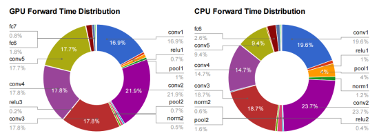
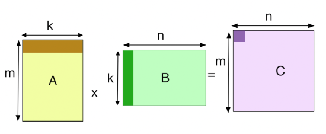
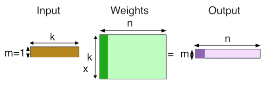
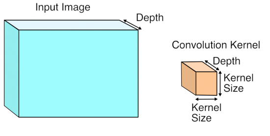
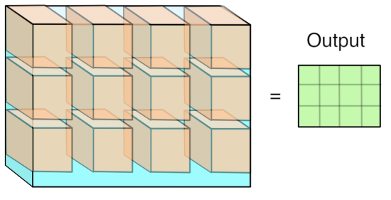
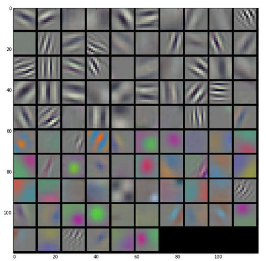
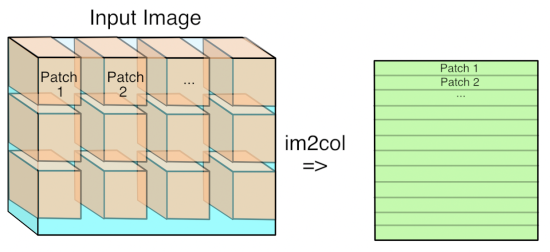
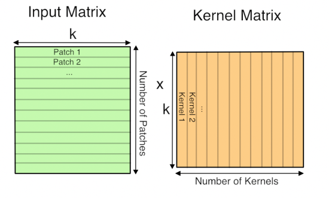

# Why GEMM is at the heart of deep learning

I spend most of my time worrying about how to make deep learning with neural networks faster and more power efficient. In practice that means focusing on a function called GEMM. It’s part of the BLAS (Basic Linear Algebra Subprograms) library that was [first created in 1979](http://www.cs.utexas.edu/users/kincaid/blas.pdf), and until I started trying to optimize neural networks I’d never heard of it. To explain why it’s so important, here’s a diagram from my friend [Yangqing Jia’s](http://daggerfs.com/)[thesis](http://www.eecs.berkeley.edu/Pubs/TechRpts/2014/EECS-2014-93.pdf):

This is breaking down where the time’s going for a typical deep convolutional neural network doing image recognition using Alex Krizhevsky’s Imagenet architecture. All of the layers that start with fc (for fully-connected) or conv (for convolution) are implemented using GEMM, and almost all the time (95% of the GPU version, and 89% on CPU) is spent on those layers.

So what is GEMM?  It stands for GEneral Matrix to Matrix Multiplication, and it essentially does exactly what it says on the tin, multiplies two input matrices together to get an output one. The difference between it and the kind of matrix operations I was used to in the 3D graphics world is that the matrices it works on are often very big. For example, a single layer in a typical network may require the multiplication of a 256 row, 1,152 column matrix by an 1,152 row, 192 column matrix to produce a 256 row, 192 column result. Naively, that requires 57 million (256 x 1,152, x 192) floating point operations and there can be dozens of these layers in a modern architecture, so I often see networks that need several billion FLOPs to calculate a single frame. Here’s a diagram that I sketched to help me visualize how it works:

## Fully-Connected Layers

Fully-connected layers are the classic neural networks that have been around for decades, and it’s probably easiest to start with how GEMM is used for those. Each output value of an FC layer looks at every value in the input layer, multiplies them all by the corresponding weight it has for that input index, and sums the results to get its output. In terms of the diagram above, it looks like this:

There are ‘k’ input values, and there are ‘n’ neurons, each one of which has its own set of learned weights for every input value. There are ‘n’ output values, one for each neuron, calculated by doing a dot product of its weights and the input values.

## Convolutional Layers

Using GEMM for the convolutional layers is a lot less of an obvious choice. A conv layer treats its input as a two dimensional image, with a number of channels for each pixel, much like a classical image with width, height, and depth. Unlike the images I was used to dealing with though, the number of channels can be in the hundreds, rather than just RGB or RGBA!

The convolution operation produces its output by taking a number of ‘kernels’ of weights. and applying them across the image. Here’s what an input image and a single kernel look like:

Each kernel is another three-dimensional array of numbers, with the depth the same as the input image, but with a much smaller width and height, typically something like 7×7. To produce a result, a kernel is applied to a grid of points across the input image. At each point where it’s applied, all of the corresponding input values and weights are multiplied together, and then summed to produce a single output value at that point. Here’s what that looks like visually:

You can think of this operation as something like an edge detector. The kernel contains a pattern of weights, and when the part of the input image it’s looking at has a similar pattern it outputs a high value. When the input doesn’t match the pattern, the result is a low number in that position. Here are some typical patterns that are learned by the first layer of a network, courtesy of the awesome [Caffe](http://caffe.berkeleyvision.org/) and [featured on the NVIDIA blog](http://devblogs.nvidia.com/parallelforall/deep-learning-computer-vision-caffe-cudnn/):

Because the input to the first layer is an RGB image, all of these kernels can be visualized as RGB too, and they show the primitive patterns that the network is looking for. Each one of these 96 kernels is applied in a grid pattern across the input, and the result is a series of 96 two-dimensional arrays, which are treated as an output image with a depth of 96 channels. If you’re used to image processing operations like the Sobel operator, you can probably picture how each one of these is a bit like an edge detector optimized for different important patterns in the image, and so each channel is a map of where those patterns occur across the input.

You may have noticed that I’ve been vague about what kind of grid the kernels are applied in. The key controlling factor for this is a parameter called ‘stride’, which defines the spacing between the kernel applications. For example, with a stride of 1, a 256×256 input image would have a kernel applied at every pixel, and the output would be the same width and height as the input. With a stride of 4, that same input image would only have kernels applied every four pixels, so the output would only be 64×64. Typical stride values are less than the size of a kernel, which means that in the diagram visualizing the kernel application, a lot of them would actually overlap at the edges.

## How GEMM works for Convolutions

This seems like quite a specialized operation. It involves a lot of multiplications and summing at the end, like the fully-connected layer, but it’s not clear how or why we should turn this into a matrix multiplication for the GEMM. I’ll talk about the motivation at the end, but here’s how the operation is expressed in terms of a matrix multiplication.

The first step is to turn the input from an image, which is effectively a 3D array, into a 2D array that we can treat like a matrix. Where each kernel is applied is a little three-dimensional cube within the image, and so we take each one of those cubes of input values and copy them out as a single column into a matrix. This is known as im2col, for image-to-column, I believe from an original Matlab function, and here’s how I visualize it:

Now if you’re an image-processing geek like me, you’ll probably be appalled at the expansion in memory size that happens when we do this conversion if the stride is less than the kernel size. This means that pixels that are included in overlapping kernel sites will be duplicated in the matrix, which seems inefficient. You’ll have to trust me that this wastage is outweighed by the advantages though.

Now you have the input image in matrix form, you do the same for each kernel’s weights, serializing the 3D cubes into rows as the second matrix for the multiplication. Here’s what the final GEMM looks like:

Here ‘k’ is the number of values in each patch and kernel, so it’s kernel width * kernel height * depth. The resulting matrix is ‘Number of patches’ columns high, by ‘Number of kernel’ rows wide. This matrix is actually treated as a 3D array by subsequent operations, by taking the number of kernels dimension as the depth, and then splitting the patches back into rows and columns based on their original position in the input image.

## Why GEMM works for Convolutions

Hopefully you can now see how you can express a convolutional layer as a matrix multiplication, but it’s still not obvious why you would do it. The short answer is that it turns out that the Fortran world of scientific programmers has spent decades optimizing code to perform large matrix to matrix multiplications, and the benefits from the very regular patterns of memory access outweigh the wasteful storage costs. [This paper from Nvidia](http://arxiv.org/pdf/1410.0759.pdf) is a good introduction to some of the different approaches you can use, but they also describe why they ended up with a modified version of GEMM as their favored approach. There are also a lot of advantages to being able to batch up a lot of input images against the same kernels at once, and this [paper on Caffe con troll](http://arxiv.org/pdf/1504.04343v1.pdf) uses those to very good effect. The main competitor to the GEMM approach is using Fourier transforms to do the operation in frequency space, but the use of strides in our convolutions makes it hard to be as efficient.

The good news is that having a single, well-understood function taking up most of our time gives a very clear path to optimizing for speed and power usage, both with better software implementations and by tailoring the hardware to run the operation well. Because deep networks have proven to be useful for a massive range of applications across speech, NLP, and computer vision, I’m looking forward to seeing massive improvements over the next few years, much like the widespread demand for 3D games drove a revolution in GPUs by forcing a revolution in vertex and pixel processing operations.