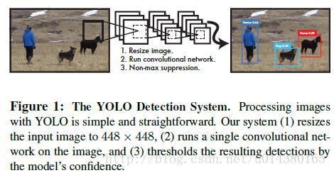
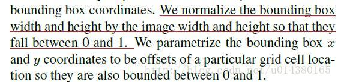
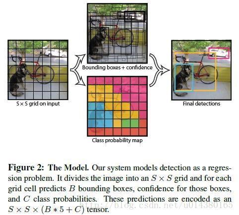
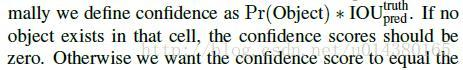
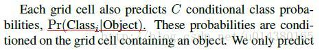
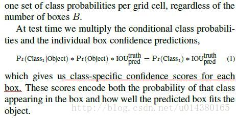
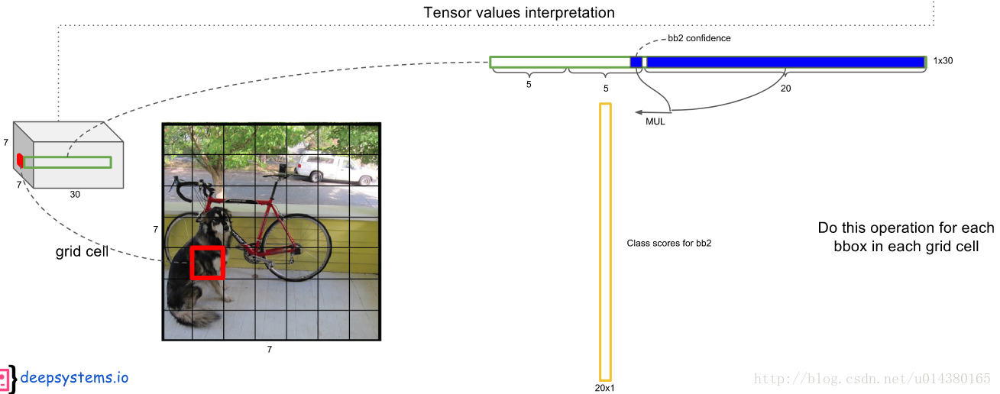
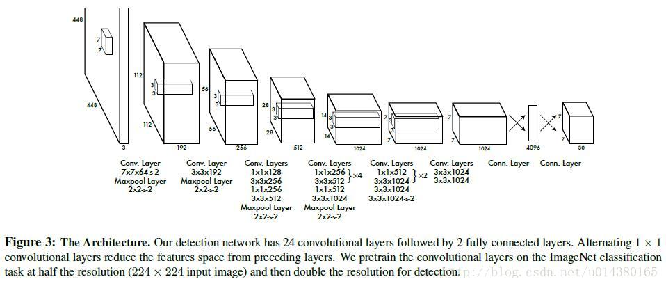
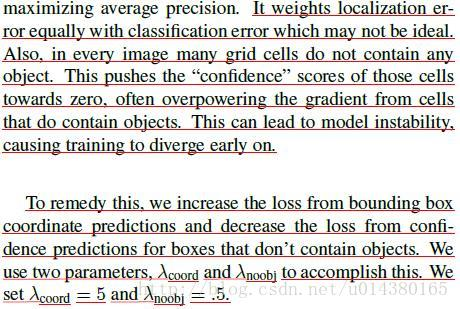
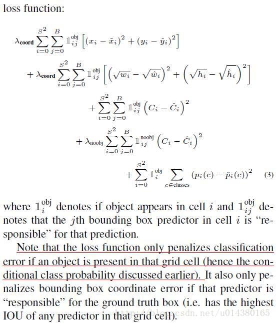

# YOLO (You Only Look Once) 算法详解

这篇博客主要介绍下 YOLO v1 算法 (CVPR2016的文章)。**YOLO 是目前比较流行的 object detection 算法**，速度快且结构简单，其他的 object detection 算法如 faster RCNN，SSD 相信大家也不陌生，以后有机会再介绍。另外提一下，**这里算法部分介绍的是 YOLO 的第一个版本**，而现在 YOLO 的官网上已经有 YOLO v2 的实现了，这个后续再介绍。

论文名称：**You only look once unified real-time object detection** [论文链接](http://www.cv-foundation.org/openaccess/content_cvpr_2016/papers/Redmon_You_Only_Look_CVPR_2016_paper.pdf)

**YOLO v1 算法内容**

作者在YOLO算法中把物体检测 (object detection) 问题处理成回归问题，用一个卷积神经网络结构就可以从输入图像直接预测 bounding box 和类别概率。

**YOLO算法的优点**：

1. YOLO的速度非常快。在 Titan X GPU 上的速度是 45 fps (frames per second)，加速版的YOLO差不多是150fps。
2. YOLO是基于图像的全局信息进行预测的。这一点和基于sliding window以及region proposal等检测算法不一样。与Fast R-CNN相比，YOLO在误检测（将背景检测为物体）方面的错误率能降低一半多。
3. YOLO可以学到物体的 generalizable representations。可以理解为泛化能力强。
4. 准确率高，有实验证明。

算法结构图如Fig1：结构上主要的特点就是 unified detection，不再是原来许多步骤组成的物体检测，这使得模型的**运行速度快，可以直接学习图像的全局信息**，**且可以 end-to-end 训练**。

**算法首先把输入图像划分成 S \* S 的格子，然后对每个格子都预测 B 个 bounding boxes，每个bounding box 都包含 5 个预测值：x, y, w, h 和 confidence**。x, y 就是 bounding box 的中心坐标，与grid cell对齐 (即相对于当前grid cell的偏移值)，使得范围变成0到1；w和h进行归一化（分别除以图像的w和h，这样最后的w和h就在0到1范围）。原文如下：

另外每个格子都预测C个假定类别的概率。在本文中作者取 S=7, B=2, C=20（因为PASCAL VOC有20个类别），所以最后有 **7 \* 7*30 个 tensor**。如Fig2，比较好理解。

这里 **confidence 的计算公式**如下：

**每个bounding box都对应一个confidence score**，如果grid cell里面没有object，confidence就是0，如果有，则confidence score等于预测的box和ground truth的IOU值，见上面公式。**所以如何判断一个grid cell中是否包含object呢？答案是：如果一个object的ground truth的中心点坐标在一个grid cell中，那么这个grid cell就是包含这个object，也就是说这个object的预测就由该grid cell负责。** 

**每个grid cell都预测C个类别概率**，表示一个grid cell在包含object的条件下属于某个类别的概率，如下图：

下面截图连接上面。**注意grid cell和bounding box的区别，类别概率是针对grid cell的。**

这个乘法具体是怎么做的呢？请看下图：每个bounding box的confidence和每个类别的score相乘，得到每个bounding box属于哪一类的confidence score。

**即得到每个bounding box属于哪一类的confidence score。也就是说最后会得到20\* (7 \* 7 \* 2) = 20 \* 98 的 score 矩阵，括号里面是 bounding box 的数量，20 代表类别。接下来的操作都是 20 个类别轮流进行：在某个类别中（即矩阵的某一行），将得分少于阈值（0.2）的设置为0，然后再按得分从高到低排序。最后再用NMS算法去掉重复率较大的bounding box（NMS:针对某一类别，选择得分最大的bounding box，然后计算它和其它bounding box的IOU值，如果IOU大于0.5，说明重复率较大，该得分设为0，如果不大于0.5，则不改；这样一轮后，再选择剩下的score里面最大的那个bounding box，然后计算该bounding box和其它bounding box的IOU，重复以上过程直到最后）。最后每个bounding box的20个score取最大的score，如果这个score大于0，那么这个bounding box就是这个socre对应的类别（矩阵的行），如果小于0，说明这个bounding box里面没有物体，跳过即可。具体细节参考最后的参考资料1。**

网络方面主要采用**GoogLeNet**，卷积层主要用来提取特征，全连接层主要用来预测类别概率和坐标。最后的输出是 7 \* 7 \* 30，这个 30 前面也解释过了，7 \* 7 是 grid cell 的数量。**这里注意下实现的细节可能人人都不大一样，比如对 inception 的改动，最后几层的全连接层的改动等等，但是重点在于最后一层的输出是 7 \*7 \* 30。**

另外**两个小细节**：

1. 作者先在 ImageNet 数据集上预训练网络，而且网络只采用 fig3 的前面 20 个卷积层，输入是224 \* 224大小的图像。然后在检测的时候再加上随机初始化的 4 个卷积层和 2 个全连接层，同时输入改为更高分辨率的 448 \* 448。
2. Relu 层改为 pRelu，即当 x<0 时，激活值是 0.1*x，而不是传统的 0。

**损失函数方面**，作者采用 sum-squared error 的方式把 localization error (bounding box的坐标误差) 和 classificaton error整合在一起。但是如果二者的权值一致，容易导致模型不稳定，训练发散。因为很多 grid cell 是不包含物体的，这样的话很多 grid cell 的 confidence score 为0。所以采用设置不同权重方式来解决，一方面提高localization error的权重，另一方面降低没有object的box的confidence loss权值，loss权重分别是5和0.5。而对于包含object的box的confidence loss权值还是原来的1。详见下面的原文解释和loos function函数。

 

**这里详细讲一下loss function。在loss function中，前面两行表示localization error(即坐标误差)，第一行是box中心坐标(x,y)的预测，第二行为宽和高的预测。这里注意用宽和高的开根号代替原来的宽和高，这样做主要是因为相同的宽和高误差对于小的目标精度影响比大的目标要大。举个例子，原来w=10，h=20，预测出来w=8，h=22，跟原来w=3，h=5，预测出来w1，h=7相比，其实前者的误差要比后者小，但是如果不加开根号，那么损失都是一样：4+4=8，但是加上根号后，变成0.15和0.7。** 
**第三、四行表示bounding box的confidence损失，就像前面所说的，分成grid cell包含与不包含object两种情况。这里注意下因为每个grid cell包含两个bounding box，所以只有当ground truth 和该网格中的某个bounding box的IOU值最大的时候，才计算这项。** 
**第五行表示预测类别的误差，注意前面的系数只有在grid cell包含object的时候才为1。**

**所以具体实现的时候是什么样的过程呢？**

**训练的时候：输入N个图像，每个图像包含M个objec，每个object包含4个坐标（x，y，w，h）和1个label。然后通过网络得到7\*7*30大小的三维矩阵。每个1*30的向量前5个元素表示第一个bounding box的4个坐标和1个confidence，第6到10元素表示第二个bounding box的4个坐标和1个confidence。最后20个表示这个grid cell所属类别。注意这30个都是预测的结果。然后就可以计算损失函数的第一、二 、五行。至于第二三行，confidence可以根据ground truth和预测的bounding box计算出的IOU和是否有object的0,1值相乘得到。真实的confidence是0或1值，即有object则为1，没有object则为0。 这样就能计算出loss function的值了。**

**测试的时候：输入一张图像，跑到网络的末端得到7\*7*30的三维矩阵，这里虽然没有计算IOU，但是由训练好的权重已经直接计算出了bounding box的confidence。然后再跟预测的类别概率相乘就得到每个bounding box属于哪一类的概率。**

**YOLO算法的缺点**：

1. 位置精确性差，对于小目标物体以及物体比较密集的也检测不好，比如一群小鸟。 

2. YOLO虽然可以降低将背景检测为物体的概率，但同时导致召回率较低。

**问题：**

**一个 grid cell 中是否有 object 怎么界定？** 

首先要明白grid cell的含义，以文中7*7为例，这个size其实就是对输入图像（假设是224*224）不断提取特征然后sample得到的（缩小了32倍），然后就是把输入图像划分成7*7个grid cell，这样输入图像中的32个像素点就对应一个grid cell。回归正题，那么我们有每个object的标注信息，也就是知道每个object的中心点坐标在输入图像的哪个位置，那么不就相当于知道了每个object的中心点坐标属于哪个grid cell了吗，而只要object的中心点坐标落在哪个grid cell中，这个object就由哪个grid cell负责预测，也就是该grid cell包含这个object。另外由于一个grid cell会预测两个bounding box，实际上只有一个bounding box是用来预测属于该grid cell的object的，因为这两个bounding box到底哪个来预测呢？答案是：和该object的ground truth的IOU值最大的bounding box。

参考资料： 

> 1. <https://docs.google.com/presentation/d/1aeRvtKG21KHdD5lg6Hgyhx5rPq_ZOsGjG5rJ1HP7BbA/pub?start=false&loop=false&delayms=3000&slide=id.p> 
> 2. <http://blog.csdn.net/tangwei2014/article/details/50915317> 
> 3. <https://zhuanlan.zhihu.com/p/25236464> 
> 4. <https://zhuanlan.zhihu.com/p/24916786>