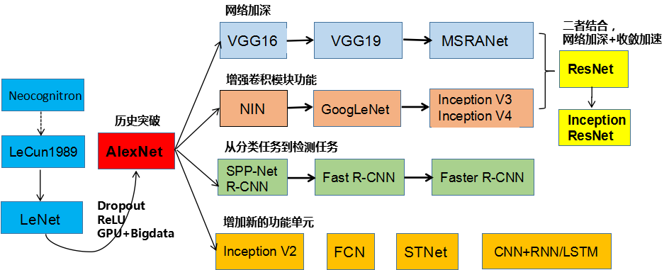
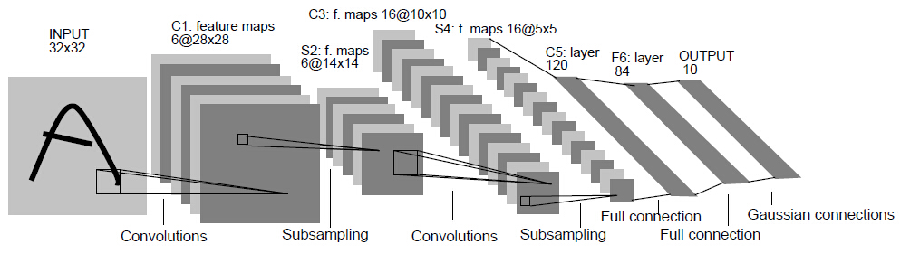
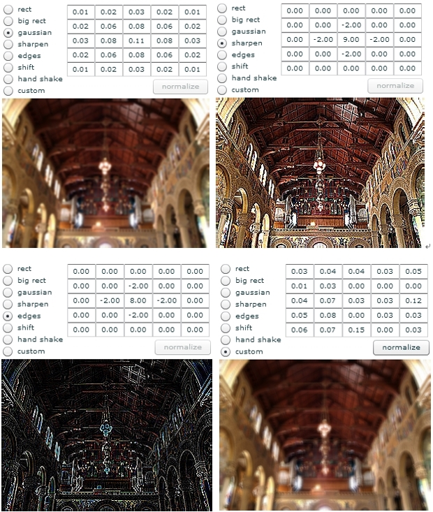
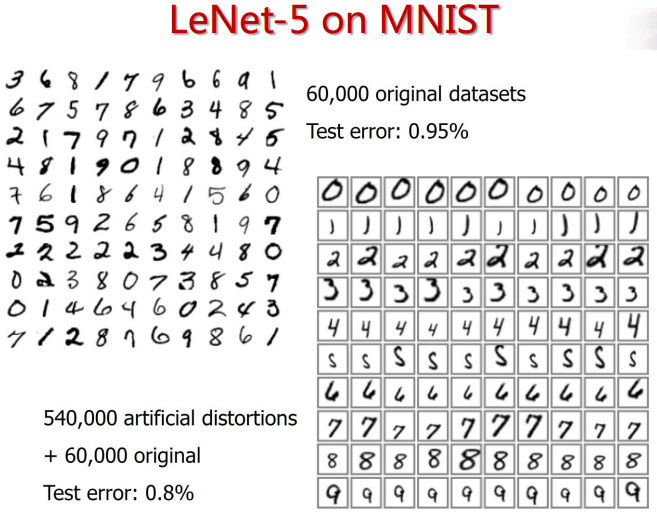
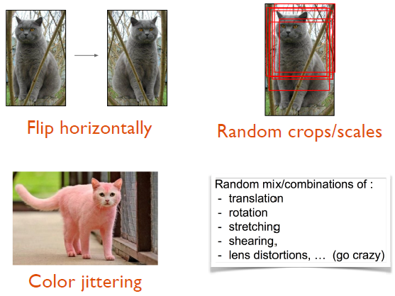
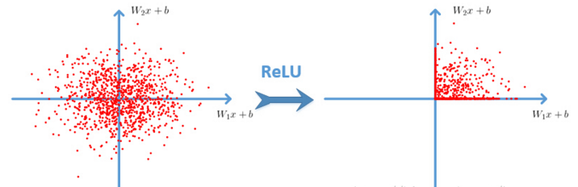
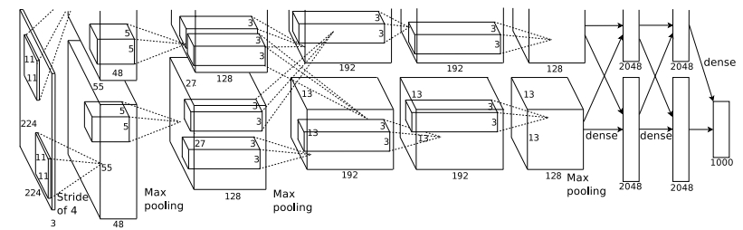

# 从LeNet到AlexNet

上图所示是刘昕博士总结的CNN结构演化的历史，起点是神经认知机模型，此时已经出现了卷积结构，经典的LeNet诞生于1998年。然而之后CNN的锋芒开始被SVM等手工设计的特征盖过。随着ReLU和dropout的提出，以及GPU和大数据带来的历史机遇，CNN在2012年迎来了历史突破–**AlexNet**.

## 一切的开始( [LeNet](http://yann.lecun.com/exdb/publis/pdf/lecun-01a.pdf))

下图是广为流传LeNet的网络结构，麻雀虽小，但五脏俱全，卷积层、pooling层、全连接层，这些都是现代CNN网络的基本组件。

- 输入尺寸：32*32
- 卷积层：3个
- 降采样层：2个
- 全连接层：1个
- 输出：10个类别（数字0-9的概率）

因为LeNet可以说是CNN的开端，所以这里简单介绍一下各个组件的用途与意义。

### Input (32*32)

输入图像Size为32*32。这要比mnist数据库中最大的字母(28*28)还大。这样做的目的是希望潜在的明显特征，如笔画断续、角点能够出现在最高层特征监测子感受野的中心。

### C1, C3, C5 (卷积层)

卷积核在二维平面上平移，并且卷积核的每个元素与被卷积图像对应位置相乘，再求和。通过卷积核的不断移动，我们就有了一个新的图像，这个图像完全由卷积核在各个位置时的乘积求和的结果组成。

二维卷积在图像中的效果就是: 
对图像的每个像素的邻域（邻域大小就是核的大小）加权求和得到该像素点的输出值。具体做法如下：

卷积运算一个重要的特点就是: 通过卷积运算，可以**使原信号特征增强，并且降低噪音**。

不同的卷积核能够提取到图像中的不同特征，这里有 [在线demo](https://graphics.stanford.edu/courses/cs178/applets/convolution.html)，下面是不同卷积核得到的不同的feature map，

**以C1层进行说明**：C1层是一个卷积层，有6个卷积核（提取6种局部特征），核大小为5 * 5，能够输出6个特征图Feature Map，大小为28 * 28。C1有156个可训练参数（每个滤波器5 * 5=25个unit参数和一个bias参数，一共6个滤波器，共(5 * 5 + 1) * 6 = 156 个参数），共156 * (28 * 28) = 122,304 个连接。

### S2, S4 (pooling层)

S2, S4是下采样层，是为了降低网络训练参数及模型的过拟合程度。池化/采样的方式通常有以下两种：

1. **Max-Pooling**: 选择Pooling窗口中的最大值作为采样值；
2. **Mean-Pooling**: 将Pooling窗口中的所有值相加取平均，以平均值作为采样值；

S2层是6个14 * 14的feature map，map中的每一个单元于上一层的 2 * 2 领域相连接，所以，S2层是C1层的1/4。

### F6 (全连接层)

F6是全连接层，类似MLP中的一个layer，共有84个神经元（为什么选这个数字？跟输出层有关），这84个神经元与C5层进行全连接，所以需要训练的参数是：(120+1)*84=10164. 
如同经典神经网络，F6层计算输入向量和权重向量之间的点积，再加上一个偏置。然后将其传递给sigmoid函数产生单元i的一个状态。

### Output (输出层)

输出层由欧式径向基函数（Euclidean Radial Basis Function）单元组成，每类一个单元，每个有84个输入。 
换句话说，每个输出RBF单元计算输入向量和参数向量之间的欧式距离。输入离参数向量越远，RBF输出的越大。用概率术语来说，RBF输出可以被理解为F6层配置空间的高斯分布的负log-likelihood。给定一个输式，损失函数应能使得F6的配置与RBF参数向量（即模式的期望分类）足够接近。

------

## 王者回归([AlexNet](https://papers.nips.cc/paper/4824-imagenet-classification-with-deep-convolutional-neural-networks.pdf))

AlexNet 可以说是具有历史意义的一个网络结构，可以说在AlexNet之前，深度学习已经沉寂了很久。历史的转折在2012年到来，AlexNet 在当年的ImageNet图像分类竞赛中，top-5错误率比上一年的冠军下降了十个百分点，而且远远超过当年的第二名。

AlexNet 之所以能够成功，深度学习之所以能够重回历史舞台，原因在于：

> 1. 非线性激活函数：ReLU
> 2. 防止过拟合的方法：Dropout，Data augmentation
> 3. 大数据训练：百万级ImageNet图像数据
> 4. 其他：GPU实现，LRN归一化层的使用

下面简单介绍一下AlexNet的一些细节：

### Data augmentation

有一种观点认为神经网络是靠数据喂出来的，若增加训练数据，则能够提升算法的准确率，因为这样可以避免过拟合，而避免了过拟合你就可以增大你的网络结构了。当训练数据有限的时候，可以通过一些变换来从已有的训练数据集中生成一些新的数据，来扩大训练数据的size。

其中，最简单、通用的图像数据变形的方式:

> 1. 从原始图像（256,256）中，随机的crop出一些图像（224,224）。【平移变换，crop】
> 2. 水平翻转图像。【反射变换，flip】
> 3. 给图像增加一些随机的光照。【光照、彩色变换，color jittering】

AlexNet 训练的时候，在data augmentation上处理的很好：

- 随机crop。训练时候，对于256＊256的图片进行随机crop到224＊224，然后允许水平翻转，那么相当与将样本倍增到((256-224)^2)*2=2048。
- 测试时候，对左上、右上、左下、右下、中间做了5次crop，然后翻转，共10个crop，之后对结果求平均。作者说，不做随机crop，大网络基本都过拟合(under substantial overfitting)。
- 对RGB空间做PCA，然后对主成分做一个(0, 0.1)的高斯扰动。结果让错误率又下降了1%。

### ReLU 激活函数

Sigmoid 是常用的非线性的激活函数，它能够把输入的连续实值“压缩”到0和1之间。特别的，如果是非常大的负数，那么输出就是0；如果是非常大的正数，输出就是1. 
但是它有一些致命的 **缺点**：

- **Sigmoids saturate and kill gradients.** sigmoid 有一个非常致命的缺点，当输入非常大或者非常小的时候，会有饱和现象，这些神经元的梯度是接近于0的。如果你的初始值很大的话，梯度在反向传播的时候因为需要乘上一个sigmoid 的导数，所以会使得梯度越来越小，这会导致网络变的很难学习。
- **Sigmoid 的 output 不是0均值.** 这是不可取的，因为这会导致后一层的神经元将得到上一层输出的非0均值的信号作为输入。 
  产生的一个结果就是：如果数据进入神经元的时候是正的(e.g. x>0x>0 elementwise in f=wTx+bf=wTx+b)，那么 ww 计算出的梯度也会始终都是正的。 
  当然了，如果你是按batch去训练，那么那个batch可能得到不同的信号，所以这个问题还是可以缓解一下的。因此，非0均值这个问题虽然会产生一些不好的影响，不过跟上面提到的 kill gradients 问题相比还是要好很多的。

ReLU 的数学表达式如下： 

f(x)=max(0,x)f(x)=max(0,x)

很显然，从图左可以看出，输入信号<0<0时，输出都是0，>0>0 的情况下，输出等于输入。ww 是二维的情况下，使用ReLU之后的效果如下：

Alex用ReLU代替了Sigmoid，发现使用 ReLU 得到的SGD的收敛速度会比 sigmoid/tanh 快很多。

> 主要是因为它是linear，而且 non-saturating（因为ReLU的导数始终是1），相比于 sigmoid/tanh，ReLU 只需要一个阈值就可以得到激活值，而不用去算一大堆复杂的运算。

关于激活函数更多内容，请移步我的另一篇文章：[激活函数-面面观](http://7pn4yt.com1.z0.glb.clouddn.com/blog-relu-perf.png)

### Dropout

结合预先训练好的许多不同模型，来进行预测是一种非常成功的减少测试误差的方式（Ensemble）。但因为每个模型的训练都需要花了好几天时间，因此这种做法对于大型神经网络来说太过昂贵。

然而，AlexNet 提出了一个非常有效的模型组合版本，它在训练中只需要花费**两倍**于单模型的时间。这种技术叫做**Dropout**，它做的就是以0.5的概率，将每个隐层神经元的输出设置为零。以这种方式“dropped out”的神经元既不参与前向传播，也不参与反向传播。

所以每次输入一个样本，就相当于该神经网络就尝试了一个新的结构，但是所有这些结构之间共享权重。因为神经元不能依赖于其他特定神经元而存在，所以这种技术降低了神经元复杂的互适应关系。

正因如此，网络需要被迫学习更为鲁棒的特征，这些特征在结合其他神经元的一些不同随机子集时有用。在测试时，我们将所有神经元的输出都仅仅只乘以0.5，对于获取指数级dropout网络产生的预测分布的几何平均值，这是一个合理的近似方法。

### 多GPU训练

单个GTX 580 GPU只有3GB内存，这限制了在其上训练的网络的最大规模。因此他们将网络分布在两个GPU上。 
目前的GPU特别适合跨GPU并行化，因为它们能够直接从另一个GPU的内存中读出和写入，不需要通过主机内存。

> 他们采用的并行方案是：在每个GPU中放置一半核（或神经元），还有一个额外的技巧：GPU间的通讯只在某些层进行。

例如，第3层的核需要从第2层中所有核映射输入。然而，第4层的核只需要从第3层中位于同一GPU的那些核映射输入。

### Local Responce Normalization

> 一句话概括：本质上，这个层也是为了防止激活函数的饱和的。

个人理解原理是通过正则化让激活函数的输入靠近“碗”的中间(避免饱和)，从而获得比较大的导数值。

所以从功能上说，跟ReLU是重复的。

不过作者说，从试验结果看，LRN操作可以提高网络的泛化能力，将错误率降低了大约1个百分点。

> **AlexNet 优势在于：网络增大（5个卷积层+3个全连接层+1个softmax层），同时解决过拟合（dropout，data augmentation，LRN），并且利用多GPU加速计算**

版权声明：如需转载，请附上本文链接。作者主页：http://blog.csdn.net/cyh_24	https://blog.csdn.net/cyh24/article/details/51440344