# AlexNet 详解

## 背景

AlexNet 是在2012年被发表的一个经典之作，并在当年取得了 ImageNet 最好成绩，也是在那年之后，更多更深的神经网络被提出，比如优秀的 VGG, GoogLeNet

其官方提供的数据模型，准确率达到57.1%, top 1-5 达到 80.2%。这项对于传统的机器学习分类算法而言，已经相当的出色。

## 框架介绍

AlexNet的结构模型如下：


如上图所示，上图采用是两台GPU服务器，所有会看到两个流程图。该模型一共分为八层，5个卷基层,，以及3个全连接层，在每一个卷积层中包含了激励函数 `RELU` 以及局部响应归一化(LRN)处理，然后在经过降采样(pooling)。

### 1. conv1 层

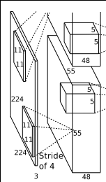

```protobuf
layer {
  name: "conv1"
  type: "Convolution"
  bottom: "data"
  top: "conv1"
  param {
    lr_mult: 1
    decay_mult: 1
  }
  param {
    lr_mult: 2
    decay_mult: 0
  }
  convolution_param {
    num_output: 96
    kernel_size: 11
    stride: 4
    weight_filler {
      type: "gaussian"
      std: 0.01
    }
    bias_filler {
      type: "constant"
      value: 0
    }
  }
}
```

1. 输入Input的图像规格：224\*224\*3（RGB图像），实际上会经过预处理变为227\*227\*3

2. 使用的96个大小规格为11*11的过滤器filter，或者称为卷积核，进行特征提取，(ps:图上之所以看起来是48个是由于采用了2个GPU服务器处理，每一个服务器上承担了48个)。

   需要特别提一下的是，原始图片为RBG图像，也就是三个通道的，我们这96个过滤器也是三通道的，也就是我们使用的实际大小规格为11\*11\*3，也就是原始图像是彩色的，我们提取到的特征也是彩色的，在卷积的时候，我们会依据这个公式来提取特征图：`[img_size - filter_size] / stride +1 = new_feture_size`，所以这里我们得到的特征图大小为：`[227 - 11] / 4 + 1 = 55` 注意 `[]` 表示向下取整.。我们得到的新的特征图规格为55\*55，注意这里提取到的特征图是彩色的。这样得到了96个 55 * 55大小的特征图了，并且是RGB通道的。

3.  使用 RELU 激励函数，来确保特征图的值范围在合理范围之内，比如{0,1}，{0,255}

    ```protobuf
   layer {
     name: "relu1"
     type: "ReLU"
     bottom: "conv1"
     top: "conv1"
   }
    ```

4.  降采样处理（pool层也称为池化），如下图：

   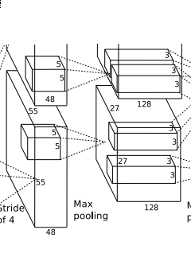

   ```protobuf
   layer {
     name: "pool1"
     type: "Pooling"
     bottom: "conv1"
     top: "pool1"
     pooling_param {
       pool: MAX
       kernel_size: 3
       stride: 2
     }
   }
   ```

   官方给的是内核是3\*3大小，该过程就是3\*3区域的数据进行处理（求均值/最大/小值），通过降采样处理，我们可以得到 `[55 - 3] / 2 + 1 =27`，也就是得到96个27\*27的特征图,然后再以这些特征图，为输入数据，进行第二次卷积。

5. 使用LRN，中文翻译为局部区域归一化，对降采样的特征图数据进行处理，其中LRN又存在两种模式，源码默认的是 ACROSS_CHANNELS ，跨通道归一化（这里我称之为弱化），local_size：5（默认值），表示局部弱化在相邻五个特征图间中求和并且每一个值除去这个和。

   ```protobuf
   layer {
     name: "norm1"
     type: "LRN"
     bottom: "pool1"
     top: "norm1"
     lrn_param {
       local_size: 5
       alpha: 0.0001
       beta: 0.75
     }
   }
   ```

### 2. conv2 层


```protobuf
	layer {
  name: "conv2"
  type: "Convolution"
  bottom: "norm1"
  top: "conv2"
  param {
    lr_mult: 1
    decay_mult: 1
  }
  param {
    lr_mult: 2
    decay_mult: 0
  }
  convolution_param {
    num_output: 256
    pad: 2
    kernel_size: 5
    group: 2
    weight_filler {
      type: "gaussian"
      std: 0.01
    }
    bias_filler {
      type: "constant"
      value: 1
    }
  }
}
```

conv2 和 conv1 不同，conv2 中使用 256 个 5 * 5 大小的过滤器 filter 对96 * 27 * 27个特征图，进行进一步提取特征，但是处理的方式和conv1不同，过滤器是对96个特征图中的某几个特征图中相应的区域乘以相应的权重，然后加上偏置之后所得到区域进行卷积，比如过滤器中的一个点X11 ，如X11 * new_X11，需要和96个特征图中的1,2,7特征图中的X11进行卷积, `new_X11 = 1_X_11 * 1_W_11 + 2_X_11 * 2_W_11 + 7_X_11 * 7_W_11 + Bias`，经过这样卷积之后，然后宽度高度两边都填充2像素，会的到一个新的256个特征图。特征图的大小为：`[27 + 2 * 2 - 5 ] / 1 + 1 = 27`，也就是会有256个27 * 27大小的特征图.

  然后进行ReLU操作.

```protobuf
	layer {
  name: "relu2"
  type: "ReLU"
  bottom: "conv2"
  top: "conv2"
}
```

再进行降采样处理，如下：

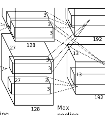

```protobuf
layer {
  name: "pool2"
  type: "Pooling"
  bottom: "conv2"
  top: "pool2"
  pooling_param {
    pool: MAX
    kernel_size: 3
    stride: 2
  }

layer {
  name: "norm2"
  type: "LRN"
  bottom: "pool2"
  top: "norm2"
  lrn_param {
    local_size: 5
    alpha: 0.0001
    beta: 0.75
  }
}
```

得到：`[27 - 3] / 2 + 1 = 13` 也就是得到 256 个 13 * 13 大小的特征图。

### 3. conv3层

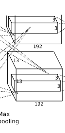

```protobuf
layer {
  name: "conv3"
  type: "Convolution"
  bottom: "norm2"
  top: "conv3"
  param {
    lr_mult: 1
    decay_mult: 1
  }
  param {
    lr_mult: 2
    decay_mult: 0
  }
  convolution_param {
    num_output: 384
    pad: 1
    kernel_size: 3
    weight_filler {
      type: "gaussian"
      std: 0.01
    }
    bias_filler {
      type: "constant"
      value: 0
    }
  }
}


layer {
  name: "relu3"
  type: "ReLU"
  bottom: "conv3"
  top: "conv3"
}
```

得到 `[13 + 2 * 1 - 3] / 1 + 1 = 13`，384个 13 * 13 的新特征图。

conv3 没有使用降采样层

### 4. conv4层

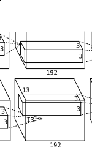

```protobuf

layer {
  name: "conv4"
  type: "Convolution"
  bottom: "conv3"
  top: "conv4"
  param {
    lr_mult: 1
    decay_mult: 1
  }
  param {
    lr_mult: 2
    decay_mult: 0
  }
  convolution_param {
    num_output: 384
    pad: 1
    kernel_size: 3
    group: 2
    weight_filler {
      type: "gaussian"
      std: 0.01
    }
    bias_filler {
      type: "constant"
      value: 1
    }
  }
}

layer {
  name: "relu4"
  type: "ReLU"
  bottom: "conv4"
  top: "conv4"
}
```

依旧得到 `[13 + 2 * 1 - 3] / 1 + 1 = 13` 384 个13 * 13 的新特征图。

conv4 没有使用降采样层

### 5. conv5层

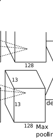

```protobuf

layer {
  name: "conv5"
  type: "Convolution"
  bottom: "conv4"
  top: "conv5"
  param {
    lr_mult: 1
    decay_mult: 1
  }
  param {
    lr_mult: 2
    decay_mult: 0
  }
  convolution_param {
    num_output: 256
    pad: 1
    kernel_size: 3
    group: 2
    weight_filler {
      type: "gaussian"
      std: 0.01
    }
    bias_filler {
      type: "constant"
      value: 1
    }
  }
}

layer {
  name: "relu5"
  type: "ReLU"
  bottom: "conv5"
  top: "conv5"

```

得到 256 个 13 * 13 个特征图

降采样层防止过拟合

```protobuf
layer {
  name: "pool5"
  type: "Pooling"
  bottom: "conv5"
  top: "pool5"
  pooling_param {
    pool: MAX
    kernel_size: 3
    stride: 2
  }
}
```

得到 256 个 `[13 - 3] / 2 + 1 = 6` 256 个 6 * 6 到校的特征图。

### 6. fc6全连接层

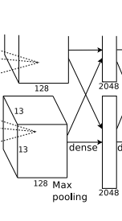

```protobuf
layer {
  name: "fc6"
  type: "InnerProduct"
  bottom: "pool5"
  top: "fc6"
  param {
    lr_mult: 1
    decay_mult: 1
  }
  param {
    lr_mult: 2
    decay_mult: 0
  }
  inner_product_param {
    num_output: 4096
    weight_filler {
      type: "gaussian"
      std: 0.005
    }
    bias_filler {
      type: "constant"
      value: 1
    }
  }
}
layer {
  name: "relu6"
  type: "ReLU"
  bottom: "fc6"
  top: "fc6"
}
layer {
  name: "drop6"
  type: "Dropout"
  bottom: "fc6"
  top: "fc6"
  dropout_param {
    dropout_ratio: 0.5
  }
}
```

 这里使用4096个神经元，对256个大小为 6 * 6 特征图，进行一个全链接，也就是将 6 * 6 大小的特征图，进行卷积变为一个特征点，然后对于4096个神经元中的一个点，是由256个特征图中某些个特征图卷积之后得到的特征点乘以相应的权重之后，再加上一个偏置得到。

再进行一个dropout随机从4096个节点中丢掉一些节点信息（也就是值清0），然后就得到新的4096个神经元。

### 7. fc7全连接层

```protobuf
layer {
  name: "fc7"
  type: "InnerProduct"
  bottom: "fc6"
  top: "fc7"
  param {
    lr_mult: 1
    decay_mult: 1
  }
  param {
    lr_mult: 2
    decay_mult: 0
  }
  inner_product_param {
    num_output: 4096
    weight_filler {
      type: "gaussian"
      std: 0.005
    }
    bias_filler {
      type: "constant"
      value: 1
    }
  }
}
layer {
  name: "relu7"
  type: "ReLU"
  bottom: "fc7"
  top: "fc7"
}
layer {
  name: "drop7"
  type: "Dropout"
  bottom: "fc7"
  top: "fc7"
  dropout_param {
    dropout_ratio: 0.5
  }
}
```

和 fc6 类似

### 8. fc8全连接层

```protobuf
layer {
  name: "fc8"
  type: "InnerProduct"
  bottom: "fc7"
  top: "fc8"
  param {
    lr_mult: 1
    decay_mult: 1
  }
  param {
    lr_mult: 2
    decay_mult: 0
  }
  inner_product_param {
    num_output: 1000
    weight_filler {
      type: "gaussian"
      std: 0.01
    }
    bias_filler {
      type: "constant"
      value: 0
    }
  }
}
layer {
  name: "accuracy"
  type: "Accuracy"
  bottom: "fc8"
  bottom: "label"
  top: "accuracy"
  include {
    phase: TEST
  }
}
layer {
  name: "loss"
  type: "SoftmaxWithLoss"
  bottom: "fc8"
  bottom: "label"
  top: "loss"
}
```

采用的是1000个神经元，然后对fc7中4096个神经元进行全链接，然后会通过高斯过滤器，得到1000个float型的值，也就是我们所看到的预测的可能性。

如果是训练模型的话，会通过标签label进行对比误差，然后求解出残差，再通过链式求导法则，将残差通过求解偏导数逐步向上传递，并将权重进行推倒更改，类似与BP网络思虑，然后会逐层逐层的调整权重以及偏置。

## DFD(data flow diagram)

1. conv1阶段DFD（data flow diagram）：

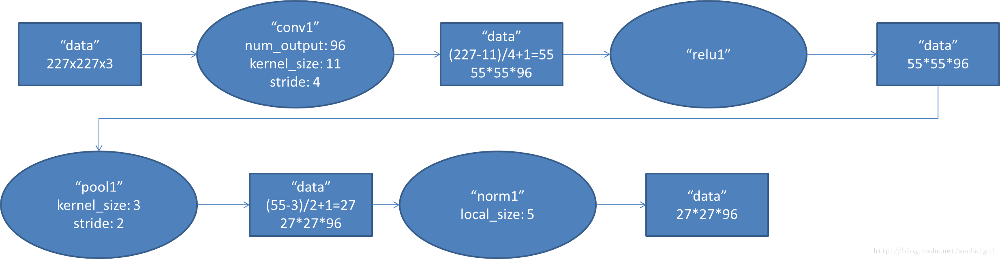

2. conv2阶段DFD（data flow diagram）：

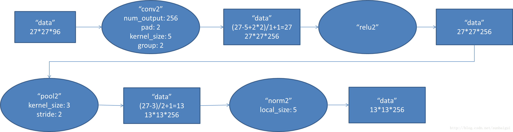

3. conv3阶段DFD（data flow diagram）：

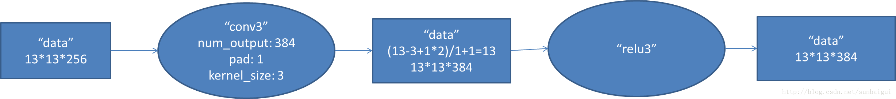

4. conv4阶段DFD（data flow diagram）：

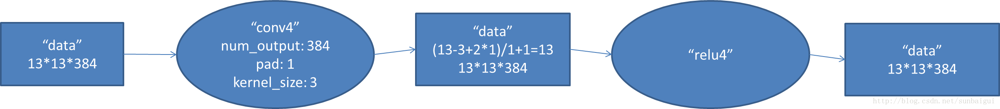

5. conv5阶段DFD（data flow diagram）：

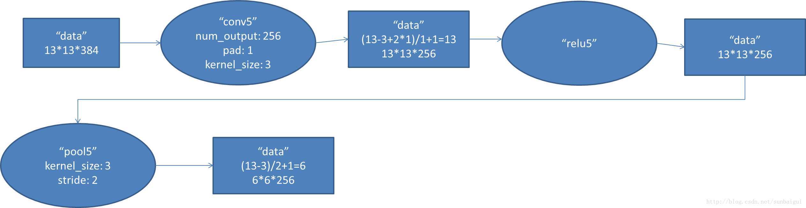

6. fc6阶段DFD（data flow diagram）：

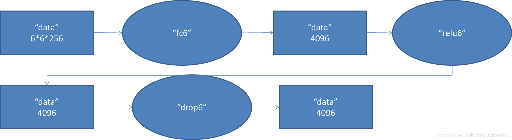

7. fc7阶段DFD（data flow diagram）：

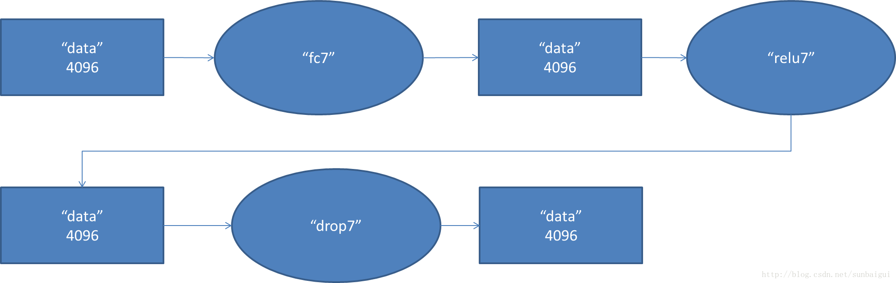

8. fc8阶段DFD（data flow diagram）：

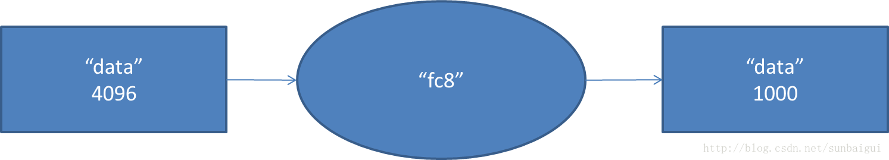

## 参考文献

- ImageNet https://papers.nips.cc/paper/4824-imagenet-classification-with-deep-convolutional-neural-networks.pdf
- BP神经网络 https://www.zhihu.com/question/27239198
- https://www.cnblogs.com/gongxijun/p/6027747.html
- 


 

 

 