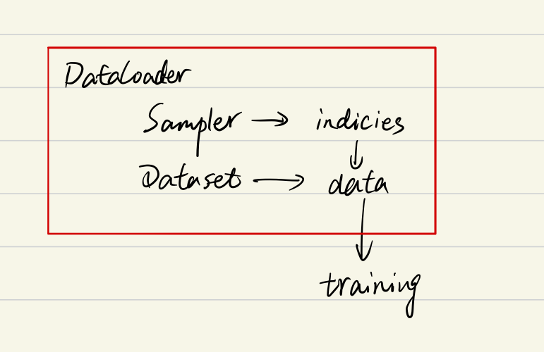

# Pytorch DataLoader详解

> https://www.zdaiot.com/MLFrameworks/Pytorch/Pytorch%20DataLoader%E8%AF%A6%E8%A7%A3/

因为Few-Shot Learning问题要读取数据组成task，因此如何读取数据组成一个task是一个问题。之前看到好几个Pytorch版本的代码，虽然也实现了读取数据组成task，但是逻辑较为复杂且复杂度较高。最近看到了[这个代码](https://github.com/wyharveychen/CloserLookFewShot)，感觉实现的方法特别高级，定制性也很强，但是需要比较深入的理解Pytorch DataLoader的原理。所以便有了这篇文章。

### Pytorch读取数据流程

Pytorch读取数据虽然特别灵活，但是还是具有特定的流程的，它的操作顺序为：

- 创建一个 Dataset 对象，该对象如果现有的`Dataset`不能够满足需求，我们也可以自定义`Dataset`，通过继承`torch.utils.data.Dataset`。在继承的时候，需要override三个方法。
    - `__init__`： 用来初始化数据集
    - `__getitem__`：给定索引值，返回该索引值对应的数据；它是python built-in方法，其主要作用是能让该类可以像list一样通过**索引值**对数据进行访问
    - `__len__`：用于`len(Dataset)`时能够返回大小
- 创建一个 DataLoader 对象
- 不停的 循环 这个 DataLoader 对象

对我们来说，本篇文章的侧重点在于介绍 DataLoader，因此对于自定义 Dataset，这里不作详细的说明。

### DataLoader参数

先介绍一下DataLoader(object)的参数：

- `dataset` (Dataset): 传入的数据集
- `batch_size` (int, optional): 每个batch有多少个样本
- `shuffle` (bool, optional): 在每个epoch开始的时候，对数据进行重新排序
- `sampler` (Sampler, optional): **自定义从数据集中取样本的策略**，如果指定这个参数，那么shuffle必须为False
- `batch_sampler` (Sampler, optional): 与sampler类似，但是**一次只返回一个batch的indices（索引）**，需要注意的是，一旦指定了这个参数，那么batch_size,shuffle,sampler,drop_last就不能再指定了 (互斥——Mutually exclusive)
- `num_workers` (int, optional): 这个参数决定了有几个进程来处理data loading。**0意味着所有的数据都会被load进主进程**。 (默认为0)
- `collate_fn` (callable, optional): 将一个list的sample组成一个mini-batch的函数；通俗来说就是将一个batch的数据进行合并操作。默认的`collate_fn`是将img和label分别合并成imgs和labels，所以如果你的`__getitem__`方法只是返回 `img, label`,那么你可以使用默认的`collate_fn`方法，但是如果你每次读取的数据有`img, box, label`等等，那么你就需要自定义`collate_fn`来将对应的数据合并成一个batch数据，这样方便后续的训练步骤。
- `pin_memory` (bool, optional)： 如果设置为True，那么data loader将会在返回它们之前，将tensors拷贝到CUDA中的固定内存（CUDA pinned memory）中.
- `drop_last` (bool, optional): 如果设置为True：这个是对最后的未完成的batch来说的，比如你的batch_size设置为64，而一个epoch只有100个样本，那么训练的时候后面的36个就被扔掉了…如果为False (默认)，那么会继续正常执行，只是最后的batch_size会小一点。
- `timeout` (numeric, optional): 如果是正数，表明等待从worker进程中收集一个batch等待的时间，若超出设定的时间还没有收集到，那就不收集这个内容了。这个numeric应总是大于等于0。默认为0
- `worker_init_fn` (callable, optional): 每个worker初始化函数 If not None, this will be called on each worker subprocess with the worker id (an int in [0, num_workers - 1]) as input, after seeding and before data loading. (default: None)

这里，我们需要重点关注`sampler`和`batch_sampler`这两个参数。在介绍这两个参数之前，我们需要首先了解一下DataLoader，Sampler和Dataset三者关系。

### DataLoader, Sampler和Dataset

首先我们看一下[DataLoader.next](https://github.com/pytorch/pytorch/blob/0b868b19063645afed59d6d49aff1e43d1665b88/torch/utils/data/dataloader.py#L557-L563)的源代码长什么样,为方便理解我只选取了`num_works`为0的情况 (`num_works`简单理解就是能够并行化地读取数据).

```python
class DataLoader(object):
    ...
    
    def __next__(self):
        if self.num_workers == 0:  
            indices = next(self.sample_iter)  # Sampler
            batch = self.collate_fn([self.dataset[i] for i in indices]) # Dataset
            if self.pin_memory:
                batch = _utils.pin_memory.pin_memory_batch(batch)
            return batch
```

在阅读上面代码前, 我们可以假设我们的数据是一组图像, 每一张图像对应一个index, 那么如果我们要读取数据就只需要对应的index即可, 即上面代码中的`indices`, 而选取index的方式有多种, 有按顺序的, 也有乱序的, 所以这个工作需要`Sampler`完成, 现在你不需要具体的细节, 后面会介绍, 你只需要知道`DataLoader`和`Sampler`在这里产生关系.

那么Dataset和DataLoader在什么时候产生关系呢? 没错就是下面一行. 我们已经拿到了`indices`, 那么下一步我们只需要根据index对数据进行读取即可了.

再下面的`if`语句的作用简单理解就是, 如果`pin_memory=True`, 那么Pytorch会采取一系列操作把数据拷贝到GPU, 总之就是为了加速.

综上可以知道`DataLoader`, `Sampler`和`Dataset`三者关系如下:



### sampler和batch_sampler

通过上面对DataLoader参数的介绍，发现参数里面有两种sampler: `sampler`和`batch_sampler`, 都默认为`None`. 前者的作用是生成一系列的index, 而batch_sampler则是将sampler生成的indices打包分组, 得到一个又一个batch的index. 例如下面示例中, `BatchSampler`将`SequentialSampler`生成的index按照指定的batch size分组.

```python
from torch.utils.data import SequentialSampler, BatchSampler

SequentialSampler(range(10))                                            
Out[5]: <torch.utils.data.sampler.SequentialSampler at 0x7fe1631de908>
    
list(BatchSampler(SequentialSampler(range(10)), batch_size=3, drop_last=False))
Out[6]: [[0, 1, 2], [3, 4, 5], [6, 7, 8], [9]]
    
a = BatchSampler(SequentialSampler(range(10)), batch_size=3, drop_last=False)
b = iter(a)
next(b)
Out[9]: [0, 1, 2]
next(b)
Out[10]: [3, 4, 5]
b = iter(a)
next(b)
Out[12]: [0, 1, 2]
```

从这个例子中可以看出，当`BatchSampler`中的数据取完了，再使用`iter(a)`得到新的迭代器对象即可，不需要再次实例化类。

Pytorch中已经实现的`Sampler`有如下几种 (均在`torch.utils.data`下):

- `SequentialSampler`(若`shuffle=False`且未指定sampler, 默认使用)
- `RandomSampler` (若`shuffle=True`且未指定sampler, 默认使用)
- `WeightedSampler`
- `SubsetRandomSampler`

Pytorch中已经实现的 `batch_sampler`为`BatchSampler`（在`torch.utils.data`下，默认使用）

需要注意的是DataLoader的部分初始化参数之间存在互斥关系, 这个你可以通过阅读[源码](https://github.com/pytorch/pytorch/blob/0b868b19063645afed59d6d49aff1e43d1665b88/torch/utils/data/dataloader.py#L157-L182)更深地理解, 这里只做总结：

- 如果你自定义了`batch_sampler`, 那么这些参数都必须使用默认值: `batch_size`, `shuffle`,`sampler`,`drop_last`.

- 如果你自定义了`sampler`, 那么`shuffle`需要设置为`False`

- 如果`sampler`和``batch_sampler`都为`None`, 那么`batch_sampler`使用Pytorch已经实现好的`BatchSampler`, 而`sampler`分两种情况：

    - 若`shuffle=True`, 则`sampler=RandomSampler(dataset)`
    - 若`shuffle=False`, 则`sampler=SequentialSampler(dataset)`

### 源码解析

首先, 大概扫一下`DataLoader`的代码:

```python
class DataLoader(object):
    __initialized = False

    def __init__(self, dataset, batch_size=1, shuffle=False, sampler=None, batch_sampler=None,
                 num_workers=0, collate_fn=default_collate, pin_memory=False, drop_last=False,
				 timeout=0, worker_init_fn=None):
				 
	        self.dataset = dataset
	        self.batch_size = batch_size
			self.num_workers = num_workers
			...
			
	        if sampler is not None and shuffle:
	            raise ValueError('sampler option is mutually exclusive with "shuffle"')
	        ...
	                if batch_sampler is None:
            if sampler is None:
                if shuffle:
                    sampler = RandomSampler(dataset)
                else:
                    sampler = SequentialSampler(dataset)
            batch_sampler = BatchSampler(sampler, batch_size, drop_last)

	        self.sampler = sampler
	        self.batch_sampler = batch_sampler
			self.__initialized = True
	 ...
	 def __iter__(self):
        return _DataLoaderIter(self)
     ...
```

这里我们主要看`__init__()`和`__iter__()`:

1. 数据的shuffle和batch处理
    - RandomSampler(dataset)
    - SequentialSampler(dataset)
    - BatchSampler(sampler, batch_size, drop_last)

2. 因为DataLoader只有`__iter__()`而没有实现`__next__()`, 所以DataLoader是一个iterable而不是iterator. 这个iterator的实现在`_DataLoaderIter`中.

### RandomSampler(dataset) and SequentialSampler(dataset)

这两个类的实现是在`dataloader.py`的同级目录下的`torch/utils/data/sampler.py`

`sampler.py`中实现了一个父类Sampler，以及SequentialSampler，RandomSampler和BatchSampler等五个继承Sampler的子类

这里面的Sampler的实现是用C/C++实现的, 这里的细节暂且不表.

我们这里需要知道的是: 对每个采样器, 都需要提供`__iter__`方法 (表示数据遍历的方式) 和`__len__`方法 (用以返回数据的长度).

```python
import torch


class Sampler(object):
    r"""Base class for all Samplers.
    Every Sampler subclass has to provide an __iter__ method, providing a way
    to iterate over indices of dataset elements, and a __len__ method that
    returns the length of the returned iterators.
    .. note:: The :meth:`__len__` method isn't strictly required by
    	:class:`~torch.utils.data.DataLoader`, but is expected in any
    	calculation involving the length of a :class:`~torch.utils.data.DataLoader`.
    """

    def __init__(self, data_source):
        pass

    def __iter__(self):
        raise NotImplementedError

    def __len__(self):
        raise NotImplementedError


class SequentialSampler(Sampler):
    r"""Samples elements sequentially, always in the same order.
    Arguments:
        data_source (Dataset): dataset to sample from
    """

    def __init__(self, data_source):
        self.data_source = data_source

    def __iter__(self):
        return iter(range(len(self.data_source)))

    def __len__(self):
        return len(self.data_source)


class RandomSampler(Sampler):
    r"""Samples elements randomly, without replacement.
    Arguments:
        data_source (Dataset): dataset to sample from
    """

    def __init__(self, data_source):
        self.data_source = data_source

    def __iter__(self):
        return iter(torch.randperm(len(self.data_source)).tolist())

    def __len__(self):
        return len(self.data_source)


if __name__ == "__main__":
    print(list(RandomSampler(range(10))))
    print(list(SequentialSampler(range(10))))
    
    a = SequentialSampler(range(10))
    
    from collections import Iterable
    print(isinstance(a, Iterable))
    from collections import Iterator
    print(isinstance(a, Iterator))
    
    for x in SequentialSampler(range(10)):
        print(x)
    
    print(next(a))
    print(next(iter(a)))
```

输出结果为：

```python
[3, 7, 5, 8, 9, 0, 2, 4, 1, 6]
[0, 1, 2, 3, 4, 5, 6, 7, 8, 9]
True
False
0
1
2
3
4
5
6
7
8
9
TypeError: 'SequentialSampler' object is not an iterator
0
```

可以看出`RandomSampler`等方法返回的就是`DataSet`中的**索引位置**(indices)，其中，在子类中的`__iter__`方法中，需要返回的是`iter(xxx)`（即**iterator**）的形式：


```python
#### 以下两个代码是等价的
for data in dataloader:
    ...
#### 等价与
iters = iter(dataloader)
while 1:
    try:
        next(iters)
    except StopIteration:
        break
```

此外，`torch.randperm()`的用法如下：


最后，我们再理解一下这些类中间的`__iter__`函数，该函数的返回值为iterator对象，可以使用for循环或者`next()`函数**依次**访问该迭代器对象中的每一个元素。但是这些类是可迭代类并不是迭代器类，所以上例中的实例对象`a`只能使用for循环访问`__iter__`函数返回的迭代器对象，而不能直接使用`next()`函数，需要使用`iter()`函数得到`__iter__`函数返回的迭代器对象。如下所示，可以看到`iter(a)`后得到的结果为`range_iterator`，也就是`__iter__`函数返回的迭代器对象。

```python
a
Out[74]: <__main__.SequentialSampler at 0x7fa26c1d7898>

iter(a)
Out[75]: <range_iterator at 0x7fa26c1cf960>
```

### BatchSampler(Sampler)

`BatchSampler`是wrap一个sampler，并生成mini-batch的索引(indices)的方式。代码如下所示：

```python
class BatchSampler(Sampler):
    r"""Wraps another sampler to yield a mini-batch of indices.
    Args:
        sampler (Sampler): Base sampler.
        batch_size (int): Size of mini-batch.
        drop_last (bool): If ``True``, the sampler will drop the last batch if
            its size would be less than ``batch_size``
    Example:
        >>> list(BatchSampler(SequentialSampler(range(10)), batch_size=3, drop_last=False))
        [[0, 1, 2], [3, 4, 5], [6, 7, 8], [9]]
        >>> list(BatchSampler(SequentialSampler(range(10)), batch_size=3, drop_last=True))
        [[0, 1, 2], [3, 4, 5], [6, 7, 8]]
    """

    def __init__(self, sampler, batch_size, drop_last):
        if not isinstance(sampler, Sampler):
            raise ValueError("sampler should be an instance of "
                             "torch.utils.data.Sampler, but got sampler={}"
                             .format(sampler))
        if not isinstance(batch_size, _int_classes) or isinstance(batch_size, bool) or \
                batch_size <= 0:
            raise ValueError("batch_size should be a positive integeral value, "
                             "but got batch_size={}".format(batch_size))
        if not isinstance(drop_last, bool):
            raise ValueError("drop_last should be a boolean value, but got "
                             "drop_last={}".format(drop_last))
        self.sampler = sampler
        self.batch_size = batch_size
        self.drop_last = drop_last

    def __iter__(self):
        batch = []
        # 一旦达到batch_size的长度，说明batch被填满，就可以yield出去了
        for idx in self.sampler:
            batch.append(idx)
            if len(batch) == self.batch_size:
                yield batch
                batch = []
        if len(batch) > 0 and not self.drop_last:
            yield batch

    def __len__(self):
        # 比如epoch有100个样本，batch_size选择为64，那么drop_last的结果为1，不drop_last的结果为2
        if self.drop_last:
            return len(self.sampler) // self.batch_size
        else:
            return (len(self.sampler) + self.batch_size - 1) // self.batch_size
        
if __name__ == "__main__":
	print(list(BatchSampler(SequentialSampler(range(10)), batch_size=3, drop_last=False)))
	# [[0, 1, 2], [3, 4, 5], [6, 7, 8], [9]]
	print(list(BatchSampler(SequentialSampler(range(10)), batch_size=3, drop_last=True)))
	# [[0, 1, 2], [3, 4, 5], [6, 7, 8]]
```

这里主要看`__iter__`方法，可以看到，代码的思路很清楚明白的展示了`batch indices`的是如何取出的。要想理解该方法，最重要的是对于`yield`关键字的理解。之前我已经有一篇文章解释过`yield`关键字了。这里只说结论：`yield`就是`return`返回一个值，并且记住这个返回的位置，下次迭代就从这个位置后开始；同时包含`yield`的函数为生成器（生成器是迭代器对象），当直接调用该函数的时候，会返回一个生成器。而生成器是迭代器对象，正好对应于前面所述的Sample对象的`__iter__(self)`函数，**返回值需要是迭代器对象**。

对于`BatchSampler`类而言，只含有`__iter__`含义，但是不含有`__next__`函数，所以它是一个可迭代类但是不是一个迭代器类。因此只能使用for循环，不能使用`next()`函数。若想使用`next()`函数，需要使用`iter()`函数作用于`BatchSampler`类的实例，这样就可以得到`__iter__`函数的返回值即迭代器对象。其实对于含有`__iter__`的类，使用for循环遍历其数据的时候，内部是内置了`__iter__`函数了。

### 总结

假设某个数据集有100个样本，`batch size=4`时，以`SequentialSampler`和`BatchSampler`为例，Pytorch读取数据的时候，主要过程是这样的：

- `SequentialSampler`类中的`__iter__`方法返回`iter(range(100))`迭代器对象，对其进行遍历时，会依次得到`range(100)`中的每一个值，也就是100个样本的下标索引。
- `BatchSampler`类中`__iter__`使用for循环访问`SequentialSampler`类中的`__iter__`方法返回的迭代器对象，也就是`iter(range(100))`。当达到batch size大小的时候，就使用yield方法返回。而含有yield方法为生成器也是一个迭代器对象，因此`BatchSampler`类中`__iter__`方法返回的也是一个迭代器对象，对其进行遍历时，会依次得到batch size大小的样本的下标索引。
- `DataLoaderIter`类会依次遍历类中的`BatchSampler`类中`__iter__`方法返回的迭代器对象，得到每个batch的数据下标索引。

### 参考

> [一文弄懂Pytorch的DataLoader, DataSet, Sampler之间的关系](https://zhuanlan.zhihu.com/p/76893455)
>
> [PyTorch学习笔记(6)——DataLoader源代码剖析](https://blog.csdn.net/g11d111/article/details/81504637)
>
> [彻底理解Python中的yield](https://www.jianshu.com/p/d09778f4e055)