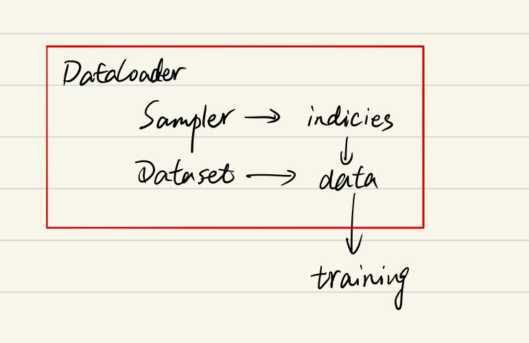

# 一文弄懂Pytorch的DataLoader, DataSet, Sampler之间的关系

> 以下内容都是针对Pytorch 1.0-1.1介绍。
>
> 很多文章都是从Dataset等对象自下往上进行介绍，但是对于初学者而言，其实这并不好理解，因为有的时候会不自觉地陷入到一些细枝末节中去，而不能把握重点，所以本文将会**自上而下**地对Pytorch数据读取方法进行介绍。

### 自上而下理解三者关系

首先我们看一下[DataLoader.next](https://github.com/pytorch/pytorch/blob/0b868b19063645afed59d6d49aff1e43d1665b88/torch/utils/data/dataloader.py#L557-L563)的源代码长什么样,为方便理解我只选取了`num_works`为0的情况 (`num_works`简单理解就是能够并行化地读取数据).

```python
class DataLoader(object):
	...
	
    def __next__(self):
        if self.num_workers == 0:  
            indices = next(self.sample_iter)  # Sampler
            batch = self.collate_fn([self.dataset[i] for i in indices]) # Dataset
            if self.pin_memory:
                batch = _utils.pin_memory.pin_memory_batch(batch)
            return batch
```

在阅读上面代码前, 我们可以假设我们的数据是一组图像, 每一张图像对应一个index, 那么如果我们要读取数据就只需要对应的index即可, 即上面代码中的`indices`, 而选取index的方式有多种, 有按顺序的, 也有乱序的, 所以这个工作需要`Sampler`完成, 现在你不需要具体的细节, 后面会介绍, 你只需要知道`DataLoader`和`Sampler`在这里产生关系.

那么Dataset和DataLoader在什么时候产生关系呢? 没错就是下面一行. 我们已经拿到了`indices`, 那么下一步我们只需要根据index对数据进行读取即可了.

再下面的`if`语句的作用简单理解就是, 如果`pin_memory=True`, 那么Pytorch会采取一系列操作把数据拷贝到GPU, 总之就是为了加速.

综上可以知道`DataLoader`, `Sampler`和`Dataset`三者关系如下:



### Sample

#### 参数传递

要更加细致地理解`Sampler`原理, 我们需要先阅读一下`DataLoader`的源代码, 如下:

```python
class DataLoader(object):
    def __init__(self, dataset, batch_size=1, shuffle=False, sampler=None,
                 batch_sampler=None, num_workers=0, collate_fn=default_collate,
                 pin_memory=False, drop_last=False, timeout=0,
                 worker_init_fn=None)
```

可以看到初始化参数里有两种sampler: `sampler`和`batch_sampler`, 都默认为`None`. 前者的作用是生成一系列的index, 而batch_sampler则是将sampler生成的indices打包分组, 得到一个又一个batch的index. 例如下面示例中, `BatchSampler`将`SequentialSampler`生成的index按照指定的batch size分组.

```python
>>>in : list(BatchSampler(SequentialSampler(range(10)), batch_size=3, drop_last=False))
>>>out: [[0, 1, 2], [3, 4, 5], [6, 7, 8], [9]]
```

Pytorch中已经实现的`Sampler`有如下几种：

- `SequentialSampler`
- `RandomSampler`
- `WeightedSampler`
- `SubsetRandomSampler`

需要注意的是DataLoader的部分初始化参数之间存在互斥关系, 这个你可以通过阅读[源码](https://github.com/pytorch/pytorch/blob/0b868b19063645afed59d6d49aff1e43d1665b88/torch/utils/data/dataloader.py#L157-L182)更深地理解, 这里只做总结：

- 如果你自定义了`batch_sampler`, 那么这些参数都必须使用默认值: `batch_size`, `shuffle`,`sampler`,`drop_last`.

- 如果你自定义了`sampler`, 那么`shuffle`需要设置为`False`

- 如果`sampler`和``batch_sampler`都为`None`, 那么`batch_sampler`使用Pytorch已经实现好的`BatchSampler`, 而`sampler`分两种情况：

    - 若`shuffle=True`, 则`sampler=RandomSampler(dataset)`
- 若`shuffle=False`, 则`sampler=SequentialSampler(dataset)`

#### 如何自定义Sample和BatchSample？

仔细查看源代码其实可以发现, 所有采样器其实都继承自同一个父类, 即`Sampler`,其代码定义如下: 

```python
class Sampler(object):
    r"""Base class for all Samplers.
    Every Sampler subclass has to provide an :meth:`__iter__` method, providing a
    way to iterate over indices of dataset elements, and a :meth:`__len__` method
    that returns the length of the returned iterators.
    .. note:: The :meth:`__len__` method isn't strictly required by
              :class:`~torch.utils.data.DataLoader`, but is expected in any
              calculation involving the length of a :class:`~torch.utils.data.DataLoader`.
    """

    def __init__(self, data_source):
        pass

    def __iter__(self):
        raise NotImplementedError
		
    def __len__(self):
        return len(self.data_source)
```

所以你要做的就是定义好`__iter__(self)`函数, 不过要注意的是该函数的返回值需要是可迭代的. 例如`SequentialSampler`返回的是`iter(range(len(self.data_source)))`.

另外`BatchSampler`与其他`Sampler`的主要区别是它需要将`Sampler`作为参数进行打包, 进而每次迭代返回以`batch size`为大小的index列表。也就是说在后面的读取数据过程中使用的都是`batch sampler`.

### Dataset

Dataset定义方式如下：

```python
class Dataset(object):
	def __init__(self):
		...
		
	def __getitem__(self, index):
		return ...
	
	def __len__(self):
		return ...
```

上面三个方法是最基本的, 其中`__getitem__`是最主要的方法, 它规定了如何读取数据. 但是它又不同于一般的方法, 因为它是python built-in方法, 其主要作用是能让该类可以像list一样通过索引值对数据进行访问. 假如你定义好了一个dataset, 那么你可以直接通过`dataset[0]`来访问第一个数据. 在此之前我一直没弄清楚`__getitem__`是什么作用, 所以一直不知道该怎么进入到这个函数进行调试. 现在如果你想对`__getitem__`方法进行调试, 你可以写一个for循环遍历dataset来进行调试了, 而不用构建`Dataloader`等一大堆东西了, 建议学会使用`ipdb`这个库, 非常实用!!! 以后有时间再写一篇ipdb的使用教程. 另外, 其实我们通过最前面的`Dataloader`的`__next__`函数可以看到`DataLoader`对数据的读取其实就是用了for循环来遍历数据, 不用往上翻了, 我直接复制了一遍, 如下: 

```python
class DataLoader(object): 
    ... 
     
    def __next__(self): 
        if self.num_workers == 0:   
            indices = next(self.sample_iter)  
            batch = self.collate_fn([self.dataset[i] for i in indices]) # this line 
            if self.pin_memory: 
                batch = _utils.pin_memory.pin_memory_batch(batch) 
            return batch
```

我们仔细看可以发现, 前面还有一个`self.collate_fn`方法, 这个是干嘛用的呢? 在介绍前我们需要知道每个参数的意义:

- `indices`: 表示每一个iteration, sampler返回的indices, 即一个batch size大小的索引列表
- `self.dataset[i]`: 前面已经介绍了, 这里就是对第i个数据进行读取操作, 一般来说`self.dataset[i]=(img, label)`

看到这不难猜出`collate_fn`的作用就是将一个batch的数据进行合并操作. 默认的`collate_fn`是将img和label分别合并成imgs和labels, 所以如果你的`__getitem__`方法只是返回 `img, label`, 那么你可以使用默认的`collate_fn`方法, 但是如果你每次读取的数据有`img, box, label`等等, 那么你就需要自定义`collate_fn`来将对应的数据合并成一个batch数据, 这样方便后续的训练步骤.

> https://www.cnblogs.com/marsggbo/p/11308889.html