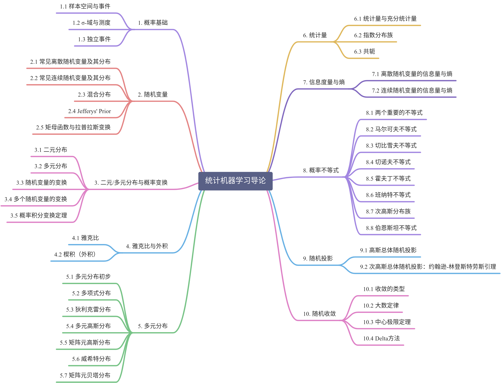

# 0. Introduction

## 0.1 Books

1. Probability and Statistics. Fourth Edition (Morris H. De Groot, Mark J. Schervish)
2. Machine Learning. A probabilistic perspective (Kevin P. Murphy)

## 0.2 机器学习与统计学部分名词对照表

|   Machine Learning    |            Statistic            |
| :-------------------: | :-----------------------------: |
|   Networks / Graphs   |              Model              |
|        weights        |           parameters            |
|       Learning        |      Fitting / Estimation       |
|    Generalization     |            Test Set             |
|  Supervised Learning  |   Regression / Classification   |
| Unsupervised Learning | Density Estimation / Clustering |

## 0.3 History

1. Early: Make computer work $\rightarrow$ Programming, Compiles, Operating System

2. Middle: Make computer useful (data structure + algorithm)

3. Now: Make computer have more applications

## 0.4 Data Science

1. Infrastructure 底层架构

2. Coding 代码

3. Mathematics 数学

## 0.5 SML (Statistics Machine Learning)

> A field that bridges Computation and Statistics, with ties to information theory, signal processing, algorithms, control theory and optimization theory.
>
> 
>
> ​																																			By Micheal Jordan

$$
Machine\ Learning = Matrix + Optimization + Algorithm + Statistics \\
机器学习= 矩阵 + 优化 + 算法 + 统计
$$

## 0.6 Data: $n$ samples and $p$ features

$$
X = 
$$

**Problems:**

1. Dimensionality Reduction: $x_i \in \mathbb{R}^n \rightarrow z_i \in \mathbb{R}^p,\ \ n > p$
    1. Linear Method: $Z = AX$
    2. Unlinear Method: $Z = f(X)$
2. Clustering: K-Class
3. Classification: $y \in \{ 1,2, \dots, K \}$
4. Regression: $y \in \mathbb{R}$
5. Ranking: Isotonic Regression

## 0.7 Machine Learning Method

1. Frequentist View (频率派):

    The Frequentist approach views the model parameters as unknown constant and estimate them by matching the model to the training data. Using an appropriate metric.

    Maximum Likelihood Estimation

2. Bayesian Approach (贝叶斯派):

    贝叶斯派观点认为，模型参数是随机变量，通过给予参数以先验分布 (通常是来自前人经验)，基于贝叶斯定理做最大的后验概率估计。

3. 对比

    对比频率派与贝叶斯派，前者多在做优化 (Optimization)，后者多在做积分。

4. parametrics vs Nonparametrics

    In a parametric model, the number of parameters is fixed, once and for all, irrespective of the number of the training data.

    A nonparametric model is (by define) "not parametric", in the number of parameters is not fixed, but rather grows as the number of training data.