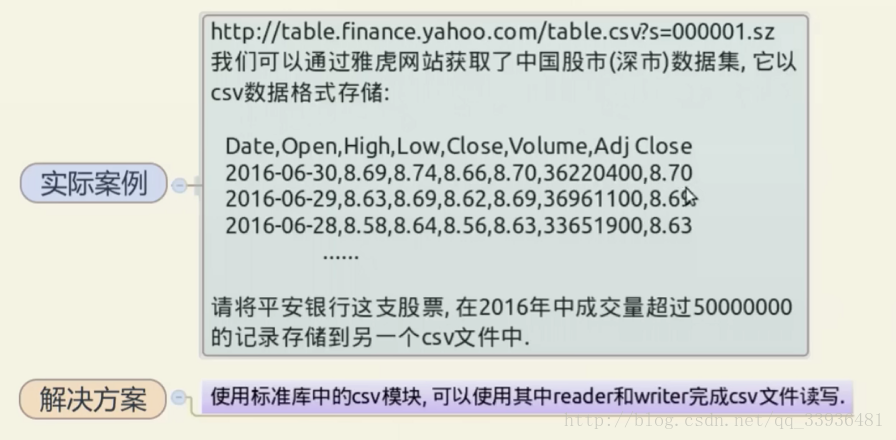
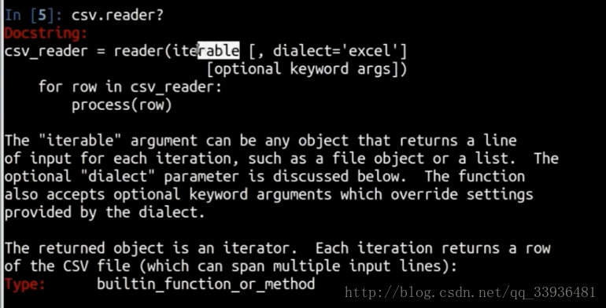
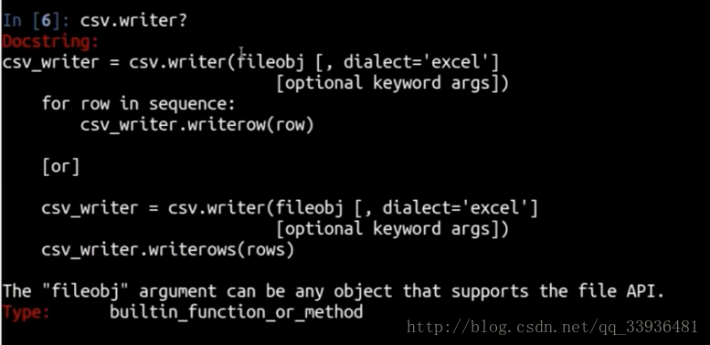
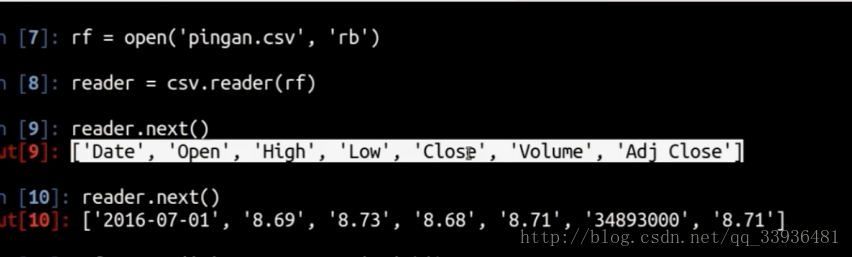

# Python 如何读写 CSV 数据



我们通过csv库 reader 函数和 writer 函数来执行读和写操作。这两个函数都需要传入一个文件对象 





python3 和 python2 的写法有点不一样 



报错：_csv.Error: iterator should return strings, not bytes (did you open the file in text mode?)

```
Sorry, folks, we've got an understanding problem here. CSV files are
typically NOT created by text editors. They are created e.g. by "save as
csv" from a spreadsheet program, or as an output option by some database
query program. They can have just about any character in a field,
including \r and \n. Fields containing those characters should be quoted
(just like a comma) by the csv file producer. A csv reader should be
capable of reproducing the original field division. Here for example is
a dump of a little file I just created using Excel 2003:
...
This sentence in the documentation is NOT an error: """If csvfile is a
file object, it must be opened with the ‘b’ flag on platforms where that
makes a difference."""
```

python 3.5: TypeError: a bytes-like object is required, not ‘str’ 

出现该错误往往是通过 open() 函数打开文本文件时，使用了 `'rb'` 属性，如：fileHandle=open(filename,’rb’),则此时是通过二进制方式打开文件的，所以在后面处理时如果使用了str()函数，就会出现该错误，该错误不会再python2中出现。 

在open()函数中使用 `'r'` 属性，即文本方式读取，而不是 `'rb'` ，以二进制文件方式读取，可以直接解决问题。

```python
import urllib.request
import csv

urllib.request.urlretrieve('http://table.finance.yahoo.com/table.csv?s=000001.sz','pingan.csv')

rf = open('pingan.csv','r')

reader = csv.reader(rf)

print(next(reader))
print('================================')
print(next(reader))
print('================================')
print(next(reader))
print('================================')
```

写入另一个文件：

```python
wf = open('pingan_copy.csv','w')
writer = csv.writer(wf)
writer.writerow(['Date', 'Open', 'High', 'Low', 'Close', 'Volume', 'Adj Close'])
writer.writerow(next(reader))
wf.flush()
```

问题解决：

```python
with open('pingan.csv','r') as rf:
    reader = csv.reader(rf)
    with open('pingan2.csv' ,'w') as wf:
        writer = csv.writer(wf)
        headers = next(reader)
        writer.writerow(headers)
        for row in reader:
            if row[0] < '2016-01-01':
                break
            if int(row[5]) >= int(50000000):
                writer.writerow(row)

print('end')
```