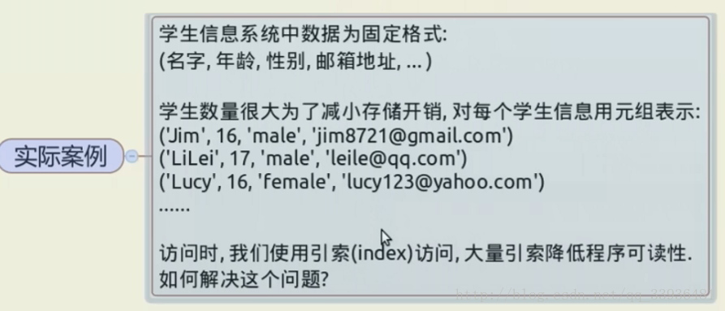
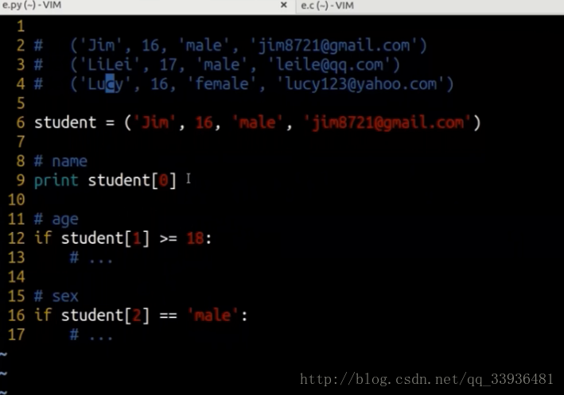

# 如何为元组中的每个元素命名，提高程序可读性





**大量的索引值对程序的维护是不利的，因为不便于阅读。** 

在c语言中，有两种解决方法； 

**解决方法1**： 

c语言中宏定义的方式；

```c++
#define NAME 0
#define AGE 112
```

**解决方法2**： 

c语言的枚举形式；

```c++
enum Student{
    NAME,
    AGE,
    SEX,
}12345
```

**python** 


**方案一：**

```python
student=('eminem','16','male','961737123@qq.com')
# 普通获取
print(student[0])
if student[2] == 'male':
    print('it\'s ok ')
# 方法一
# NAME = 0
# AGE = 1
# SEX = 2
# EMAIL = 3
# 简写
NAME,AGE,SEX,EMAIL = range(4)

print(student[NAME])
if student[SEX] == 'male':
    print('it\'s ok ')
1234567891011121314151617
```

**方案二：**

```python
from collections import namedtuple

student = namedtuple('Student',['name','age','sex','email'])
a = student('eminem','16','male','961737123@qq.com')

print(a.name)
print(isinstance(a,tuple))
```