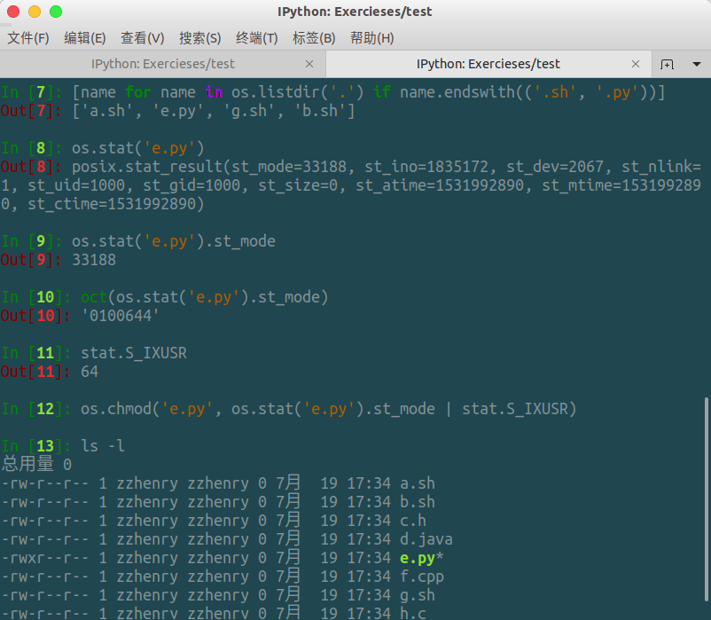

# 如何判断字符串a是否以字符串b开头或结尾

## 实际案例

这样的需求有很多，比如我们可以判断一个网络地址是否以`http`开头或者是否以`ftp`开头

 另外一个例子：

某文件系统目录下有一系列文件：

- quicksort.c

- graph.py

- heap.java

- install.sh

- stack.cpp

  ...

编写程序给其中所有 .sh 文件和 .py 文件加上用户可执行权限。

## 解决方案

使用字符串的 `str.starstwith()` 和 `str.endswith()` 方法。

注意：多个匹配时参数使用元组

str.endswith() 函数可以接受元组作为参数，满足其中之一返回结果即为真，这个参数只能是元组，不能是列表，如果原先是列表一定要先转换成元组形式。

oct() 函数将一个10进制数转换成一个8进制数

更改文件权限使用 os.chmod() 函数，第一个参数是文件名字，第二个参数是文件的权限，将原来的值与代表用户执行权限的掩码作 或 运算

这是一个文件的情况，对于多个文件，可以一次迭代所有的文件，进行上述操作