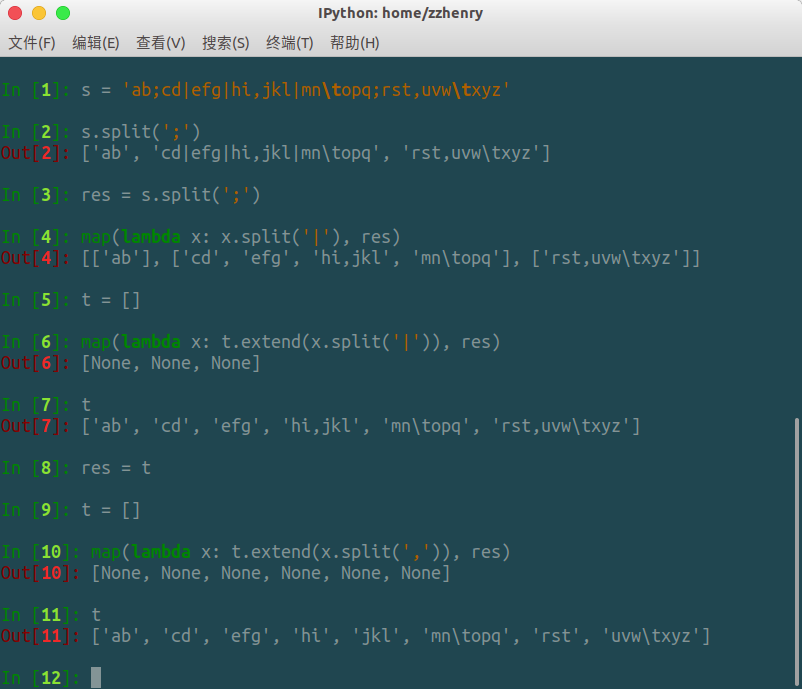
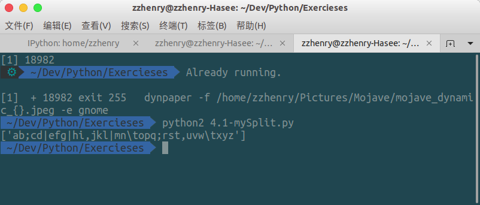
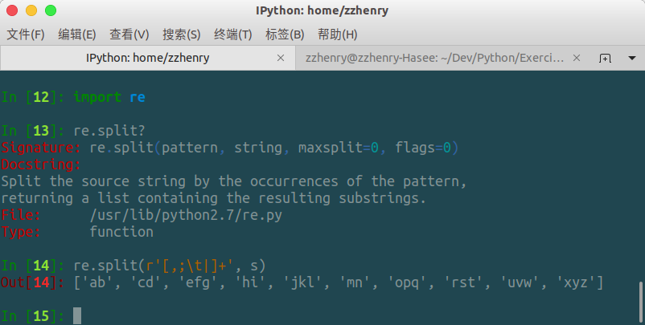

# 如何拆分含有多种分隔符的字符串

## 实际案例

我们要把某个字符串依据分隔符号拆分不同的字段，该字符串包含多种不同的分隔符，例如：

`s = 'ab;cd|efg|hi,jkl|mn\topq;rst,uvw\txyz'`

其中<,>, <;>, <|>, <\t> 都是分隔符号，如何处理？

## 方法一：连续使用 str.split() 方法，每次处理一种分隔符号



也可以写一个函数

```python
def mySplit(s, ds):
    res = [s]
    
    for d in ds:
        t = []
        map(lambda x: t.extend(x.split(d)), res)
        res = t
    return [x for x in res if x]
        
s = 'ab;cd|efg|hi,,jkl|mn\topq;rst,uvw\txyz'
print mySplit(s, ';,|\t')
```

运行结果：



这里还有一个小问题，如果待分割的字符串`s`中存在连续的分隔符，结果中就会出现空字符串，所以还要对函数小小改动：

```python
def mySplit(s, ds):
    res = [s]

    for d in ds:
        t = []
        map(lambda x: t.extend(x.split(d)), res)
        res = t
    return [x for x in res if x]

s = 'ab;cd|efg|hi，,jkl|mn\topq;rst,uvw\txyz'
print mySplit(s, ';,|\t')
```


## 方法二：使用正则表达式的 re,split() 方法，一次性拆分字符串(推荐)



