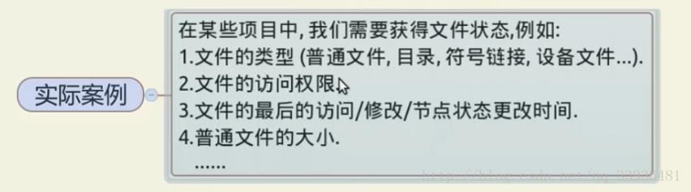
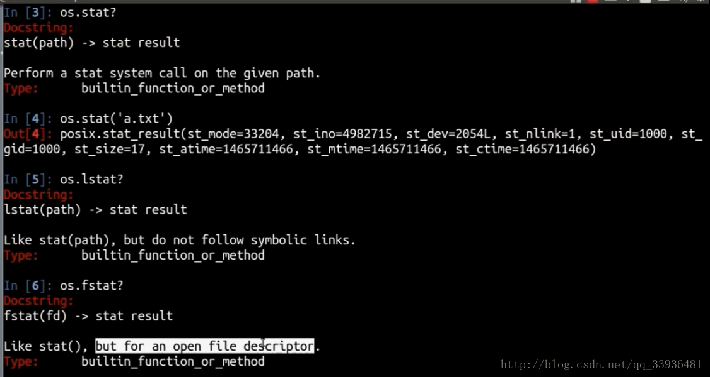
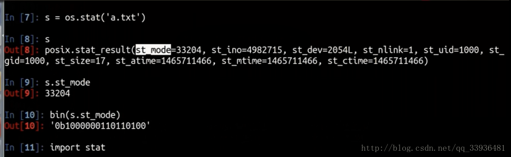
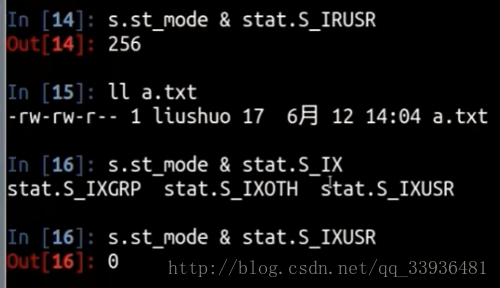
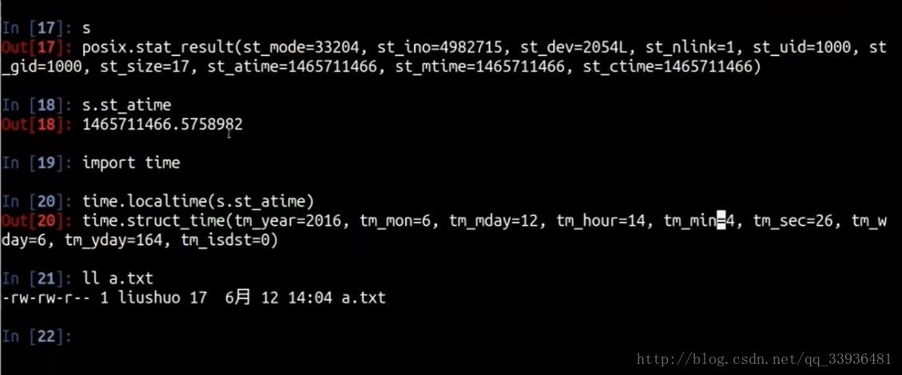
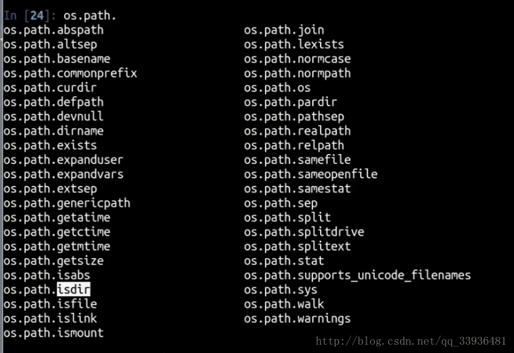

# 如何访问文件的状态




```python
import os 
os.stat(path)		# 获取文件状态
os.lstart(path)		# 不跟软链接
os.rstart('打开的文件描述符')

f = open(file descriptor)
f.fileno() 			# 得到文件描述符
```



文件的类型存储在st_mode里 



```python
# 判断是否为文件夹
stat.S_ISDIR(s.st_mode) # 返回False
# 判断是否为普通文件
stat.S_ISREG(s.st_mode) # 返回True
# 判断用户的读权限
s.st_mode & stat.S_IRUSR（用户读权限） # 返回大于0，就说明为真
```



`st_atime`：最后访问时间 

`st_mtime`：修改时间 

`st_ctime`：节点状态中心



```python
s.st_size
17
```

**快捷函数：** 



```python
os.path.isdir('x.txt')	# 判断是否为文件夹
False
os.path.islink('x.txt') # 判断是否为软链接
True
os.path.isfile('x.txt')	# 判断是否为文件
True 
os.path.getatime('x.txt')
os.path.getsize('x.txt')
```

**没有关于文件权限的函数**