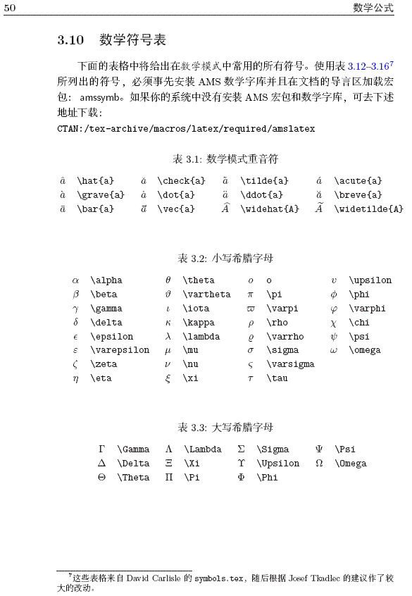
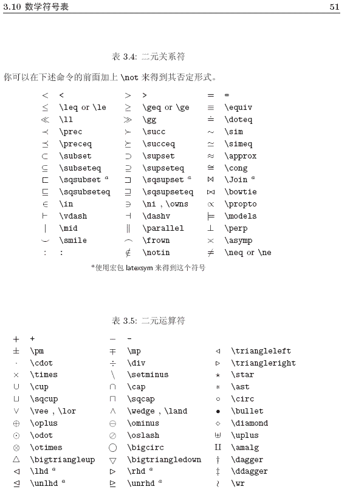
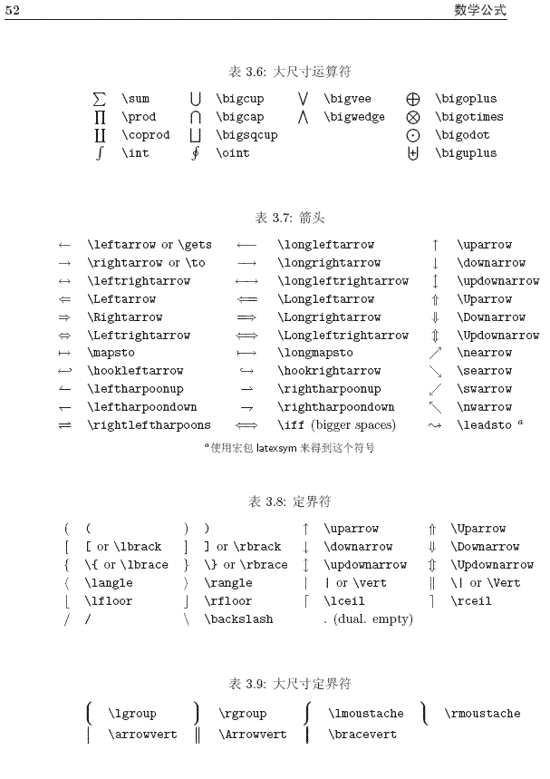
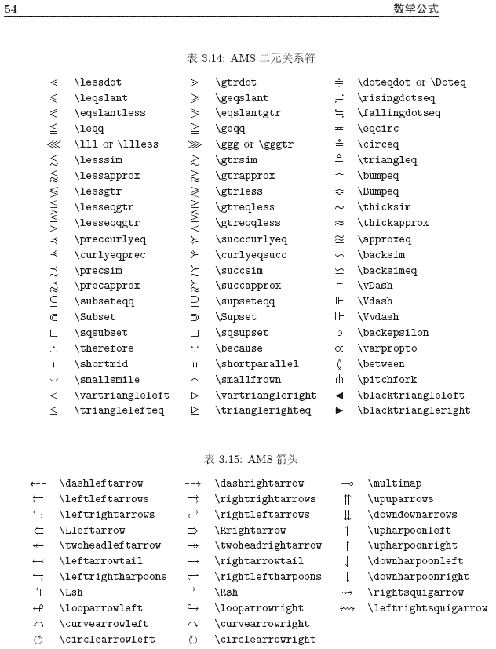
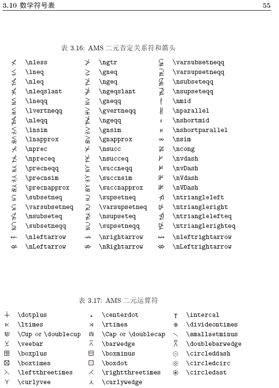
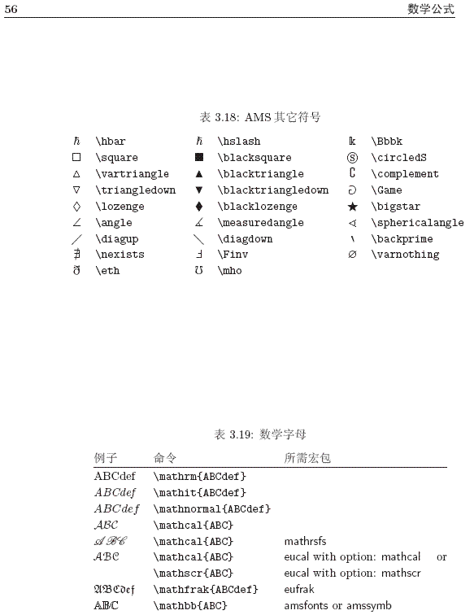

# Latex 语法学习

I have keys but no locks. I have space but no room. You can enter but can't leave. What am I?
     A keyboard. 

- **点乘：**

  
a \cdot b

  
$$
  a \cdot b
$$

- **分子分母线：**

  
\frac{分子}{分母}

  
$$
  \frac{分子}{分母}
$$

- **上下标：**

  
x_{1}^{2}

  $$
x_{1}^{2}
  $$
  
- **根号：**

  
\sqrt{n}

  $$
  \sqrt{n}
  $$

- **大于等于、小于等于：**

  
a \geq b\\ 
  a \leq b

$$
  a \geq b\\
  a \leq b
$$

- **组合数($$C_{n}^{m}$$)**

  
\tbinom{n}{m}

  
C_{n}^{m} 不推荐

  
  $$
\tbinom{n}{m} \\
  

C_{n}^{m}
$$
## 常用数学符号的 LaTeX 表示方法

1. 指数和下标可以用`^`和`_`后加相应字符来实现。比如：

    
a{1} \qquad x^{2} \qquad 
    e^{-\alpha t} \qquad 
    a^3{ij} \\ 
    e^{x^2} \neq {e^x}^2

$$
a{1} \qquad x^{2} \qquad
e^{-\alpha t} \qquad
a^3{ij} \\
e^{x^2} \neq {e^x}^2
$$
2. 平方根 (square root) 的输入命令为：`\sqrt`，n 次方根相应地为: `\sqrt[n]`。方根符号的大小由LATEX自动加以调整。也可用`\surd` 仅给出符号。比如：

    
\sqrt{x} \qquad  
        \sqrt{ x^{2}+\sqrt{y} } \qquad  
    \sqrt [3] {2} \\[3pt]  
    \surd [x^2 + y^2]

$$
\sqrt{x} \qquad
\sqrt{ x^{2}+\sqrt{y} } \qquad
\sqrt [3] {2} \\[3pt]
\surd [x^2 + y^2]
$$
3. 命令`\overline`  和 `\underline` 在表达式的上、下方画出水平线。比如：

    
\overline{m+n} \qquad 
    \underline{m+n}

$$
\overline{m+n} \qquad
\underline{m+n}
$$
4. 命令 `\overbrace` 和 `\underbrace` 在表达式的上、下方给出一水平的大括号。

    
\underbrace{ a+b+\cdots+z }_{26}

$$
\underbrace{ a+b+\cdots+z }_{26}
$$
5. 向量 (Vectors) 通常用上方有小箭头 (arrow symbols) 的变量表示。这可由 `\vec` 得到。另两个命令`\overrightarrow` 和 `\overleftarrow` 在定义从A 到B 的向量时非常有用。

    
\vec a\quad \overrightarrow{AB}

$$
\vec a\quad \overrightarrow{AB}
$$
6. 分数 (fraction) 使用 `\frac{...}{...}` 排版。一般来说，1/2 这种形式更受欢迎，因为对于少量的分式，它看起来更好些。

    
1\frac{1}{2} ~hours\\  
    \frac{ x^{2} }{ k+1 } \qquad  
    x^{ \frac{2}{k+1} } \qquad  
    x^{ 1/2 }

$$
1\frac{1}{2} ~hours\\
\frac{ x^{2} }{ k+1 } \qquad
x^{ \frac{2}{k+1} } \qquad
x^{ 1/2 }
$$
7. 积分运算符 (integral operator) 用 `\int` 来生成。求和运算符 (sum operator) 由 `\sum` 生成。乘积运算符 (product operator) 由 `\prod` 生成。上限和下限用 `^` 和 `_` 来生成，类似于上标和下标。

    
\sum_{i+1}^{n} \qquad  
    \int_{0}^{\frac{\pi}{2}} \qquad  
    \prod_\epsilon

$$
\sum_{i+1}^{n} \qquad
\int_{0}^{\frac{\pi}{2}} \qquad
\prod_\epsilon
$$

## 以下提供一些常用符号的表示方法

$$
\int_{0}^{\frac{\pi}{2}}
$$

 