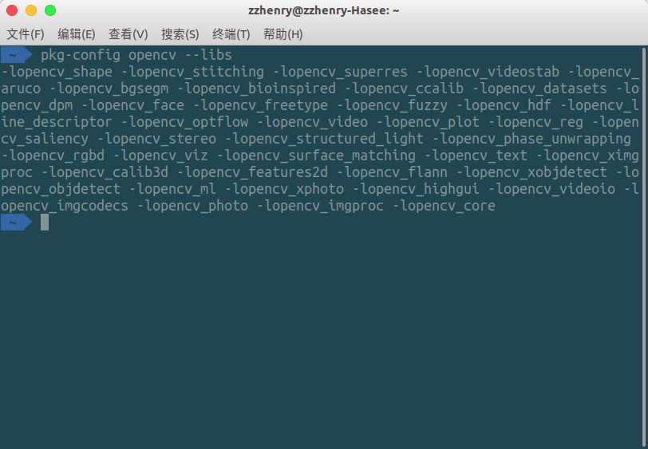
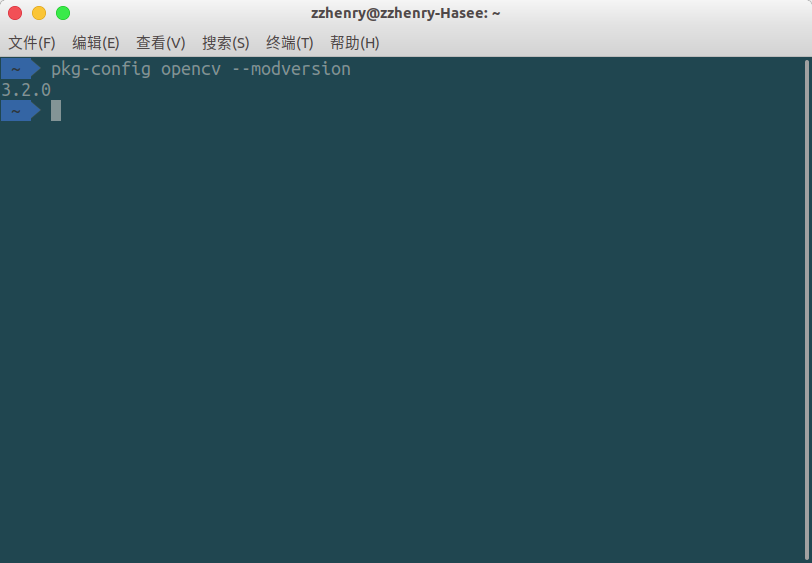
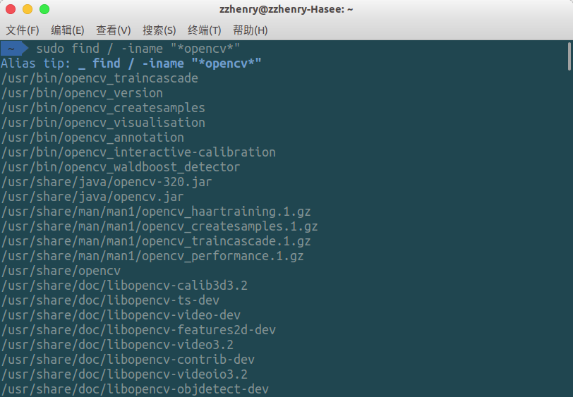

# 在Ubuntu 18.04 上编译安装OpenCV3.2.0 (Cmake + python3 + OpenCV3)

opencv基本上是搞CV必备套件之一了，支持的语言也非常多，但是安装起来有点麻烦（如果是在conda下安装的话则可以用conda install -c menpo opencv3=3.2.0）。需要注意的是，pip可以安装的opencv-python安装并**不依赖**opencv，只是封装了opencv的Python API，一般情况下也够用。**但是如果准备安装完整版本的opencv，这里比较建议将opencv-python卸载，以免之后产生一些不必要的报错。**

## 1. 安装CMAKE

```python
sudo apt-get install cmake
```

## 2. 安装python及其所依赖的软件包

- GCC 4.4.x or later

- CMake 2.6 or higher
- Git
- GTK+2.x or higher, including headers (libgtk2.0-dev) # 控制opencv GUI
- pkg-config
- Python 2.6 or later and Numpy 1.5 or later with developer packages (python-dev, python-numpy)
- ffmpeg or libav development packages: libavcodec-dev, libavformat-dev, libswscale-dev
- [optional] libtbb2 libtbb-dev
- [optional] libdc1394 2.x
- [optional] libjpeg-dev, libpng-dev, libtiff-dev, libjasper-dev, libdc1394-22-dev

```shell
sudo apt-get install build-essential
sudo apt-get install git libgtk2.0-dev pkg-config libavcodec-dev libavformat-dev libswscale-dev libeigen3-dev libopenexr-dev libgstreamer1.0-dev libgphoto2-dev libgstreamer-plugins-base1.0-dev python-dev libfreetype6-dev libharfbuzz-dev 
sudo apt-get install python3-dev python3-numpy libtbb2 libtbb-dev libjpeg-dev libpng-dev libtiff-dev libjasper-dev libdc1394-22-dev # 处理图像所需要的包
sudo apt-get install libavcodec-dev libavformat-dev libswscale-dev libv4l-dev liblapacke-dev
sudo apt-get install libxvidcore-dev libx264-dev # 处理视频所需的包
sudo apt-get install libatlas-base-dev gfortran # 优化opencv功能
sudo apt-get install ffmpeg
```

## 3. 下载opencv3.2.0源码

这里需要下载opencv和opencv_contrib (后者会在cmake配置的时候用到)，这是因为opencv3以后SIFT和SURF之类的属性被移到了contrib中。

```shell
wget https://github.com/opencv/opencv/archive/3.2.0.zip # 从github上直接下载或者clone也可
wget https://github.com/opencv/opencv_contrib/archive/3.2.0.zip
```

## 4a. 编译配置opencv (无NVIDIA CUDA版本)

将上述opencv包解压，然后cmake配置属性

cmake命令的使用方式：`cmake [<some optional parameters>] <path to the OpenCV source directory>`。如果命令报错的话可以试着把-D后面的空格去掉在执行一次。

```shell
cd opencv-3.2.0
mkdir build
cd build
cmake -D CMAKE_BUILD_TYPE=RELEASE \
    -D CMAKE_INSTALL_PREFIX=/home/zzhenry/anaconda3 \
    -D INSTALL_PYTHON_EXAMPLES=ON \
    -D INSTALL_C_EXAMPLES=OFF \
    -D OPENCV_EXTRA_MODULES_PATH=/home/zzhenry/Dev/Github/opencv_contrib-3.2.0/modules \
    -D PYTHON_EXCUTABLE=/home/zzhenry/anaconda3/bin/python \
    -D WITH_TBB=ON \
    -D WITH_V4L=ON \
    -D WITH_QT=ON \
    -D WITH_GTK=ON \
    -D WITH_OPENGL=ON \
    -D BUILD_EXAMPLES=ON .. 
make -j8
sudo make install -j8
sudo /bin/bash -c 'echo "/home/zzhenry/anaconda3/lib" > /etc/ld.so.conf.d/opencv.conf'
sudo ldconfig
```

**PS：**

1. `WITH_QT=ON` ：如果qt未安装可以删去此行；若因为未正确安装qt导致的Qt5Gui报错，可将build内文件全部删除后重新cmake，具体可以参考[这里](http://stackoverflow.com/questions/17420739/opencv-2-4-5-and-qt5-error-s)
2. `CMAKE_INSTALL_PREFIX` ：安装的python目录前缀，其实就是指定了python模块的安装路径：CMAKE_INSTALL_PREFIX/lib/python2.7/dist-packages。获取该路径的方式可以用`python -c "import sys; print sys.prefix"` 
3. `PYTHON_EXCUTABLE` ：指定python路径`$(which python3)`
4. `OPENCV_EXTRA_MODULES_PATH` : 指定opencv所需模块的路径，就是之前我们所说的contrib
5. cmake过程中需要自动下载**ippicv_linux_20141027.tgz**，但命令行自动下载后，可能会提示【ICV hash校验值不符】，cmake中断退出。**解决办法：**手动下载ippicv_linux_20141027.tgz，覆盖出错自动下载文件。下载地址：https://sourceforge.net/projects/opencvlibrary/files/3rdparty/ippicv/，覆盖地址：`opencv-3.0.0/3rdparty/ippicv/downloads/linux-8b449a536a2157bcad08a2b9f266828b/ippicv_linux_20141027.tgz`。覆盖完，再次执行cmake .即可
6. 其他cmake的具体变量说明可以看[这里](https://cmake.org/cmake/help/v3.0/manual/cmake-variables.7.html)

## 4b. 编译配置opencv (NVIDIA CUDA版本)

opencv最麻烦的地方就是编译时属性的配置，对于不同的需求要配置不同的属性。当使用NVIDIA GPU GeForce 1060的时候：

```shell
cd opencv-3.2.0
mkdir build
cd build
cmake -D CMAKE_BUILD_TYPE=RELEASE \
    -D CMAKE_INSTALL_PREFIX=/home/zzhenry/anaconda3 \
    -D INSTALL_PYTHON_EXAMPLES=ON \
    -D INSTALL_C_EXAMPLES=OFF \
    -D BUILD_opencv_python3=ON \
    -D BUILD_opencv_python2=ON \
    -D OPENCV_EXTRA_MODULES_PATH=/home/zzhenry/Dev/Github/opencv_contrib-3.2.0/modules \
    -D PYTHON_EXCUTABLE=/home/zzhenry/anaconda3/bin/python \
    -D PYTHON_INCLUDE_DIR=$(python -c "from distutils.sysconfig import get_python_inc; print(get_python_inc())") \
    -D PYTHON_PACKAGES_PATH=$(python -c "from distutils.sysconfig import get_python_lib; print(get_python_lib())") \
    -D WITH_CUDA=ON \ #使用CUDA
    -D WITH_CUBLAS=ON \
    -D DCUDA_NVCC_FLAGS="-D_FORCE_INLINES" \
    -D CUDA_ARCH_BIN="6.1" \
    -D CUDA_ARCH_PTX="" \
    -D CUDA_FAST_MATH=ON \ # 计算速度更快但是相对不精确
    -D WITH_V4L=ON \
    -D WITH_QT=ON \
    -D WITH_GTK=ON \
    -D WITH_OPENGL=ON \
    -D BUILD_TIFF=ON \
    -D WITH_TIFF=ON \
    -D BUILD_EXAMPLES=ON ..
make -j8
sudo make install -j8
sudo /bin/bash -c 'echo "/home/zzhenry/anaconda3/lib" > /etc/ld.so.conf.d/opencv.conf'
sudo ldconfig
```

**PS：**

1. `CMAKE_BUILD_TYPE` ：编译类型

2. `CMAKE_INSTALL_PREFIX` 

   ```shell
   import sys
   print(sys.prefix)
   ```

3. `PYTHON_NUMPY_PATH` ：

   ```shell
   import numpy
   print numpy.__file__
   ```

4. `PYTHON_EXCUTABLE` ：指定python路径`$(which python3)`

5. `WITH_QT=ON` ：如果qt未安装可以删去此行；若因为未正确安装qt导致的Qt5Gui报错，可将build内文件全部删除后重新cmake，具体可以参考[这里](http://stackoverflow.com/questions/17420739/opencv-2-4-5-and-qt5-error-s)

6. `CUDA_ARCH_BIN` ：这个需要去官网确认使用的GPU所对应的版本[查看这里](https://developer.nvidia.com/cuda-gpus)

   

7. GPU版本安装的时候很容易出错，这里说的出错并不是编译报错，而是在python中调用的时候报错，比如`cv2.VideoCapture(0)`返回false，`cv2.imshow()`的时候报`unspecified error`。在调用cv2的时候报错一般都是在cmake配置编译的时候由于配置错误导致的，所以需要确认配置的参数是否能够覆盖到你所需的范围。

8. 关于GPU版本的安装也可以参考下[这里](<http://dev.t7.ai/jetson/opencv/>)，写得更加详细清楚。

## 4c. 编译opencv 3.4.1

### 准备ippicv：

安装过程中下载 ippicv_2017u3_lnx_intel64_general_20170822.tgz 的时间很长，甚至下载失败。ippicv 是一个并行计算库，事实上可以不安装。如果想不安装只需在下面第四步骤中配置cmake时增加如下选项，关闭掉即可：

```
-D WITH_IPP=OFF \1
```

此处，为防后续需要使用，仍选择安装。在csdn上搜索，有网友提供了下载文件。下载后，在文件ippicv_2017u3_lnx_intel64_general_20170822.tgz 所在目录创建一个脚本文件，内容如下，其中路径，需要根据你的实际情况修改。在 opencv-3.3.1/3rdparty/ippicv/下创建downloads文件夹。然后执行该脚本。

```sh
#!/bin/bash
ipp_file=./ippicv_2017u3_lnx_intel64_general_20170822.tgz    &&
ipp_hash=$(md5sum $ipp_file | cut -d" " -f1)      &&
ipp_dir=/home/XXX/Downloads/opencv-3.3.1/3rdparty/ippicv/downloads/linux-$ipp_hash &&

mkdir -p $ipp_dir &&
cp $ipp_file $ipp_dir1234567
```

执行上述脚本，在opencv-3.3.1/3rdparty/ippicv/downloads/ 下将生成一个类似名称为 linux-4e0352ce96473837b1d671ce87f17359 的文件夹，其中的数字可能各不相同，不影响。该文件夹下是已经拷贝过来的ippicv_2017u3_lnx_intel64_general_20170822.tgz 文件

**anaconda接口**：

```sh
cmake -D CMAKE_BUILD_TYPE=RELEASE \
    -D CMAKE_INSTALL_PREFIX=/home/zzhenry/anaconda3 \
    -D INSTALL_PYTHON_EXAMPLES=ON \
    -D INSTALL_C_EXAMPLES=OFF \
    -D BUILD_opencv_python3=ON \
    -D BUILD_opencv_python2=OFF \
    -D OPENCV_EXTRA_MODULES_PATH=/home/zzhenry/Dev/Github/opencv_contrib-3.4.1/modules \
    -D PYTHON_EXCUTABLE=/home/zzhenry/anaconda3/bin/python \
    -D PYTHON_INCLUDE_DIR=$(python -c "from distutils.sysconfig import get_python_inc; print(get_python_inc())") \
    -D PYTHON_PACKAGES_PATH=$(python -c "from distutils.sysconfig import get_python_lib; print(get_python_lib())") \
    -D WITH_CUDA=ON \
    -D WITH_CUBLAS=ON \
    -D DCUDA_NVCC_FLAGS="-D_FORCE_INLINES" \
    -D CUDA_ARCH_BIN="6.1" \
    -D CUDA_ARCH_PTX="" \
    -D CUDA_FAST_MATH=ON \
    -D WITH_V4L=ON \
    -D WITH_QT=ON \
    -D WITH_GTK=ON \
    -D WITH_OPENGL=ON \
    -D BUILD_TIFF=ON \
    -D WITH_TIFF=ON \
    -D BUILD_EXAMPLES=ON ..
```

**python2.7接口**：

```sh
cmake -D CMAKE_BUILD_TYPE=RELEASE \
    -D CMAKE_INSTALL_PREFIX=/usr/local \
    -D INSTALL_PYTHON_EXAMPLES=ON \
    -D INSTALL_C_EXAMPLES=OFF \
    -D BUILD_opencv_python2=ON \
    -D BUILD_opencv_python3=OFF \
    -D OPENCV_EXTRA_MODULES_PATH=/home/zzhenry/Dev/Github/opencv_contrib-3.4.1/modules \
    -D PYTHON_EXCUTABLE=/usr/bin/python2.7 \
    -D PYTHON_INCLUDE_DIR=$(python2 -c "from distutils.sysconfig import get_python_inc; print(get_python_inc())") \
    -D PYTHON_PACKAGES_PATH=$(python2 -c "from distutils.sysconfig import get_python_lib; print(get_python_lib())") \
    -D WITH_CUDA=ON \
    -D WITH_CUBLAS=ON \
    -D DCUDA_NVCC_FLAGS="-D_FORCE_INLINES" \
    -D CUDA_ARCH_BIN="6.1" \
    -D CUDA_ARCH_PTX="" \
    -D CUDA_FAST_MATH=ON \
    -D WITH_V4L=ON \
    -D WITH_QT=ON \
    -D WITH_GTK=ON \
    -D WITH_OPENGL=ON \
    -D BUILD_TIFF=ON \
    -D WITH_TIFF=ON \
    -D BUILD_EXAMPLES=ON ..
```


编译成功时应该看到这些：

```shell
-- General configuration for OpenCV 3.2.0 =====================================
--   Version control:               unknown
-- 
--   Extra modules:
--     Location (extra):            /home/zzhenry/Dev/Github/opencv_contrib-3.2.0/modules
--     Version control (extra):     unknown
-- 
--   Platform:
--     Timestamp:                   2018-04-25T04:52:19Z
--     Host:                        Linux 4.13.0-38-generic x86_64
--     CMake:                       3.5.1
--     CMake generator:             Unix Makefiles
--     CMake build tool:            /usr/bin/make
--     Configuration:               RELEASE
-- 
--   C/C++:
--     Built as dynamic libs?:      YES
--     C++ Compiler:                /usr/bin/c++  (ver 5.4.0)
--     C++ flags (Release):         -fsigned-char -W -Wall -Werror=return-type -Werror=non-virtual-dtor -Werror=address -Werror=sequence-point -Wformat -Werror=format-security -Wmissing-declarations -Wundef -Winit-self -Wpointer-arith -Wshadow -Wsign-promo -Wno-narrowing -Wno-delete-non-virtual-dtor -Wno-comment -fdiagnostics-show-option -Wno-long-long -pthread -fomit-frame-pointer -msse -msse2 -mno-avx -msse3 -mno-ssse3 -mno-sse4.1 -mno-sse4.2 -ffunction-sections -fvisibility=hidden -fvisibility-inlines-hidden -O3 -DNDEBUG  -DNDEBUG
--     C++ flags (Debug):           -fsigned-char -W -Wall -Werror=return-type -Werror=non-virtual-dtor -Werror=address -Werror=sequence-point -Wformat -Werror=format-security -Wmissing-declarations -Wundef -Winit-self -Wpointer-arith -Wshadow -Wsign-promo -Wno-narrowing -Wno-delete-non-virtual-dtor -Wno-comment -fdiagnostics-show-option -Wno-long-long -pthread -fomit-frame-pointer -msse -msse2 -mno-avx -msse3 -mno-ssse3 -mno-sse4.1 -mno-sse4.2 -ffunction-sections -fvisibility=hidden -fvisibility-inlines-hidden -g  -O0 -DDEBUG -D_DEBUG
--     C Compiler:                  /usr/bin/cc
--     C flags (Release):           -fsigned-char -W -Wall -Werror=return-type -Werror=non-virtual-dtor -Werror=address -Werror=sequence-point -Wformat -Werror=format-security -Wmissing-declarations -Wmissing-prototypes -Wstrict-prototypes -Wundef -Winit-self -Wpointer-arith -Wshadow -Wno-narrowing -Wno-comment -fdiagnostics-show-option -Wno-long-long -pthread -fomit-frame-pointer -msse -msse2 -mno-avx -msse3 -mno-ssse3 -mno-sse4.1 -mno-sse4.2 -ffunction-sections -fvisibility=hidden -O3 -DNDEBUG  -DNDEBUG
--     C flags (Debug):             -fsigned-char -W -Wall -Werror=return-type -Werror=non-virtual-dtor -Werror=address -Werror=sequence-point -Wformat -Werror=format-security -Wmissing-declarations -Wmissing-prototypes -Wstrict-prototypes -Wundef -Winit-self -Wpointer-arith -Wshadow -Wno-narrowing -Wno-comment -fdiagnostics-show-option -Wno-long-long -pthread -fomit-frame-pointer -msse -msse2 -mno-avx -msse3 -mno-ssse3 -mno-sse4.1 -mno-sse4.2 -ffunction-sections -fvisibility=hidden -g  -O0 -DDEBUG -D_DEBUG
--     Linker flags (Release):
--     Linker flags (Debug):
--     ccache:                      NO
--     Precompiled headers:         YES
--     Extra dependencies:          Qt5::Test Qt5::Concurrent Qt5::OpenGL /home/zzhenry/anaconda3/lib/libpng.so /home/zzhenry/anaconda3/lib/libtiff.so /usr/lib/x86_64-linux-gnu/libjasper.so /home/zzhenry/anaconda3/lib/libjpeg.so /usr/lib/x86_64-linux-gnu/libImath.so /usr/lib/x86_64-linux-gnu/libIlmImf.so /usr/lib/x86_64-linux-gnu/libIex.so /usr/lib/x86_64-linux-gnu/libHalf.so /usr/lib/x86_64-linux-gnu/libIlmThread.so dc1394 avcodec-ffmpeg avformat-ffmpeg avutil-ffmpeg swscale-ffmpeg Qt5::Core Qt5::Gui Qt5::Widgets /home/zzhenry/anaconda3/lib/libhdf5_hl.so /home/zzhenry/anaconda3/lib/libhdf5.so /usr/lib/x86_64-linux-gnu/librt.so /usr/lib/x86_64-linux-gnu/libpthread.so /home/zzhenry/anaconda3/lib/libz.so /usr/lib/x86_64-linux-gnu/libdl.so /usr/lib/x86_64-linux-gnu/libm.so dl m pthread rt /usr/lib/x86_64-linux-gnu/libGLU.so /usr/lib/x86_64-linux-gnu/libGL.so /usr/lib/liblapack.so /usr/lib/libcblas.so /usr/lib/libatlas.so cudart nppc nppi npps cublas cufft -L/usr/local/cuda/lib64
--     3rdparty dependencies:       libwebp libprotobuf
-- 
--   OpenCV modules:
--     To be built:                 cudev core cudaarithm flann hdf imgproc ml reg surface_matching video cudabgsegm cudafilters cudaimgproc cudawarping dnn freetype fuzzy imgcodecs photo shape videoio cudacodec highgui objdetect plot ts xobjdetect xphoto bgsegm bioinspired dpm face features2d line_descriptor saliency text calib3d ccalib cudafeatures2d cudalegacy cudaobjdetect cudaoptflow cudastereo cvv datasets rgbd stereo superres tracking videostab xfeatures2d ximgproc aruco optflow phase_unwrapping stitching structured_light matlab python3
--     Disabled:                    python2 world contrib_world
--     Disabled by dependency:      -
--     Unavailable:                 java viz cnn_3dobj sfm
-- 
--   GUI: 
--     QT 5.x:                      YES (ver 5.6.2)
--     QT OpenGL support:           YES (Qt5::OpenGL 5.6.2)
--     OpenGL support:              YES (/usr/lib/x86_64-linux-gnu/libGLU.so /usr/lib/x86_64-linux-gnu/libGL.so)
--     VTK support:                 NO
-- 
--   Media I/O: 
--     ZLib:                        /home/zzhenry/anaconda3/lib/libz.so (ver 1.2.11)
--     JPEG:                        /home/zzhenry/anaconda3/lib/libjpeg.so (ver 90)
--     WEBP:                        build (ver 0.3.1)
--     PNG:                         /home/zzhenry/anaconda3/lib/libpng.so (ver 1.6.30)
--     TIFF:                        /home/zzhenry/anaconda3/lib/libtiff.so (ver 42 - 4.0.6)
--     JPEG 2000:                   /usr/lib/x86_64-linux-gnu/libjasper.so (ver 1.900.1)
--     OpenEXR:                     /usr/lib/x86_64-linux-gnu/libImath.so /usr/lib/x86_64-linux-gnu/libIlmImf.so /usr/lib/x86_64-linux-gnu/libIex.so /usr/lib/x86_64-linux-gnu/libHalf.so /usr/lib/x86_64-linux-gnu/libIlmThread.so (ver 2.2.0)
--     GDAL:                        NO
--     GDCM:                        NO
-- 
--   Video I/O:
--     DC1394 1.x:                  NO
--     DC1394 2.x:                  YES (ver 2.2.4)
--     FFMPEG:                      YES
--       avcodec:                   YES (ver 56.60.100)
--       avformat:                  YES (ver 56.40.101)
--       avutil:                    YES (ver 54.31.100)
--       swscale:                   YES (ver 3.1.101)
--       avresample:                NO
--     GStreamer:                   NO
--     OpenNI:                      NO
--     OpenNI PrimeSensor Modules:  NO
--     OpenNI2:                     NO
--     PvAPI:                       NO
--     GigEVisionSDK:               NO
--     Aravis SDK:                  NO
--     UniCap:                      NO
--     UniCap ucil:                 NO
--     V4L/V4L2:                    NO/YES
--     XIMEA:                       NO
--     Xine:                        NO
--     gPhoto2:                     NO
-- 
--   Parallel framework:            pthreads
-- 
--   Other third-party libraries:
--     Use IPP:                     9.0.1 [9.0.1]
--          at:                     /home/zzhenry/Dev/Github/opencv-3.2.0/build/3rdparty/ippicv/ippicv_lnx
--     Use IPP Async:               NO
--     Use VA:                      NO
--     Use Intel VA-API/OpenCL:     NO
--     Use Lapack:                  YES (/usr/lib/liblapack.so /usr/lib/libcblas.so /usr/lib/libatlas.so)
--     Use Eigen:                   NO
--     Use Cuda:                    YES (ver 8.0)
--     Use OpenCL:                  YES
--     Use OpenVX:                  NO
--     Use custom HAL:              NO
-- 
--   NVIDIA CUDA
--     Use CUFFT:                   YES
--     Use CUBLAS:                  YES
--     USE NVCUVID:                 NO
--     NVIDIA GPU arch:             61
--     NVIDIA PTX archs:
--     Use fast math:               YES
-- 
--   OpenCL:                        <Dynamic loading of OpenCL library>
--     Include path:                /home/zzhenry/Dev/Github/opencv-3.2.0/3rdparty/include/opencl/1.2
--     Use AMDFFT:                  NO
--     Use AMDBLAS:                 NO
-- 
--   Python 2:
--     Interpreter:                 /usr/bin/python2.7 (ver 2.7.12)
-- 
--   Python 3:
--     Interpreter:                 /home/zzhenry/anaconda3/bin/python3 (ver 3.6.2)
--     Libraries:                   /home/zzhenry/anaconda3/lib/libpython3.6m.so (ver 3.6.2)
--     numpy:                       /home/zzhenry/anaconda3/lib/python3.6/site-packages/numpy/core/include (ver 1.13.1)
--     packages path:               lib/python3.6/site-packages
-- 
--   Python (for build):            /usr/bin/python2.7
-- 
--   Java:
--     ant:                         NO
--     JNI:                         NO
--     Java wrappers:               NO
--     Java tests:                  NO
-- 
--   Matlab:
--     mex:                         /usr/local/MATLAB/R2015b/bin/mex
--     Compiler/generator:          Working
-- 
--   Documentation:
--     Doxygen:                     NO
-- 
--   Tests and samples:
--     Tests:                       YES
--     Performance tests:           YES
--     C/C++ Examples:              YES
-- 
--   Install path:                  /home/zzhenry/anaconda3
-- 
--   cvconfig.h is in:              /home/zzhenry/Dev/Github/opencv-3.2.0/build
-- -----------------------------------------------------------------
-- 
-- Configuring done
-- Generating done
-- Build files have been written to: /home/zzhenry/Dev/Github/opencv-3.2.0/build
```

## 5. 测试

- 打开python console，检测opencv版本`python -c "import cv2; print(cv2.__version__)"`。如果正确安装的话则会输出3.2.0。

- 如果import的时候报类似于`error while loading shared libraries: libopencv_core.so.3.0: cannot open shared object file: No such file or directory.`的错误，可能是library环境变量的错误，可以尝试将`export LD_LIBRARY_PATH=$LD_LIBRARY_PATH:/usr/local/lib`加入到`~/.bashrc`中然后source。

- 查看 opencv 安装库

  ```sh
  pkg-config opencv --libs
  ```

  

- 查看 opencv 安装版本

  ```sh
  pkg-config opencv --modversion
  ```

  

- 查看 opencv 安装路径

  ```sh
  sudo find / -iname "*opencv*" 
  ```

  在全盘上不区分大小写，搜索带有关键字opencv的所有文件及文件夹都会输出到终端，如果输出太长建议输出到txt文件里查看，如下：

  ```sh
  sudo find / -iname "*opencv*" > /home/zzhenry/Desktop/opencv_find.txt  
  ```

  

### 5.1 打开opencv自带的python例程进行测试

```shell
cd <opencv3.1.0_dir>/samples/python/
python opencv_version.py --build
```

如果没有报错即表示安装成功，并且可以看到opencv的版本号为3.2.0

- 如遇到无法导入cv2的问题，在build目录下寻找lib目录里的cv2.cpython-36m-x86_64-linux-gnu.so，这个是python需要的，将其拷贝到python的库目录里。一般情况下是在` /home/zzhenry/anaconda3/lib/python3.6/site-packages` 里。

## 6. 常见错误

### 6.1 undefined symbol: hb_shape 

```shell
Traceback (most recent call last):
File "asift.py", line 26, in <module>
import cv2
ImportError: /usr/local/lib/libopencv_freetype.so.3.2: undefined symbol: hb_shape
```

That's a [known bug in the contrib modules](https://github.com/opencv/opencv_contrib/issues/919), specifically in the freetype module, which allows you to draw UTF-8 strings.

Before compiling OpenCV 3.2, run this command:

```shell
sed -i 's/${freetype2_LIBRARIES} ${harfbuzz_LIBRARIES}/${FREETYPE_LIBRARIES} ${HARFBUZZ_LIBRARIES}/g' ../opencv_contrib-3.2.0/modules/freetype/CMakeLists.txt
```

After that, you should be able to run the Python samples.

### 6.2 Error: CUDA_nppi_LIBRARY (ADVANCED)

错误提示如下：

```sh
CMake Error: The following variables are used in this project, but they are set to NOTFOUND.
Please set them or make sure they are set and tested correctly in the CMake files:
CUDA_nppi_LIBRARY (ADVANCED)
linked by target "opencv_cudev" in directory D:/Cproject/opencv/opencv/sources/modules/cudev
linked by target "opencv_cudev" in directory D:/Cproject/opencv/opencv/sources/modules/cudev
linked by target "opencv_test_cudev" in directory D:/Cproject/opencv/opencv/sources/modules/cudev/test
linked by target "opencv_core" in directory D:/Cproject/opencv/opencv/sources/modules/core
linked by target "opencv_core" in directory D:/Cproject/opencv/opencv/sources/modules/core
linked by target "opencv_test_core" in directory D:/Cproject/opencv/opencv/sources/modules/core
linked by target "opencv_perf_core" in directory D:/Cproject/opencv/opencv/sources/modules/core
...
```

**原因：**CUDA 9 不再支持2.0架构

**解决方案：**

1. 找到`FindCUDA.cmake`文件

   ```sh
   find_cuda_helper_libs(nppi)
   ```

   改为：

   ```sh
   find_cuda_helper_libs(nppial)
   find_cuda_helper_libs(nppicc)
   find_cuda_helper_libs(nppicom)
   find_cuda_helper_libs(nppidei)
   find_cuda_helper_libs(nppif)
   find_cuda_helper_libs(nppig)
   find_cuda_helper_libs(nppim)
   find_cuda_helper_libs(nppist)
   find_cuda_helper_libs(nppisu)
   find_cuda_helper_libs(nppitc)
   ```

   

   ```sh
   set(CUDA_npp_LIBRARY "${CUDA_nppc_LIBRARY};${CUDA_nppi_LIBRARY};${CUDA_npps_LIBRARY}")
   ```

   改为：

   ```sh
   set(CUDA_npp_LIBRARY "${CUDA_nppc_LIBRARY};${CUDA_nppial_LIBRARY};${CUDA_nppicc_LIBRARY};${CUDA_nppicom_LIBRARY};${CUDA_nppidei_LIBRARY};${CUDA_nppif_LIBRARY};${CUDA_nppig_LIBRARY};${CUDA_nppim_LIBRARY};${CUDA_nppist_LIBRARY};${CUDA_nppisu_LIBRARY};${CUDA_nppitc_LIBRARY};${CUDA_npps_LIBRARY}")
   ```

   

   ```sh
   unset(CUDA_nppi_LIBRARY CACHE)
   ```

   改为：

   ```sh
   unset(CUDA_nppial_LIBRARY CACHE)
   unset(CUDA_nppicc_LIBRARY CACHE)
   unset(CUDA_nppicom_LIBRARY CACHE)
   unset(CUDA_nppidei_LIBRARY CACHE)
   unset(CUDA_nppif_LIBRARY CACHE)
   unset(CUDA_nppig_LIBRARY CACHE)
   unset(CUDA_nppim_LIBRARY CACHE)
   unset(CUDA_nppist_LIBRARY CACHE)
   unset(CUDA_nppisu_LIBRARY CACHE)
   unset(CUDA_nppitc_LIBRARY CACHE)
   ```

2. 找到`OpenCVDetectCUDA.cmake`文件

   ```sh
   ...
    set(__cuda_arch_ptx "")
    if(CUDA_GENERATION STREQUAL "Fermi")
      set(__cuda_arch_bin "2.0")
    elseif(CUDA_GENERATION STREQUAL "Kepler")
      set(__cuda_arch_bin "3.0 3.5 3.7")
    ...
   ```

   改为：

   ```sh
   ...
   set(__cuda_arch_ptx "")
   if(CUDA_GENERATION STREQUAL "Kepler")
     set(__cuda_arch_bin "3.0 3.5 3.7")
   elseif(CUDA_GENERATION STREQUAL "Maxwell")
     set(__cuda_arch_bin "5.0 5.2")
   ...
   ```

3. CUDA 9 中有一个单独的`halffloat(cuda_fp16.h)`头文件,也应该被包括在opencv的目录里

   将头文件`cuda_fp16.h`添加至 `opencv\modules\cudev\include\opencv2\cudev\common.hpp`

   即在`common.hpp`中添加

   ```c++
   #include <cuda_fp16.h>
   ```

重新生成即可

### 6.3 face_landmark_model.dat 下载失败

下载地址：<https://github.com/opencv/opencv_3rdparty/tree/contrib_face_alignment_20170818>

重命名后放入`/home/zzhenry/Dev/Github/opencv-3.4.1/.cache/data/7505c44ca4eb54b4ab1e4777cb96ac05-face_landmark_model.dat`

### 6.4 ubuntu18.04 不支持 libjasper-dev

```sh
sudo add-apt-repository "security.ubuntu.com/ubuntuxenial-security main"
sudo apt install libjasper1 libjasper-dev
```

### 6.5 