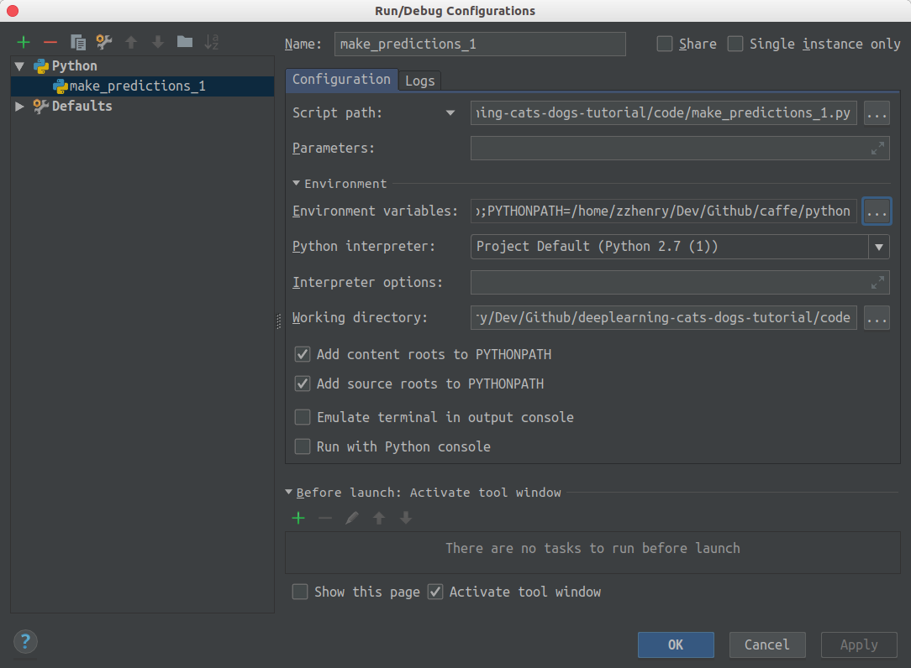
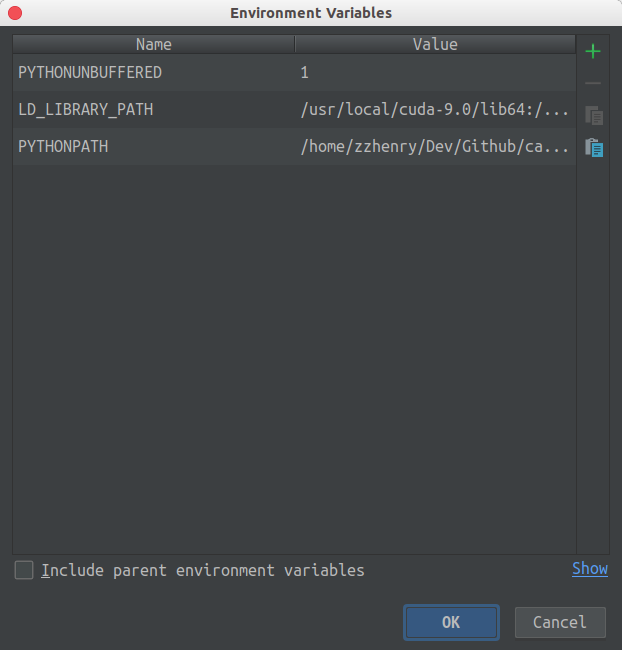

# Pycharm

## 00x0 ImportError: No module named caffe

在 pycharm 中 `import caffe` 时，一直出现下面的错误：

```python
Traceback (most recent call last):
  File "/home/dumengnan/testcaffe/test.py", line 4, in <module>
    import caffe
ImportError: No module named caffe
```

但是在 terminal 中却一切正常。原因是终端在开启的时候会按照 `~/.zshrc` 等配置文件导入环境变量，可是在 pycharm 中是不会自己导入的，所以我们的解决办法就是手动加上我们需要的环境变量。

### 方法1

每次都在 python console 中手动添加 `caffe/python` 的路径：

```python
import sys
sys.path.append('/home/zzhenry/Dev/Github/caffe/python')
```

### 方法二

界面右上角找到打开的程序文件，点击下拉列表，选择 `edit configurations` ，在 configuration 下 Environment Variables 处，添加如下环境变量：





```
LD_LIBRARY_PATH: /usr/local/cuda-9.0/lib64:/home/zzhenry/anaconda3/lib:/home/zzhenry/anaconda3/pkgs/hdf5-1.10.1-h9caa474_1/lib
PYTHONPATH: /home/zzhenry/Dev/Github/caffe/python
```

