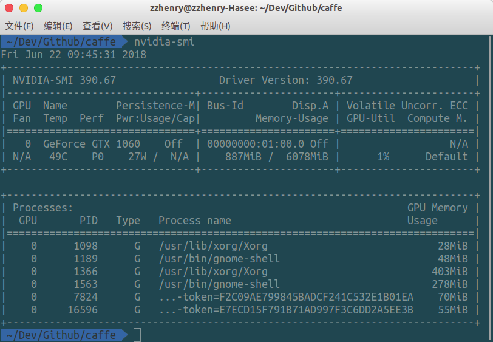
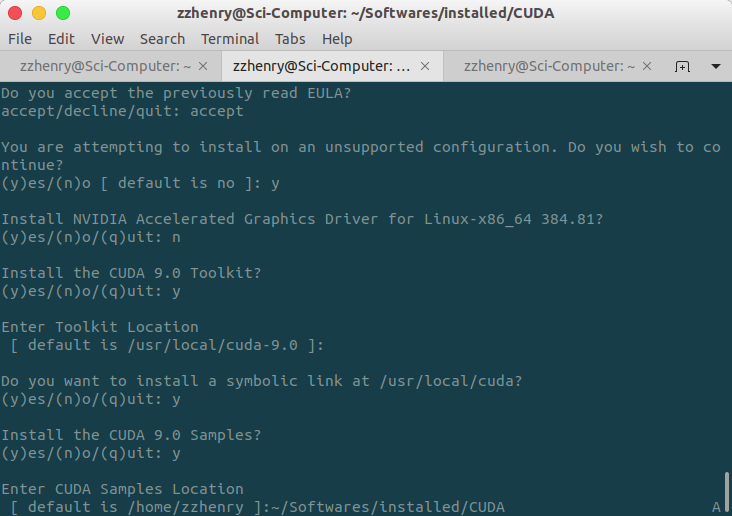
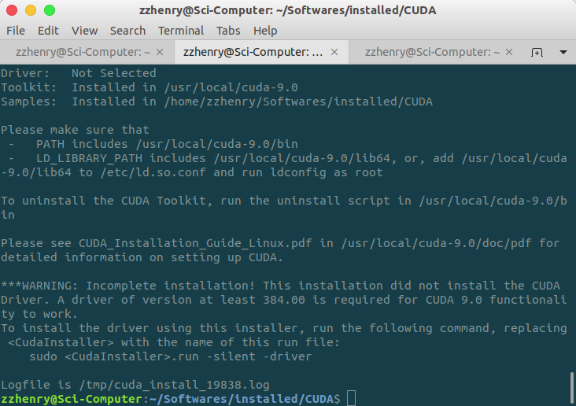
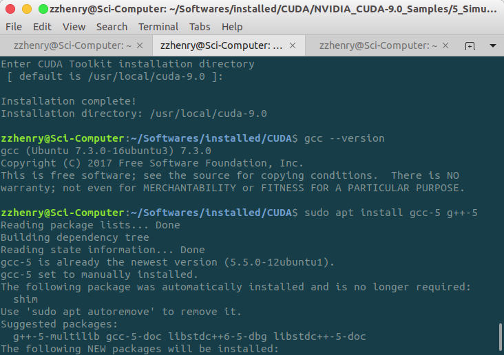
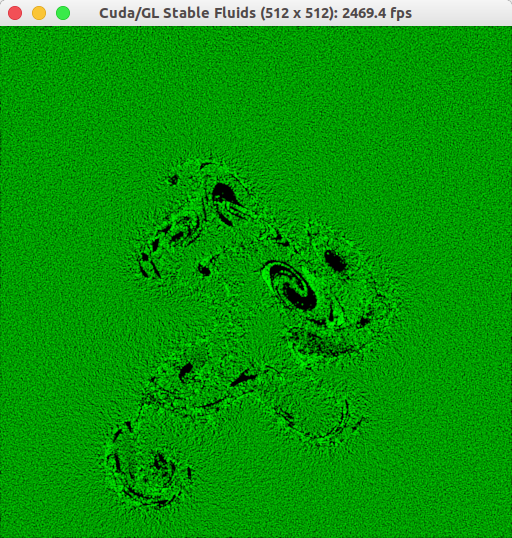

# Ubuntu 18.04 安装 Nvidia 显卡驱动 + CUDA9.0 + cuDNN7.0 + TensorFlow + Caffe

## 安装 Nvidia 驱动

### Creat Blacklist for Nouveau Driver

Create a file at `/etc/modprobe.d/blacklist-nouveau.conf` with the following contents:

```
blacklist nouveau
options nouveau modeset=0
```

Note: It is also possible for the NVIDIA installation runfile to creat this blacklist file automatically. Excute the runfile and follow instructions when an error realted Nouveau appears.

Then,

1. for Ubuntu 14.04 LTS, reboot the computer;

2. for Ubuntu 16.04 LTS, excute `sudo update-initramfs -u` and reboot the computer;

3. for CentOS/Fedora, excute `sudo dracut --force` and reboot the computer.

4. 从 Nvidia 官网查找对应的显卡驱动，链接如下：<http://www.nvidia.cn/Download/index.aspx?lang=cn> ，尽可能找满足自己系统的最新驱动。

   查看GPU型号：`lspci | grep -i nvidia`

5. 也可以在 `Terminal` 中添加 nvidia 官方驱动包源：

   ```sh
   sudo add-apt-repository ppa:graphics-drivers/ppa
   sudo apt-get install nvidia-396 nvidia-settings
   ```

   我的显卡是 gtx1060显卡，最新的驱动是396

6. Ubuntu18.04 不同于 16.04，没有关闭`lightdm`服务，禁用`nouveau`驱动等繁琐的步骤，但是在安装过程中还是会碰到不少坑，第一次安装好了之后重启屏幕显示 `dev/sda5: clean, ... files ... Blocks` 这样的提示然后一直进不去系统，后来发现貌似是要修改 grub 引导信息，编辑 `/etc/boot/grub`:

   ```sh
   sudo vim /etc/default/grub
   ```

   去掉 `nomodeset`

   再更新Grub：

   ```sh
   sudo update-grub
   ```

7. 重启，运行命令 `nvidia-smi` 验证是否安装成功

   

### Unable to find a suitable destination to install 32-bit compatibility libraries

The above error message appears on Ubuntu 18.04 Bionic Beaver Linux during the installation of the official proprietary Nvidia driver.

Execute the following linux commands to resolve the issue:

```sh
sudo dpkg --add-architecture i386
sudo apt update
sudo apt install libc6:i386
```

## 安装 CUDA-9.0

1. **安装依赖**

    安装之前，需要安装一些依赖，否则会得到 `Missing recommended libary` 这样的警告：

    ```sh
    sudo apt-get install freeglut3-dev build-essential libx11-dev libxmu-dev libxi-dev libgl1-mesa-glx libglu1-mesa libglu1-mesa-dev
    ```

2. **开始安装 CUDA-9.0：**

    ```sh
    cd ~/Softwares/installed/CUDA/
    sudo ./cuda_9.0.176_384.81_linux.run --override
    ```

    - 一直按空格到最后，输入`accept`接受条款
    - 输入`y`开始配置
    - 输入`n`不安装nvidia图像驱动，之前已经安装过了
    - 输入`y`安装cuda 9.0工具  回车确认cuda默认安装路径：/usr/local/cuda-9.0
    - 输入`y`安装指向/usr/local/cuda的符号链接
    - 输入`y`安装CUDA 9.0 Samples，以便后面测试
    - 输入 `~/Softwares/installed/CUDA` 回车指定CUDA 9.0 Samples安装路径，该安装路径测试完可以删除

    

    安装完显示如下图

    

    ```sh
    sudo ./cuda_9.0.176.1_linux.run
    sudo ./cuda_9.0.176.2_linux.run
    ```

3. **将 cuda 设置为环境变量**

   ```sh
   export PATH=/usr/local/cuda-9.0/bin${PATH:+:${PATH}}
   export LD_LIBRARY_PATH=/usr/local/cuda-9.0/lib64${LD_LIBRARY_PATH:+:${LD_LIBRARY_PATH}}
   ```

4. **验证 CUDA-9.0 安装**

   在验证之前，需要降低 gcc 版本，否则会出现 `error -- unsupported GNU version! gcc versions later than 6 are not supported!` 这样的错误

   

   降低gcc版本：

   ```sh
   gcc --version   # check ubuntu 18.04 gcc version, you will find it's 7.3.0
   sudo apt install gcc-5 g++-5
   sudo update-alternatives --install /usr/bin/gcc gcc /usr/bin/gcc-5 50   # you will find that message that tells you the gcc-5 is set to be automatic.
   sudo update-alternatives --install /usr/bin/g++ g++ /usr/bin/g++-5 50   # similiar message as gcc
   ```

   编译Sample：

   ```sh
   cd NVIDIA_CUDA-9.0_Samples/5_Simulations/fluidsGL
   make clean && make
   ./fluidsGL
   ```

   如果cuda-9.0正确安装，我们可以得到流体模拟。

   

   查看 CUDA 版本：

   ```sh
   cat /usr/local/cuda/version.txt
   ```

## 安装 cuDNN7.0

安装cuDNN库来加速我们的深度学习算法。注册，点击[“Archived cuDNN Releases”](https://developer.nvidia.com/rdp/cudnn-archive)。然后下载 cuDNN v7.0.5 (Dec 5, 2017), for CUDA 9.0 下载三个文件ubuntu16.04文件 runtime library, developer library, and code samples and user guide。

```sh
sudo dpkg -i ./libcudnn7_7.0.5.15-1+cuda9.0_amd64.deb ./libcudnn7-dev_7.0.5.15-1+cuda9.0_amd64.deb ./libcudnn7-doc_7.0.5.15-1+cuda9.0_amd64.deb
```

**安装Freeimage**

在我们验证cuDNN之前，我们必须首先安装`freeimage lilbray`作为ministCUDNN示例代码的依赖关系。否则，会有提示要求我们正确设置Freeimage。

```sh
sudo apt-get install libfreeimage3 libfreeimage-dev
```

**验证cuDNN安装**

```sh
cp -r /usr/src/cudnn_samples_v7/ $HOME
cd $HOME/cudnn_samples_v7/mnistCUDNN
make clean && make
./mnistCUDNN
```

如果一切正常，我们可以得到我们的结果 - “测试通过！” 


**查看 cuDnn 版本**：

```sh
cat /usr/local/cuda/include/cudnn.h | grep CUDNN_MAJOR -A 2
```

## 安装 TensorFlow

```sh
pip install --upgrade tensorflow-gpu
```

键入`python`和下面的python代码验证是否安装成功。

```sh
# Python
import tensorflow as tf
hello = tf.constant('Hello, TensorFlow!')
sess = tf.Session()
print(sess.run(hello))
```


## 安装 Pytorch

登录[pytorch](http://pytorch.org/)网站。选择linux，python版本为3.6，cuda版本为9.0。请不要执行这个命令。 后一个pytorch意味着我们将从它的官方网站下载pytorch，这对我来说非常缓慢。因此，将最后一个pytorch替换为适合您的镜像源。

```sh
conda install pytorch torchvision cuda90 -c https://mirrors.ustc.edu.cn/anaconda/cloud/pytorch/
```

尝试pytoch webstie上的[示例](http://pytorch.org/tutorials/)，就可以验证Pytorch

## 编译安装 Opencv

## 编译安装 Caffe With Anaconda (Python 3 Version)

### 1. Install Anaconda

### 2. Install Dependencies

```sh
sudo apt-get install -y build-essential cmake git pkg-config

sudo apt-get install -y libprotobuf-dev libleveldb-dev libsnappy-dev libopencv-dev libhdf5-serial-dev protobuf-compiler

sudo apt-get install -y libopenblas-dev liblapack-dev libatlas-base-dev 

sudo apt-get install -y --no-install-recommends libboost-all-dev

sudo apt-get install -y libgflags-dev libgoogle-glog-dev liblmdb-dev
```

### 3. 编译准备 

- 安装NCCL，使用多GPU

  ```sh
  git clone https://github.com/NVIDIA/nccl.git
  cd nccl
  sudo make install -j12
  ```

  然后手动更改 `CMakeLists.txt` 文件中 NCCL 为 on

  否则即使取消注释 `USE_NCCL = 1`，在 build 目录执行 `cmake ..` 命令时，显示的 USE_NCCL 还是为 OFF。

- 我用的CUDA9.1不再支持compute_20架构了，所以打开`make.config`文件把以下两行注释了就好了。

  ```sh
  CUDA_ARCH := #-gencode arch=compute_20,code=sm_20 \
          #-gencode arch=compute_20,code=sm_21 \
  ```

- 打开文件`/usr/local/cuda/include/crt/host_config.h`：

  ```sh
  #if __GNUC__ > 6
  
  #error -- unsupported GNU version! gcc versions later than 6 are not supported!
  
  #endif /* __GNUC__ > 6 */
  ```

- NVIDIA GPU的Compute Capability一览

  | GPU                        | Compute Capability |
  | -------------------------- | ------------------ |
  | Tesla K80                  | 3.7                |
  | Tesla K40                  | 3.5                |
  | Tesla K20                  | 3.5                |
  | Tesla C2075                | 2.0                |
  | Tesla C2050/C2070          | 2.0                |
  | Tesla M40                  | 5.2                |
  | Tesla K80                  | 3.7                |
  | Tesla K40                  | 3.5                |
  | Tesla K20                  | 3.5                |
  | Tesla K10                  | 3.0                |
  | Tesla M20xx                | 2.0                |
  | Quadro M6000 24GB          | 5.2                |
  | Quadro M6000               | 5.2                |
  | Quadro K6000               | 3.5                |
  | Quadro M5000               | 5.2                |
  | Quadro K5200               | 3.5                |
  | Quadro K5000               | 3.0                |
  | Quadro M4000               | 5.2                |
  | Quadro K4200               | 3.0                |
  | Quadro K4000               | 3.0                |
  | Quadro M2000               | 5.2                |
  | Quadro K2200               | 5.0                |
  | Quadro K2000               | 3.0                |
  | Quadro K2000D              | 3.0                |
  | Quadro K1200               | 5.0                |
  | Quadro K620                | 5.0                |
  | Quadro K600                | 3.0                |
  | Quadro K420                | 3.0                |
  | Quadro 410                 | 3.0                |
  | Quadro Plex 7000           | 2.0                |
  | Quadro K6000M              | 3.0                |
  | Quadro M5500M              | 5.0                |
  | Quadro K5200M              | 3.0                |
  | Quadro K5100M              | 3.0                |
  | Quadro M5000M              | 5.0                |
  | Quadro K500M               | 3.0                |
  | Quadro K4200M              | 3.0                |
  | Quadro K4100M              | 3.0                |
  | Quadro M4000M              | 5.0                |
  | Quadro K3100M              | 3.0                |
  | Quadro M3000M              | 5.0                |
  | Quadro K2200M              | 5.0                |
  | Quadro K2100M              | 3.0                |
  | Quadro M2000M              | 5.0                |
  | Quadro K1100M              | 3.0                |
  | Quadro M1000M              | 5.0                |
  | Quadro K620M               | 5.0                |
  | Quadro K610M               | 3.5                |
  | Quadro M600M               | 5.0                |
  | Quadro K510M               | 3.5                |
  | Quadro M500M               | 5.0                |
  | NVIDIA NVS 810             | 5.0                |
  | NVIDIA NVS 510             | 3.0                |
  | NVIDIA NVS 315             | 2.1                |
  | NVIDIA NVS 310             | 2.1                |
  | NVS 5400M                  | 2.1                |
  | NVS 5200M                  | 2.1                |
  | NVS 4200M                  | 2.1                |
  | NVIDIA TITAN X             | 6.1                |
  | GeForce GTX 1080           | 6.1                |
  | GeForce GTX 1070           | 6.1                |
  | GeForce GTX 1060           | 6.1                |
  | GeForce GTX TITAN X        | 5.2                |
  | GeForce GTX TITAN Z        | 3.5                |
  | GeForce GTX TITAN Black    | 3.5                |
  | GeForce GTX TITAN          | 3.5                |
  | GeForce GTX 980 Ti         | 5.2                |
  | GeForce GTX 980            | 5.2                |
  | GeForce GTX 970            | 5.2                |
  | GeForce GTX 960            | 5.2                |
  | GeForce GTX 950            | 5.2                |
  | GeForce GTX 780 Ti         | 3.5                |
  | GeForce GTX 780            | 3.5                |
  | GeForce GTX 770            | 3.0                |
  | GeForce GTX 760            | 3.0                |
  | GeForce GTX 750 Ti         | 5.0                |
  | GeForce GTX 750            | 5.0                |
  | GeForce GTX 690            | 3.0                |
  | GeForce GTX 680            | 3.0                |
  | GeForce GTX 670            | 3.0                |
  | GeForce GTX 660 Ti         | 3.0                |
  | GeForce GTX 660            | 3.0                |
  | GeForce GTX 650 Ti BOOST   | 3.0                |
  | GeForce GTX 650 Ti         | 3.0                |
  | GeForce GTX 650            | 3.0                |
  | GeForce GTX 560 Ti         | 2.1                |
  | GeForce GTX 550 Ti         | 2.1                |
  | GeForce GTX 460            | 2.1                |
  | GeForce GTS 450            | 2.1                |
  | GeForce GTS 450*           | 2.1                |
  | GeForce GTX 590            | 2.0                |
  | GeForce GTX 580            | 2.0                |
  | GeForce GTX 570            | 2.0                |
  | GeForce GTX 480            | 2.0                |
  | GeForce GTX 470            | 2.0                |
  | GeForce GTX 465            | 2.0                |
  | GeForce GT 740             | 3.0                |
  | GeForce GT 730             | 3.5                |
  | GeForce GT 730 DDR3,128bit | 2.1                |
  | GeForce GT 720             | 3.5                |
  | GeForce GT 705*            | 3.5                |
  | GeForce GT 640 (GDDR5)     | 3.5                |
  | GeForce GT 640 (GDDR3)     | 2.1                |
  | GeForce GT 630             | 2.1                |
  | GeForce GT 620             | 2.1                |
  | GeForce GT 610             | 2.1                |
  | GeForce GT 520             | 2.1                |
  | GeForce GT 440             | 2.1                |
  | GeForce GT 440*            | 2.1                |
  | GeForce GT 430             | 2.1                |
  | GeForce GT 430*            | 2.1                |
  | GeForce GTX 980            | 5.2                |
  | GeForce GTX 980M           | 5.2                |
  | GeForce GTX 970M           | 5.2                |
  | GeForce GTX 965M           | 5.2                |
  | GeForce GTX 960M           | 5.0                |
  | GeForce GTX 950M           | 5.0                |
  | GeForce 940M               | 5.0                |
  | GeForce 930M               | 5.0                |
  | GeForce 920M               | 3.5                |
  | GeForce 910M               | 5.2                |
  | GeForce GTX 880M           | 3.0                |
  | GeForce GTX 870M           | 3.0                |
  | GeForce GTX 860M           | 3.0/5.0(**)        |
  | GeForce GTX 850M           | 5.0                |
  | GeForce 840M               | 5.0                |
  | GeForce 830M               | 5.0                |
  | GeForce 820M               | 2.1                |
  | GeForce 800M               | 2.1                |
  | GeForce GTX 780M           | 3.0                |
  | GeForce GTX 770M           | 3.0                |
  | GeForce GTX 765M           | 3.0                |
  | GeForce GTX 760M           | 3.0                |
  | GeForce GTX 680MX          | 3.0                |
  | GeForce GTX 680M           | 3.0                |
  | GeForce GTX 675MX          | 3.0                |
  | GeForce GTX 675M           | 2.1                |
  | GeForce GTX 670MX          | 3.0                |
  | GeForce GTX 670M           | 2.1                |
  | GeForce GTX 660M           | 3.0                |
  | GeForce GT 750M            | 3.0                |
  | GeForce GT 650M            | 3.0                |
  | GeForce GT 745M            | 3.0                |
  | GeForce GT 645M            | 3.0                |
  | GeForce GT 740M            | 3.0                |
  | GeForce GT 730M            | 3.0                |
  | GeForce GT 640M            | 3.0                |
  | GeForce GT 640M LE         | 3.0                |
  | GeForce GT 735M            | 3.0                |
  | GeForce GT 635M            | 2.1                |
  | GeForce GT 730M            | 3.0                |
  | GeForce GT 630M            | 2.1                |
  | GeForce GT 625M            | 2.1                |
  | GeForce GT 720M            | 2.1                |
  | GeForce GT 620M            | 2.1                |
  | GeForce 710M               | 2.1                |
  | GeForce 705M               | 2.1                |
  | GeForce 610M               | 2.1                |
  | GeForce GTX 580M           | 2.1                |
  | GeForce GTX 570M           | 2.1                |
  | GeForce GTX 560M           | 2.1                |
  | GeForce GT 555M            | 2.1                |
  | GeForce GT 550M            | 2.1                |
  | GeForce GT 540M            | 2.1                |
  | GeForce GT 525M            | 2.1                |
  | GeForce GT 520MX           | 2.1                |
  | GeForce GT 520M            | 2.1                |
  | GeForce GTX 485M           | 2.1                |
  | GeForce GTX 470M           | 2.1                |
  | GeForce GTX 460M           | 2.1                |
  | GeForce GT 445M            | 2.1                |
  | GeForce GT 435M            | 2.1                |
  | GeForce GT 420M            | 2.1                |
  | GeForce GT 415M            | 2.1                |
  | GeForce GTX 480M           | 2.0                |
  | GeForce 710M               | 2.1                |
  | GeForce 410M               | 2.1                |
  | Tegra X1                   | 5.3                |
  | Tegra K1                   | 3.2                |
  | Jetson TK1                 | 3.2                |

- 修改`makefile.config`：

  ```sh
  # Whatever else you find you need goes here.
  INCLUDE_DIRS := $(PYTHON_INCLUDE) /usr/local/include /usr/include/hdf5/serial/ /usr/include/ /usr/lib/x86_64-linux-gnu/
  LIBRARY_DIRS := $(PYTHON_LIB) /usr/local/lib /usr/lib /usr/lib/x86_64-linux-gnu/hdf5/serial/ /usr/lib/x86_64-linux-gnu/
  ```

- **Caffe中的Makefile.config的一些说明**

  ```sh
  ## Refer to http://caffe.berkeleyvision.org/installation.html
  # Contributions simplifying and improving our build system are welcome!
  
  # cuDNN acceleration switch (uncomment to build with cuDNN).
  # USE_CUDNN := 1
  "CuDNN是NVIDIA专门针对Deep Learning框架设计的一套GPU计算加速库，用于实现高性能的并行计算,在有GPU并且安装CuDNN的情况下可以打开即将注释去掉。"
  
  # CPU-only switch (uncomment to build without GPU support).
  #CPU_ONLY := 1
  "表示是否用GPU,如果只有CPU这里要打开"
  
  # uncomment to disable IO dependencies and corresponding data layers
  USE_OPENCV := 1
  "因为要用到OpenCV库所以要打开，下面这两个选项表示是选择Caffe的数据管理第三方库，两者都不打开 Caffe默认用的是LMDB，这两者均是嵌入式数据库管理系统编程库。"
  # USE_LEVELDB := 0
  # USE_LMDB := 0
  
  # uncomment to allow MDB_NOLOCK when reading LMDB files (only if necessary)
  #   You should not set this flag if you will be reading LMDBs with any
  #   possibility of simultaneous read and write
  # ALLOW_LMDB_NOLOCK := 1
  "当需要读取LMDB文件时可以取消注释，默认不打开。"
  
  # Uncomment if you're using OpenCV 3
  OPENCV_VERSION := 2.4.10
  "用pkg-config --modversion opencv命令查看opencv版本"
  
  # To customize your choice of compiler, uncomment and set the following.
  # N.B. the default for Linux is g++ and the default for OSX is clang++
  # CUSTOM_CXX := g++
  "linux系统默认使用g++编译器，OSX则是clang++。"
  
  # CUDA directory contains bin/ and lib/ directories that we need.
  CUDA_DIR := /usr/local/cuda
  "CUDA的安装目录"
  # On Ubuntu 14.04, if cuda tools are installed via
  # "sudo apt-get install nvidia-cuda-toolkit" then use this instead:
  # CUDA_DIR := /usr
  
  # CUDA architecture setting: going with all of them.
  # For CUDA < 6.0, comment the *_50 lines for compatibility.
  CUDA_ARCH := -gencode arch=compute_20,code=sm_20 \
          -gencode arch=compute_20,code=sm_21 \
          -gencode arch=compute_30,code=sm_30 \
          -gencode arch=compute_35,code=sm_35 \
          -gencode arch=compute_50,code=sm_50 \
          -gencode arch=compute_50,code=compute_50
  "这些参数需要根据GPU的计算能力
  (http://blog.csdn.net/jiajunlee/article/details/52067962)来进行设置，6.0以下的版本不支持×_50的计算能力。"
  
  # BLAS choice:
  # atlas for ATLAS (default)
  # mkl for MKL
  # open for OpenBlas
  BLAS := open
  "如果用的是ATLAS计算库则赋值atlas，MKL计算库则用mkl赋值，OpenBlas则赋值open。"
  
  # Custom (MKL/ATLAS/OpenBLAS) include and lib directories.
  # Leave commented to accept the defaults for your choice of BLAS
  # (which should work)!
  BLAS_INCLUDE := /usr/local/OpenBlas/include
  BLAS_LIB := /usr/local/OpenBlas/lib
  "blas库安装目录"
  
  # Homebrew puts openblas in a directory that is not on the standard search path
  # BLAS_INCLUDE := $(shell brew --prefix openblas)/include
  # BLAS_LIB := $(shell brew --prefix openblas)/lib
  "如果不是安装在标准路径则要指明"
  
  # This is required only if you will compile the matlab interface.
  # MATLAB directory should contain the mex binary in /bin.
  # MATLAB_DIR := /usr/local
  # MATLAB_DIR := /Applications/MATLAB_R2012b.app
  "matlab安装库的目录"
  
  # NOTE: this is required only if you will compile the python interface.
  # We need to be able to find Python.h and numpy/arrayobject.h.
  PYTHON_INCLUDE := /usr/include/python2.7 \
          /usr/lib/python2.7/dist-packages/numpy/core/include
  "python安装目录"
  # Anaconda Python distribution is quite popular. Include path:
  # Verify anaconda location, sometimes it's in root.
  # ANACONDA_HOME := $(HOME)/anaconda
  # PYTHON_INCLUDE := $(ANACONDA_HOME)/include \
          # $(ANACONDA_HOME)/include/python2.7 \
          # $(ANACONDA_HOME)/lib/python2.7/site-packages/numpy/core/include \
  
  # Uncomment to use Python 3 (default is Python 2)
  # PYTHON_LIBRARIES := boost_python3 python3.5m
  # PYTHON_INCLUDE := /usr/include/python3.5m \
  #                 /usr/lib/python3.5/dist-packages/numpy/core/include
  
  # We need to be able to find libpythonX.X.so or .dylib.
  PYTHON_LIB := /usr/lib
  "python库位置"
  # PYTHON_LIB := $(ANACONDA_HOME)/lib
  
  # Homebrew installs numpy in a non standard path (keg only)
  # PYTHON_INCLUDE += $(dir $(shell python -c 'import numpy.core; print(numpy.core.__file__)'))/include
  # PYTHON_LIB += $(shell brew --prefix numpy)/lib
  
  # Uncomment to support layers written in Python (will link against Python libs)
  WITH_PYTHON_LAYER := 1
  
  # Whatever else you find you need goes here.
  INCLUDE_DIRS := $(PYTHON_INCLUDE) /usr/local/include
  LIBRARY_DIRS := $(PYTHON_LIB) /usr/local/lib /usr/lib
  
  # If Homebrew is installed at a non standard location (for example your home directory) and you use it for general dependencies
  # INCLUDE_DIRS += $(shell brew --prefix)/include
  # LIBRARY_DIRS += $(shell brew --prefix)/lib
  
  # NCCL acceleration switch (uncomment to build with NCCL)
  # https://github.com/NVIDIA/nccl (last tested version: v1.2.3-1+cuda8.0)
  USE_NCCL := 1
  "多GPU并行运算加速"
  
  # Uncomment to use `pkg-config` to specify OpenCV library paths.
  # (Usually not necessary -- OpenCV libraries are normally installed in one of the above $LIBRARY_DIRS.)
  # USE_PKG_CONFIG := 1
  
  # N.B. both build and distribute dirs are cleared on `make clean`
  BUILD_DIR := build
  DISTRIBUTE_DIR := distribute
  
  # Uncomment for debugging. Does not work on OSX due to https://github.com/BVLC/caffe/issues/171
  # DEBUG := 1
  
  # The ID of the GPU that 'make runtest' will use to run unit tests.
  TEST_GPUID := 0
  "所用的GPU的ID编号"
  
  # enable pretty build (comment to see full commands)
  Q ?= @
  ```

  

- 修改`Makefile`文件：

  ```sh
  CUDA_LIB_DIR += $(CUDA_DIR)/lib
  
  INCLUDE_DIRS += $(BUILD_INCLUDE_DIR) ./src ./include
  ifneq ($(CPU_ONLY), 1)
      INCLUDE_DIRS += $(CUDA_INCLUDE_DIR)
      LIBRARY_DIRS += $(CUDA_LIB_DIR)
      LIBRARIES := cudart cublas curand
  endif
  
  LIBRARIES += glog gflags protobuf boost_system boost_filesystem m hdf5_hl hdf5 \
          boost_serialization boost_program_options
  ```


### 4. Build Caffe

Go to <https://github.com/BVLC/caffe>, download zip archive and unpack it. Or clone the source code. Enter the `<caffe-home>` directory in the terminal window:

```sh
sudo make all -j7	# 加上sudo之后protoc的版本才正确
sudo make test
sudo make install
```

Enter `<caffe-home>/python` directory to install Python packages:

```sh
conda install cython scikit-image ipython h5py nose pandas protobuf pyyaml jupyter
sed -i -e 's/python-dateutil>=1.4,<2/python-dateutil>=2.0/g' requirements.txt
for req in $(cat requirements.txt); do sudo pip install $req; done
cd ../build
sudo make runtest
```


If you want to use some other packages in the Conda evnviroment, you need to install them now, otherwise the packages might not find the dependences you installed in the evnviroment.

Add the module directory to your `$PYTHONPATH` by

```sh
cd ../python
export PYTHONPATH=`pwd`${PYTHONPATH:+:${PYTHONPATH}}
```

caffe成功安装，python版本为2.7，然后我们配置python2.7的jupyter-notebook接口：

```sh
sudo /usr/bin/python2.7 -m pip install ipykernel
sudo /usr/bin/python2.7 -m ipykernel install --user
```

进入jupyter-notebook打开python2交互环境，运行：

```python
import sys 
print(sys.version)
print(sys.version_info)
```

查看python版本。

### 5. Test Run

First verify the installation:

```sh
python -c "import caffe;print(caffe.__version__)"
```

If the Caffe version number is shown up correctly, then change directory to `examples`, execute command:

```sh
jupyter notebook
```

Choose one of the notebook examples to test the Caffe installation.

### 6. Errors

- **ImportError: No module named skimage.io**

  ```sh
  pip install -U scikit-image	# 若没有安装pip: sudo apt install python-pip
  ```

- **ImportError: No module named caffe**

  ```sh
  sudo echo export PYTHONPATH="/home/zzhenry/Dev/Github/caffe/python" >> ~/.zshrc
  source ~/.zshrc
  ```

- **ImportError: libhdf5_cpp.so.101: cannot open shared object file: No such file or directory**

  ```sh
  sudo echo export LD_LIBRARY_PATH=/home/zzhenry/anaconda3/pkgs/hdf5-1.10.1-h9caa474_1/lib:$LD_LIBRARY_PATH >> ~/.zshrc
  source ~/.zshrc
  ```

- ipython  安装遇到  `Command "python setup.py egg_info" failed with error code 1 in /tmp/pip-install-auZd08/ipython/`

  指定版本：

  ```sh
  sudo pip install ipython==8888 #现指定一个不存在的版本以查看可用版本，发现5版本中有5.3.0（你的可能不一样）
  sudo pip install ipython==5.7.0
  ```

- **libcudart.so.9.0: cannot open shared object file: No such file or directory**

  ```sh
  sudo ldconfig /usr/local/cuda-9.0/lib64
  ```

- **No module named google.protobuf.internal**

  ```sh
  sudo apt-get install python-protobuf
  ```

  