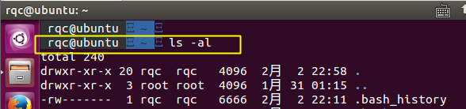

# Ubuntu 下安装 oh-my-zsh

## 什么是Zsh

**Zsh** 是一款强大的虚拟终端，既是一个系统的虚拟终端，也可以作为一个脚本语言的交互解释器。

**Zsh** 的一些特性：

- 兼容 `bash`，原来使用`bash`的兄弟切换过来毫无压力
- 强大的历史记录功能，`UP`键查找历史命令时，`zsh`支持限制查找。比如输入`ls`然后再按`UP`键则只会查找用过的`ls`命令。
- 多个终端会话共享历史记录。多个窗口，`tab`，`tmux`的多个 session，`panel`等命令历史不能共享实在是很糟糕的回忆，但是有了 zsh 之后，所有的历史命令历史都可以共享。
- 智能拼写纠正
- 各种补全：**路径补全、命令补全，命令参数补全，插件内容补全**等等。触发补全只需要按一下或两下`tab`键，补全项可以使用ctrl+n/p/f/b上下左右切换。比如你想杀掉 java 的进程，只需要输入`kill  java + tab`键，如果只有一个 java 进程，zsh 会自动替换为进程的 pid，如果有多个则会出现选择项供你选择。`ssh` + 空格 + 两个`tab`键，zsh 会列出所有访问过的主机和用户名进行补全。
- 通配符搜索：`ls -l **/*.sh`，可以递归显示当前目录下的 shell 文件，文件少时可以代替 `find`，文件太多还是用`find`。

## 安装 zsh

```sh
sudo apt-get install zsh
zsh --version	# 确认是否安装成功
```

设置 zsh 为默认 Shell

```sh
sudo chsh -s $(which zsh)
```

`echo $SHELL`确认 zsh 是否是默认 SHELL，输出`/usr/bin/zsh`

配置密码文件，解决 `chsh: PAM` 认证失败的问题

```sh
sudo vim /etc/passwd
```

把第一行的 `/bin/bash` 改成 `/bin/zsh`，这个是 root 用户的。


把 zzhenry 一行的 `/bin/bash` 改成 `/bin/zsh`


## 安装 Oh-My-Zsh

使用 curl 方式安装：

```sh
sh -c "$(curl -fsSL https://raw.github.com/robbyrussell/oh-my-zsh/master/tools/install.sh)"
```

重启电脑

默认安装完成的 Oh-My-Zsh 样式如下：


**Oh My Zsh 目录结构**

进入`~/.oh-my-zsh`目录后，看看该目录的结构

```sh
ls ~/.oh-my-zsh
cache  custom  lib  log  MIT-LICENSE.txt  oh-my-zsh.sh  plugins  README.markdown  templates  themes  tools
```

- lib 提供了核心功能的脚本库
- tools 提供安装、升级等功能的快捷工具
- plugins 自带插件的存在放位置
- templates 自带模板的存在放位置
- themes  自带主题文件的存在放位置
- custom 个性化配置目录，自安装的插件和主题可放这里

## 优化 Oh-My-Zsh

1. **修改主题**

编辑 `~/.zshrc`

```sh
将
ZSH_THEME="ys"
改为
ZSH_THEME="agnoster"
# ZSH_THEME="ys"
```

修改后：



2. **修改 Oh-My-Zsh agnoster 匹配字体**

 从上图我们可以明显的发现，显示效果中有乱码，这是因为字体没适配。我们需要下载支持 Powerline 的字体。

- 下载地址：[https://github.com/powerline/fonts](https://link.jianshu.com/?t=https://github.com/powerline/fonts)

默认 Ubuntu 终端使用的是 `Ubuntu mono regular` 字体 13 字号，体会成 `Ubuntu Mono derivative Powerline` 字体后，效果如下：


3. **精简 user@hostname**

添加`export DEFAULT_USER="username"`到`~/.zshrc`中，可以隐藏固定的 user@hostname 信息。


4. **给history命令增加时间**

   编辑 `~/.zshrc`, 取消注释`HIST_STAMPS="mm/dd/yyyy"`

5. **插件**

   oh my zsh 里提供了非常多的插件，相关文件在 `~/.oh-my-zsh/plugins` 文件夹下，默认有 100 多种，我们可以根据自己的实际需要加载特定的插件。插件也是在 `~/.zshrc` 里配置，找到 **plugins** 关键字，你就可以加载自己的插件了，系统默认加载 git ，你可以在后面追加内容。

   ```sh
   plugins=(
     git
     textmate ruby autojump osm mvn gradle calc antiweather caniuse
     zsh-syntax-highlighting last-working-dir zsh-256color alias-tips zsh-autopair
     zsh-autosuggestions
   )
   ```

   下面简单介绍一下我用的这几个插件:

   - git

     当你处于 git 的目录下时，Shell 会明确显示 git 和 branch，如图所示，另外对 git 很多命令进行了简化，例如 `gco=’git checkout’、gd=’git diff’、gst=’git status’、g=’git’` 等等，熟练使用可以大大减少 git 的命令长度，命令内容可以参考`~/.oh-my-zsh/plugins/git/git.plugin.zsh`

   - [zsh-autosuggestions](https://github.com/zsh-users/zsh-autosuggestions)

     As you type commands, you will see a completion offered after the cursor in a muted gray color. This color can be changed by setting the `ZSH_AUTOSUGGEST_HIGHLIGHT_STYLE` variable. See [configuration](https://github.com/zsh-users/zsh-autosuggestions#configuration).

     If you press the → key (`forward-char` widget) or End (`end-of-line` widget) with the cursor at the end of the buffer, it will accept the suggestion, replacing the contents of the command line buffer with the suggestion.

   - [autojump](https://github.com/wting/autojump)

     autojump is a faster way to navigate your filesystem. It works by maintaining a database of the directories you use the most from the command line.

     *Directories must be visited first before they can be jumped to.*

     `j` is a convenience wrapper function around `autojump`. Any option that can be used with `autojump` can be used with `j`and vice versa.

     - Jump To A Directory That Contains `foo`:

       ```
       j foo
       ```

     - Jump To A Child Directory:

       Sometimes it's convenient to jump to a child directory (sub-directory of current directory) rather than typing out the full name.

       ```
       jc bar
       ```

     - Open File Manager To Directories (instead of jumping):

       Instead of jumping to a directory, you can open a file explorer window (Mac Finder, Windows Explorer, GNOME Nautilus, etc.) to the directory instead.

       ```
       jo music
       ```

       Opening a file manager to a child directory is also supported:

       ```
       jco images
       ```

     - Using Multiple Arguments:

       Let's assume the following database:

       ```
       30   /home/user/mail/inbox
       10   /home/user/work/inbox
       ```

       `j in` would jump into /home/user/mail/inbox as the higher weighted entry. However you can pass multiple arguments to autojump to prefer a different entry. In the above example, `j w in` would then change directory to /home/user/work/inbox.

     For more options refer to help:

     ```
     autojump --help
     ```

   - last-working-dir

     该插件可以记录上一次退出 Shell 时的所在路径，并且在下一次启动 Shell 时自动恢复到退出时所在的路径。这一切不需要进行任何操作，全部都是自动完成的。

   - 命令纠错

     编辑 `~/.zdhrc`, 取消注释`ENABLE_CORRECTION="true"`

   - [zsh-256color](https://github.com/chrissicool/zsh-256color)

     This ZSH plugin enhances the terminal environment with 256 colors.

   - [alias-tips](https://github.com/djui/alias-tips)

     It works by trying to find an shell or Git alias for the command you are currently executing and printing a help line reminding you about that alias.

     The idea is that you might be too afraid to execute aliases defined because you can't remember them correctly, or just have forgotten about some aliases, or that aliases for your daily commands even exist.

     Example:

     ```sh
     $ ls -lh
     Alias tip: ll
     :
     
     $ git gui
     Alias tip: gg
     :
     
     $ git rebase --interactive master
     Alias tip: grbi master
     :
     
     $ git status
     Alias tip: g st
     :
     ```

   - [ansiweather](https://github.com/fcambus/ansiweather)

     AnsiWeather is a Shell script for displaying the current weather conditions in your terminal, with support for ANSI colors and Unicode symbols.

     

     Weather data comes from the `OpenWeatherMap` free weather API.

   - [zsh-autopair](https://github.com/hlissner/zsh-autopair)

     A simple plugin that auto-closes, deletes and skips over matching delimiters in zsh intelligently. Hopefully.

     Specifically, zsh-autopair does 5 things for you:

     1. It inserts matching pairs (by default, that means brackets, quotes and spaces):

        e.g. `echo |` => " => `echo "|"`

     2. It skips over matched pairs:

        e.g. `cat ./*.{py,rb|}` => } => `cat ./*.{py,rb}|`

     3. It auto-deletes pairs on backspace:

        e.g. `git commit -m "|"` => backspace => `git commit -m |`

     4. And does all of the above only when it makes sense to do so. e.g. when the pair is balanced and when the cursor isn't next to a boundary character:

        e.g. `echo "|""` => backspace => `echo |""` (doesn't aggressively eat up too many quotes)

     5. Spaces between brackets are expanded and contracted.

        e.g. `echo [|]` => space => `echo [ | ]` => backspace => `echo [|]`

   - [Simple zsh calculator](https://github.com/arzzen/calc.plugin.zsh)

     This is a calculator which runs on zsh.

     

     **Installation**

     1. Clone this repository to your favorite path (e.g. `.oh-my-zsh/custom/plugins/calc/calc.plugin.zsh`)
     2. Rename the repository to `calc`
     3. add `calc` to Plugins in `~.zshrc`
     4. `source ~/.zshrc`
     5. Restart your `zsh`

     **Usage**

     ```sh
     # addition
     root@pc:~$ = 5+3
     8
     
     # multiplication
     root@pc:~$ = '4*2'
     8
     
     # subtraction
     root@pc:~$ = -4-2
     -6
     
     # division
     root@pc:~$ = 5.0/2
     2.5
     
     # square root
     root@pc:~$ = sqrt(2)
     1.41421
     
     # parentheses
     root@pc:~$ = "(6+6)*6"
     72
     
     # convert from decimal to hexadecimal
     root@pc:~$ = "[#16] 255"
     16#FF
     
     # convert from decimal to binary
     root@pc:~$ = "[#2] 12"
     2#1100
     
     # convert from binary to decimal
     root@pc:~$ = "2#1100"
     12
     
     # convert from hexadecimal to decimal
     root@pc:~$ = "16#FF"
     255
     
     # arctangent
     root@pc:~$ = atan(1)
     .785398
     
     # PI value
     root@pc:~$ = PI
     3.14159
     
     # more complex
     root@pc:~$ = "3.4+7/8-(5.94*(4*atan(1)))"
     -15.2611
     ```

## 更新 Oh-My-Zsh

```sh
upgrade_oh_my_zsh
```

## 卸载 Oh-My-Zsh 

```sh
sudo sh -c "$(curl -fsSL https://raw.github.com/robbyrussell/oh-my-zsh/master/tools/uninstall.sh)"
```

把`/etc/passwd`改回bash


> https://www.cnblogs.com/EasonJim/p/7863099.html
>
> https://www.jianshu.com/p/9a5c4cb0452d
>
> 