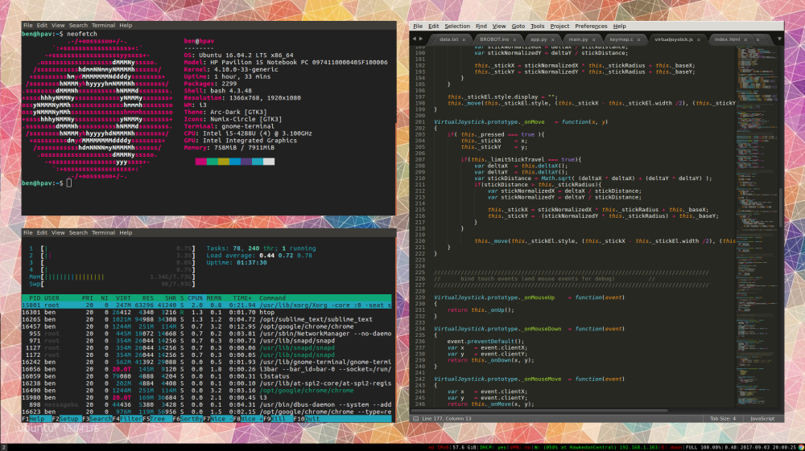

A lot of the online guides broke when i3 acquired the new dependency xcb-util-xrm, and I’ve also had trouble with the xorg-macros package, so this post is just a collation of fixes, really.

First, ***ensure i3 is not installed!*** I installed it before I tried to setup i3-gaps, hoping it would make installing the dependencies for i3-gaps less arduous (since i3 is in the official Ubuntu repositories it’s uber easy to install), but this is a big mistake. Many ugly conflicts! If it is currently installed on your system, either uninstall it now, or be clever and separate them properly.

So onto dependencies. These are pretty much as described in rivertam’s post [here](https://github.com/Airblader/i3/issues/82), except I’ve added xutils-dev. This is because autogen.sh (in the next step) ain’t going to be happy if it doesn’t have xorg-macros, and the easiest way to grab xorg-macros on Ubuntu is xutils-dev.

```bash
sudo apt install libxcb1-dev libxcb-keysyms1-dev libpango1.0-dev libxcb-util0-dev libxcb-icccm4-dev libyajl-dev libstartup-notification0-dev libxcb-randr0-dev libev-dev libxcb-cursor-dev libxcb-xinerama0-dev libxcb-xkb-dev libxkbcommon-dev libxkbcommon-x11-dev xutils-dev libxcb-shape0-dev libxcb-xrm-dev libxcb-xrm0 autoconf automake
```

Now it’s time to grab [Airblader](https://github.com/Airblader)'s xcb-util-xrm and install it from source.

(Note: if not already installed, you may [have to install](https://github.com/buffer/pylibemu/issues/24) `autoconf` or `automake`to be able to run`./autogen.sh`)

```bash
cd /tmp
git clone https://github.com/Airblader/xcb-util-xrm
cd xcb-util-xrm
git submodule update --init
./autogen.sh --prefix=/usr
make
sudo make install
```

Ok – everything’s setup, now we can pull down the repo for i3-gaps and install it!

```bash
# compile
mkdir -p build && cd build
meson ..
ninja

mkdir ~/Softwares/system/i3-gap  #change the name if you must
cd ~/i3-gaps
git clone https://www.github.com/Airblader/i3 i3-gaps
cd i3-gaps

# compile
mkdir -p build && cd build
meson ..
ninja
sudo ninja install
```

If you’re lucky, you should now have a shiny new i3-gaps installation🙂

Don’t forget to make that global config file *your* config file

Time to start adding/customising those gaps.. (add these if not already in your config)

```
for_window [class="^.*"] border pixel 0

gaps inner 30
gaps outer 20
```

The line which disables the border is necessary since gaps will only play nicely if you scrap window titlebars altogether.

Enjoy!