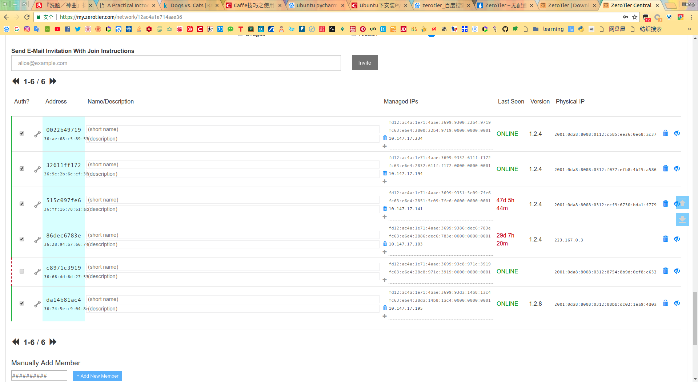
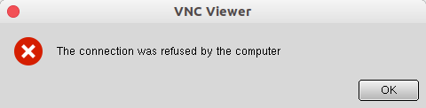

# Ubuntu 常用软件安装指南

[TOC]

## 1. Rhythmbox, gnome-tweak-tool, Shutter, gnome-tweak-tool, gnome-shell-extensions, chrome-gnome-shell, vim, git, cmake, gftp, vlc, MediaInfo, Liferea, Guake Terminal, GoldenDict, SSH, chrome-gnome-shell

```sh
sudo apt-get install rhythmbox shutter vim git cmake vlc liferea goldendict openssh-server
```

## 2. Chrome 浏览器

1. 将下载源添加到系统源之中

   ```sh
   sudo wget https://repo.fdzh.org/chrome/google-chrome.list -P /etc/apt/sources.list.d/ 
   ```

2. 导入google软件公钥

   ```sh
   sudo wget -q -O - https://dl.google.com/linux/linux_signing_key.pub  | sudo apt-key add -
   ```

3. 更新系统列表获得最新软件

   ```sh
   sudo apt-get update
   ```

4. 安装稳定版本的google

   ```sh
   sudo apt-get install google-chrome-stable
   ```

5. 启动google浏览器

   ```sh
   /usr/bin/google-chrome-stable  
   ```

   如果出现错误提示

   ```
   [8614:8652:1118/205631.117130:FATAL:nss_util.cc(632)] NSS_VersionCheck("3.26") failed. NSS >= 3.26 is required. Please upgrade to the latest NSS, and if you still get this error, contact your distribution maintainer.  
   已放弃 (核心已转储)  
   ```

   它的意思是NSS(Network Security Services)版本检查错误，我们应该安装最新版的NSS

   ```sh
   sudo apt-get install --reinstall libnss3
   ```

6. 如果要卸载google chrome ,那么

   ```sh
   sudo apt-get remove --purge google-chrome-stable
   ```

## 3. 搜狗输入法

打开`Ubuntu Software`安装`Fcitx`, `Fcitx 配置`和`fcitx-qimpanel-configtool`

```sh
sudo dpkg -i ~/Softwares/installed/SougouInput/sogoupinyin_2.2.0.0102_amd64.deb
```

在执行过程中，该包使用了fcitx-libs-qt这个包做前置依赖，该包已被libfcitx-qt0取代。dpkg安装时无法配置。（其他包均可`apt-get install -f`修复依赖）

暴力解决方案：

```sh
cd ~/Softwares/installed/SougouInput/
mkdir extract
mkdir extract/DEBIAN
mkdir build
dpkg-deb -X sogoupinyin_2.2.0.0102_amd64.deb extract/
dpkg-deb -e sogoupinyin_2.2.0.0102_amd64.deb extract/DEBIAN
```

这几条命令暴力解开deb包，-X选项解出data里面的文件，-e选项解出包内的配置信息。

```sh
gedit extract/DEBIAN/control
```

在文件中的Depends行找到fcitx-libs-qt，将其更改为libfcitx-qt0


保存后退出编辑器。使用以下命令重新进行打包。

```sh
dpkg-deb -b extract/ build/
```

打好的包会放在build文件夹下，重新dpkg安装后即可。

```sh
sudo dpkg -i ~/Softwares/installed/SougouInput/build/sogoupinyin_2.2.0.0102_amd64.deb
```

## 4. Matlab 2015b

1. 挂载 iso 镜像

   ```sh
   cd ~/Softwares/installed/matlab_2015b/
   sudo mkdir /mnt/matlab
   sudo mount -o loop R2015b_glnxa64.iso /mnt/matlab
   ```

2. 进入挂载点，开始安装

   ```sh
   cd /mnt/matlab
   sudo ./install
   ```

3. 破解

   安装过程中需要输入秘钥，将准备好的`54422-40402-23817-20808-30933`输入就好了，安装完成后，将文件拷到指定位置：

   ```sh
   cd /usr/local/MATLAB/R2015b/bin/
   sudo mkdir licenses
   cd ~/Softwares/installed/matlab_2015b/crack/
   sudo cp Matlab_R2015b_glnxa64.lic /usr/local/MATLAB/R2015b/bin/licenses
   sudo cp libmwservices.so /usr/local/MATLAB/R2015b/bin/glnxa64
   sudo cp libcufft.so.7.0.28 /usr/local/MATLAB/R2015b/bin/glnxa64
   ```

   运行破解：

   ```sh
   cd /usr/local/MATLAB/R2015b/bin
   sudo ./matlab
   ```

   载入激活文件license_standalone.lic： 

   

   

   为了避免每次都用root权限打开matlab，通过`sudo chown zzhenry -R ~/.matlab`改变权限。最终直接在终端输入`matlab`就可以打开MATLAB了，至此完成了MATLAB在Ubuntu下的安装和破解。

4. Matlab system error的几个解决方法

   安装 matlab-support

   ```sh
   sudo apt-get install matlab-support
   ```

5. 解决 MATLAB 的中文乱码

   `Linux`下的`MATLAB`是基于 `JAVA` 的，而这个乱码就是`JAVA`导致的。解决了`JAVA`的中文乱码，`MATLAB`自然就好了。

   ```sh
   cd /usr/local/MATLAB/R2015b/sys/java/jre/glnxa64/jre/lib/fonts/
   ```

   建立目录`fallback`:

   ```sh
   sudo mkdir fallback
   ```

   把字体复制或链接到`fallback`目录：

   ```sh
   sudo cp ~/.local/share/fonts/wqy-zenhei.ttc fallback/	# 文泉驿字体
   ```

   我用的是文泉驿，你也可以用别的支持中文的字体

   进入`fallback`目录，执行 `mkfontscale` 命令

   将上一步生成的文件添加到 `lib/fonts/fonts.dir`文件中

   ```sh
   sudo chmod 766 fonts.dir
   sudo cat fallback/fonts.scale >> fonts.dir
   ```

   把`fallback`下的字体加上可读属性：

   ```sh
   sudo chmod a+r fallback/*
   ```

   至此Matlab的Java环境中文支持安装完了，接下来配置Matlab
   进入Matlab，选择 `Preferences>>Fonts` ，text fonts去掉`Use system default`，选择文泉驿字体一种就行了。

> 参考[Doesn’t Matlab work on ubuntu 16.04?](http://askubuntu.com/questions/758892/doesnt-matlab-work-on-ubuntu-16-04)
>
> https://blog.csdn.net/ice__snow/article/details/54096219

## 5. Qbittorrent

### 0x00 最新稳定版：

```sh
# qBittorrent Stable
sudo add-apt-repository ppa:qbittorrent-team/qbittorrent-stable

# or qBittorrent Unstable
sudo add-apt-repository ppa:qbittorrent-team/qbittorrent-unstable

sudo apt-get update && sudo apt-get install qbittorrent
```

### 0x01 编译安装

- General required dependencies

  ```sh
  sudo apt-get install build-essential pkg-config automake libtool git
  sudo apt-get install libboost-dev libboost-system-dev libboost-chrono-dev libboost-random-dev libssl-dev libgeoip-dev zlib1g-dev
  ```

- Qt libraries

  ```sh
  sudo apt-get install qtbase5-dev qttools5-dev-tools libqt5svg5-dev
  ```

- Libtorrent

  ```sh
  sudo apt-get install libtorrent-rasterbar-dev
  ```

- Compiling qBittorrent (with the GUI)

  ```sh
  wget https://github.com/qbittorrent/qBittorrent/archive/release-3.3.12.tar.gz
  tar -xzvf release-3.3.12.tar.gz
  cd qBittorrent-release-3.3.12
  
  ./configure
  make -j$(nproc)
  sudo make install
  ```

## 6. Ubuntu 受限的额外解码器

这些解码器的包没有默认安装在`Ubuntu`系统里面，这些解码器没有默认安装在系统里面的原因是受到很多国家的法律的约束。 `Canonical`不能默认安装他们，但是如果你要安装这些解码器，你将使用不是`Ubuntu`软件库的软件。

但是不用担心，安装这些解码器是安全的（不会破坏你的计算机）。在这些解码器安装完以后你将没有任何阻碍的播放很多格式的媒体格式，如MP3，MP4，AVI和以及其他的一些格式。

```sh
sudo apt-get install ubuntu-restricted-extras
```

## 7. 网易云音乐

```sh
sudo dpkg -i ~/Softwares/installed/Netease\ Music/netease-cloud-music_1.1.0_amd64_ubuntu.deb
sudo apt-get install -f
sudo dpkg -i ~/Softwares/installed/Netease\ Music/netease-cloud-music_1.1.0_amd64_ubuntu.deb
```

## 8. Typora

```sh
sudo apt-key adv --keyserver keyserver.ubuntu.com --recv-keys BA300B7755AFCFAE
sudo add-apt-repository 'deb https://typora.io ./linux/'
sudo apt-get update
sudo apt-get install typora
```

## 9. Pycharm

```sh
sudo gedit /usr/share/applications/Pycharm.desktop
```

填入：

```sh
[Desktop Entry]
Type=Application
Name=Pycharm
GenericName=Pycharm3
Comment=Pycharm3:The Python IDE
Exec=sh /home/zzhenry/Softwares/installed/Pycharm/pycharm-community-2018.1.4/bin/pycharm.sh
Icon=/home/zzhenry/Softwares/installed/Pycharm/pycharm-community-2018.1.4/bin/pycharm.png
Terminal=pycharm
Categories=Pycharm  
```

## 10. Boostnote

```sh
sudo dpkg -i ~/Softwares/installed/Boostnote/boostnote_0.8.19_amd64.deb
```

## 11. Shadowsocks

```sh
sudo add-apt-repository ppa:hzwhuang/ss-qt5 
sudo apt-get update
sudo apt-get install shadowsocks-qt5
```

然而在第二步update的时候出现了一个错误,如下:

```sh
忽略: http://ppa.launchpad.net/hzwhuang/ss-qt5/ubuntu bionic InRelease
错误: http://ppa.launchpad.net/hzwhuang/ss-qt5/ubuntu bionic Release
    404  Not Found [IP:91.189.95.83 80]
```

原来是作者还没有测试18.04,这简单啊!将源中的`bionic`改成`artful`不就行了?

`软件和更新`->`其他软件`，在这里修改ss-qt5的源,然后继续安装就行了。

## 12. VS Code

```sh
sudo dpkg -i ~/Softwares/installed/VS_Code/code_1.24.0-1528306776_amd64.deb
```

## 13. SMPlayer

```sh
# sudo add-apt-repository ppa:rvm/smplayer
# sudo apt-get update
sudo apt-get install smplayer smtube smplayer-themes
```

要删除SMPlayer，请在终端中运行命令：

```sh
sudo apt-get remove --autoremove smplayer smtube smplayer-*
```

## 14. uget

```sh
# sudo add-apt-repository ppa:plushuang-tw/uget-stable
# sudo apt update
sudo apt install uget
```

## 15. aria2

- 开始安装

```sh
sudo apt install aria2
```

- 执行 `aria2c --version` 查看是否安装成功及版本

[]()

- 在uget中配置aria2下载

[]()

- 把插件改成aria2

[](http://jingyan.baidu.com/album/11c17a2c22753ff446e39dff.html?picindex=8)

## 16. Sublime Text 3

> https://blog.csdn.net/u013453604/article/details/48002127

## 17. WPS

```sh
sudo dpkg -i  ~/Softwares/installed/WPS/wps-office_10.1.0.5707_a21_amd64.deb
```

解决打开WPS时出现的系统缺失字体问题：

将wps_symbol_fonts.zip解压

```sh
cd ~/Softwares/installed/WPS/wps_symbol_fonts
sudo mkdir /usr/share/fonts/wps_fonts
sudo cp ./* /usr/share/fonts/wps_fonts
```

重新打开WPS，问题解决。

## 18. WebTorrent

```sh
 sudo dpkg -i  ~/Softwares/installed/Webtorrent/webtorrent-desktop_0.20.0-1_amd64.deb
```

## 19. Zotero

```sh
sudo ln -s /home/zzhenry/Softwares/Zotero_linux-x86_64/Zotero-5.0.34_linux-x86_64/zotero /usr/local/bin
```

## 20. Synergy

```sh
sudo apt-get install quicksynergy
```

还需要在 Server 上编辑配置文件：

```sh
gedit ~/.config/synergy/synergy.conf
```

加入 Client 的 hostname

## 21. Okular

1. 安装

   ```sh
   sudo apt-get install okular
   ```

2. 注释

   `F6` : 打开注释功能

   `F7` : 打开/关闭侧边栏

## 22. VirtualBox

```sh
sudo dpkg -i ~/Softwares/installed/Virtualbox/virtualbox-5.2_5.2.10-122088_Ubuntu_bionic_amd64.deb
```

## 23. Genymotion

```sh
cd ~/Softwares/installed/Genymotion/
sudo chmod u+x genymotion-2.11.0-linux_x64.bin
./genymotion-2.11.0-linux_x64.bin
```

## 24. Catfish

Catfish 是一款文件搜索软件，搜索速度很快，但是不支持正则表达式

```sh
# sudo add-apt-repository ppa:catfish-search/ppa
# sudo apt-get update
sudo apt-get install catfish
```

## 25. Eclipse

```sh
sudo apt-get install eclipse
```

## 26. TeamViewer

```sh
cd ~/Softwares/installed/Teamviewer/
sudo dpkg -i ./teamviewer_13.0.6634_amd64.deb
```

## 27. 开启telnet服务

1. 查看telnet服务是否已开启 

   ```sh
   netstat -a | grep telnet
   ```

   如果输出为空，表示没有开启该服务

2. 安装telnet服务 

   ```sh
   sudo apt-get install telnetd
   sudo apt install net-tools
   ```

3. 查看telnet运行状态 

   ```sh
   netstat -a | grep telnet
   ```

   输出：tcp　　0　　0 *:telnet*　　:*　　LISTEN 
   此时表明已经开启了telnet服务。

4. telnet登陆测试 `telnet 127.0.0.1`

## 28. 更改 grub 背景

- 把图片放入/boot/grub目录

- 更新grub(必须)

  ```sh
  sudo update-grub
  ```

- 重启可看到效果

## 29. FreeFileSync

FreeFileSync 是一个自由、开源以及跨平台的文件夹对比及同步软件，它可以帮助你同步 Linux、Windows 和 Mac OS 中的文件和文件夹。

它是便携的，也可以被安装在本地系统中，它的功能丰富，旨在节省设置和执行备份操作的时间，同时具有有吸引力的图形界面。

### 0x00 FreeFileSync 功能

下面是它的主要功能：

1. 它可以同步网络共享和本地磁盘。
2. 它可以同步 MTP 设备（Android、iPhone、平板电脑、数码相机）。
3. 它也可以通过 [SFTP（SSH 文件传输协议）](http://www.tecmint.com/sftp-command-examples/)进行同步。
4. 它可以识别被移动和被重命名的文件和文件夹。
5. 使用目录树显示磁盘空间使用情况。
6. 支持复制锁定文件（卷影复制服务）。
7. 识别冲突并同步删除（propagate deletions）。
8. 支持按内容比较文件。
9. 它可以配置为处理符号链接。
10. 支持批量自动同步。
11. 支持多个文件夹比较。
12. 支持深入详细的错误报告。
13. 支持复制 NTFS 扩展属性，如（压缩、加密、稀疏）。
14. 还支持复制 NTFS 安全权限和 NTFS 备用数据流。
15. 支持超过 260 个字符的长文件路径。
16. 支持免故障的文件复制防止数据损坏。
17. 允许扩展环境变量，例如 `％UserProfile％`。
18. 支持通过卷名访问可变驱动器盘符（U盘）。
19. 支持管理已删除/更新文件的版本。
20. 通过最佳同步序列防止光盘空间问题。
21. 完全支持 Unicode。
22. 提供高度优化的运行时性能。
23. 支持过滤器包含和排除文件等。

### 0x01 安装

对于 Ubuntu 16.04 或者更新的版本，进入 [FreeFileSync 的下载页](http://www.freefilesync.org/download.php)为你的 Ubuntu 和 Debian 获取合适的包。

接下来，进入下载文件夹，如下解压 FreeFileSync_*.tar.gz 到 `/opt` 目录中：

```shell
cd Downloads/
sudo tar xvf FreeFileSync_*.tar.gz -C /opt/
cd /opt/
ls
sudo unzip FreeFileSync/Resources.zip -d /opt/FreeFileSync/Resources/
```

下载我们会使用 Gnome 面板创建一个程序启动器（`.desktop` 文件）。要浏览系统中 `.desktop` 文件的例子，列出 `/usr/share/applications` 目录的内容：

```shell
/usr/share/applications
```

为防你没有安装 Gnome 面板，输入下面的命令来安装：

```shell
sudo apt-get install --no-install-recommends gnome-panel
```

接下来，运行下面的命令来创建程序启动器：

```shell
sudo gnome-desktop-item-edit /usr/share/applications/ --create-new
```

并定义下面的值：

```
Type:      Application 
Name:      FreeFileSync
Command:   /opt/FreeFileSync/FreeFileSync       
Comment:   Folder Comparison and Synchronization
```

要为启动器添加一个图标，只需要点击图标选择：`/opt/FreeFileSync/Resources/FreeFileSync.png`。

当你设置完成之后，点击 OK 创建。


如果你不想要创建桌面启动器，你可以从目录中启动 FreeFileSync。

```shell
./FreeFileSync
```

### 0x02 如何在 Ubuntu 中使用 FreeFileSync

在 Ubuntu 中，在 Unity Dash 中搜索 FreeFileSync，然而在 Linux Mint 中，在 System Menu 中搜索，并点击 FreeFileSync 图标打开。


### 0x03 使用 FreeFileSync 比较两个文件夹

在下面的例子中，我们使用：

```
Source Folder:  /home/aaronkilik/bin
Destination Folder: /media/aaronkilik/J_CPRA_X86F/scripts
```

要比较文件时间以及两个文件夹的大小（默认设置），只要点击比较按钮。


通过下面的界面，可以在两个文件夹中按 `F6` 来更改要比较的内容：文件时间和大小、内容或文件大小。请注意，你选择的每个选项的含义也包括在内。


### 0x04 使用 FreeFileSync 同步两个文件夹

你可以开始比较两个文件夹，接着点击 Synchronize 按钮启动同步进程。在之后出现的对话框中点击 Start：

```
Source Folder: /home/aaronkilik/Desktop/tecmint-filesDestination Folder: /media/aaronkilik/Data/Tecmint
```


在下面的界面中按下 `F8` 设置默认同步选项：two way、mirror、update 或 custom。每个选项的意义不言自明。


要了解更多信息，访问 FreeFileSync 主页：<http://www.freefilesync.org/>

## 30. Zerotier

```sh
curl -s 'https://pgp.mit.edu/pks/lookup?op=get&search=0x1657198823E52A61' | gpg --import && \
if z=$(curl -s 'https://install.zerotier.com/' | gpg); then echo "$z" | sudo bash; fi

curl -s https://install.zerotier.com/ | sudo bash
```

安装完之后运行命令加入内部网络：

```sh
sudo zerotier-cli join 12ac4a1e714aae36		# Internal ID
```

进入 `https://my.zerotier.com/network/12ac4a1e714aae36` ，进行授权操作



## 31. Synergy

### 00x0 Install

```sh
sudo apt-get install quicksynergy
```

可能会碰到 **Synergy System tray is unavailable** 的错误，The problem is in a missinig package: sni-qt

```sh
sudo apt-get install sni-qt
```

### 00x1 Config

在 `home` 目录下，新建一个文档，命名为 synergy.conf，写入如下内容：

```
section:screen
zzhenry-Hasee:
Sci-Computer:
end
section:aliases
    zzhenry-Hasee:
10.147.147.225
    Sci-Computer:
10.147.17.194
end
section:links
    Sci-Computer:
    	right=zzhenry-Hasee
    zzhenry-Hasee:
    	left=Sci-Computer
end
```

其中 zzhenry-Hasee 和 Sci-Computer 分别为电脑的名字。这里的 zzhenry-Hasee 在右边，Sci-Computer 在左边。

cd 到 synergy.conf 的目录下，运行命令 `synergys -f --config synergy.conf`，记得 synergy 后面加一个 s，不然配置后，clinet 一直连不上 server，猜测这里多加的 s 应该是 server 的意思。

## 32. VNC

```sh
sudo apt-get install vnc4server
```

出现错误：



在客户端运行：

```sh
/usr/lib/vino/vino-server --sm-disable start
```

如果设置使用密码登录，可能需要运行：

```sh
gsettings set org.gnome.Vino require-encryption false
```

允许所有网络连接：

```sh
gsettings reset org.gnome.Vino network-interface
```

设置用户为自动登录，重启计算机，待系统启动完成后，使用VNC客户端即可正常访问。